# PR0201: Instalación y configuración de Hadoop en modo pseudo-distribuido

### ------------- ESPECIALIZACIÓN EN INTELIGENCIA ARTIFICIAL Y BIG DATA -------------
---------------------------------------------------------------------------------

Módulo:                     BIG DATA APLICADO
Profesor:                   Víctor J. González
Unidad de Trabajo:          UT02. HDFS. Almacenamiento distribuido
Práctica:                   PR0201. Instalación de Hadoop en modo pseudo-distribuido
Resultados de aprendizaje:  RA1, RA2 y RA3


Lo primero que hacemos es configurar la red y el nombre de la máquina.
Por la parte de la red tenemos que tener dos adaptadores una NAT  y otra solo anfitriona que en mi caso asigno la dirección **192.168.56.10**.

Por la parte del nombre, asignamos el nombre de la máquina como **Haddop-abr**, y como usuario creamos el usuario alumno con la contraseña "paso" 

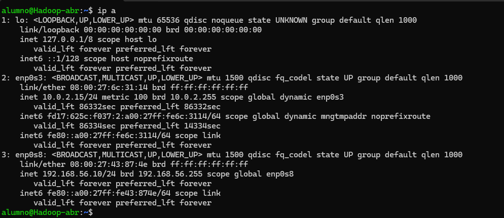
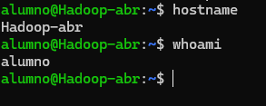


Para el uso de hadoop, crearemos un nuevo usuario llamado **hadoop**

```bash
sudo adduser hadoop
```
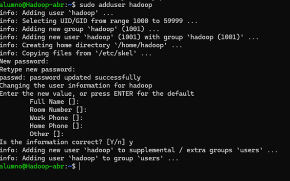

Además le damos permiso para realizar las operaciones con **sudo**

```bash
sudo usermod -a -G sudo hadoop
```


Seguidamente, creamos la carpeta personal del nuevo usuario y le hacemos propietario.

```bash
cd /opt
sudo mkdir hadoop
sudo chown hadoop /opt/hadoop
```


Comenzamos a usar el usuario creado para poder trabajar con él.


Procederemos a la **Instalación** de apache **Hadoop**


Comprobamos que los hashes son iguales para confirmar que no se ha dañado ningun archivo durante la descarga

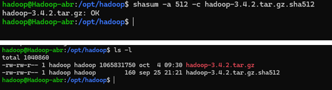

Una vez confirmado, descomprimimos el archivo


Descargamos **jdk** y descomprimimos

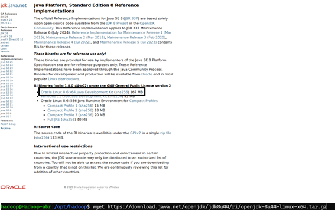


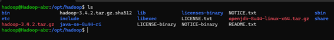

Para que sea más fácil de recordar, **renombremos** el archivo

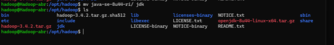

Comprobamos la **versión** instalada de Java

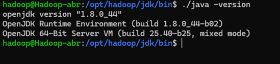

Modificamos el archivo **bashrc**

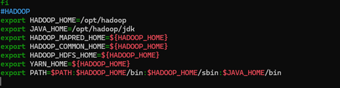

Recargamos el archivo 

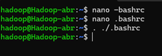

Comprobamos 

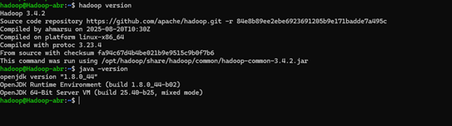

Modificamos el siguiente archivo que modifica la configuración de hadoop

```bash
/otp/hadoop/etc/hadoop/hadoop-env.sh
```
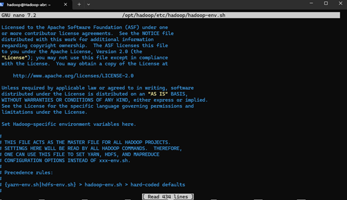

Añadiendo la siguiente línea

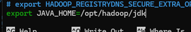

Comprobamos mediante el uso de procesos en paralelo con **mapreduce**

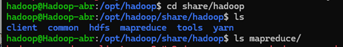

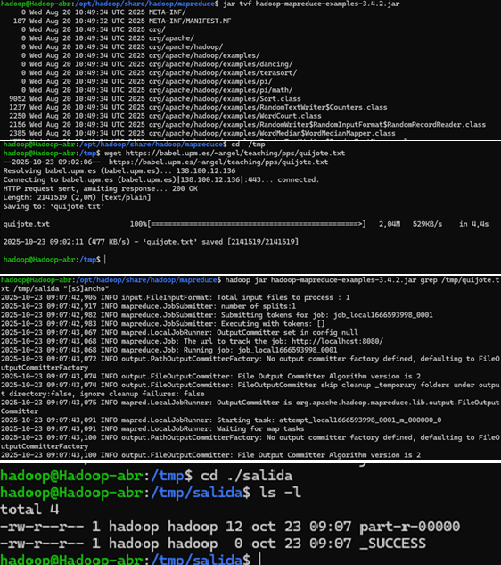

Una vez comprobado, pasamos a instalar **SSH**

Para ello lo primero que hacemos es generar un par de claves con el siguiente comando:

```bash
ssh-keygen -b 2048
```


Vamos al directorio personal y buscamos el directorio ssh, donde se crean las claves y añadimos la clave pública al archivo authorized keys


Asignamos permisos y confirmamos

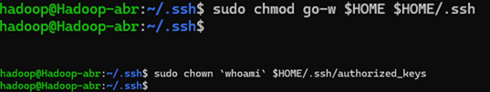

Finalizada la configuración, probamos a conectarnos sin necesidad de contraseña

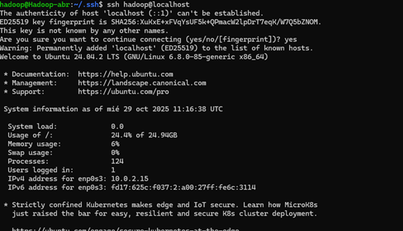

Procedemos a configurar **HDFS**

Para ello necesitaremos modificar el siguiente archivo xml


```bash
/opt/hadoop/etc/hadoop/core-site.xml
```
Lo dejamos de la siguiente manera


También será necesario modificar el siguiente archivo

```bash
/opt/hadoop/etc/hadoop/hdfs-site.xml
```
Lo dejamos de la siguiente manera

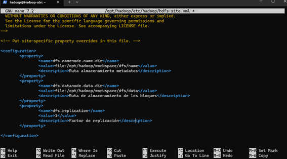

Como hemos indicado en el archivo, tendremos que crear los siguientes directorios

```bash
/opt/hadoop/workspace/dfs/name
/opt/hadoop/workspace/dfs/data
```

Además tendremos que formatear el namenode, es decir inicializar el sistema de archivos distribuido HDFS antes de usarlo por primera vez
Para ello usamos

```bash
hdfs namenode -format
```
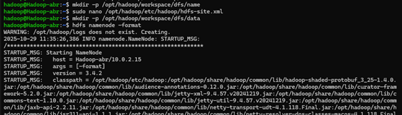

Vemos el contenido del directorio


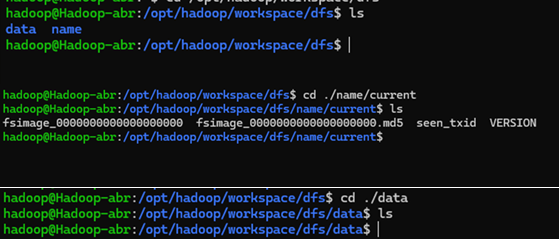

**Activamos Hadoop** (Se puede activar desde cualquier directorio)

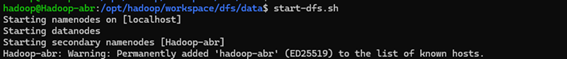

Comprobamos que se han puesto en marcha con el comando **JPS**

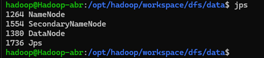

Podemos comprobar también que funciona desde la interfaz web con la **ip: puerto9870**

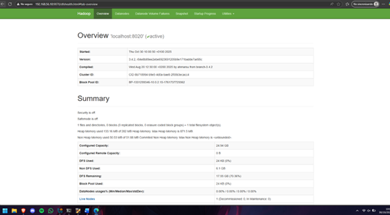

**Comandos Básicos de CLI de HDFS**

Toda la interacción con HDFS se hace mediante el comando hdfs + subcomandos
Los comandos de clientes utilizan el subcomando dfs
(Utiliza por comodidad comandos de linux)
Saber que comandos puedo usar

```bash
Hdfs dfs -help
```

Para trabajar con ficheros 

```bash
Hdfs dfs
```
Ejemplo de comandos


Para crear una carpeta


Pasar un archivo de local a HDFS(Comando **put** ruta del archivo, ruta de hdfs donde se guardará)

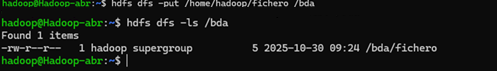

Comprobamos y miramos información desde la interfaz web

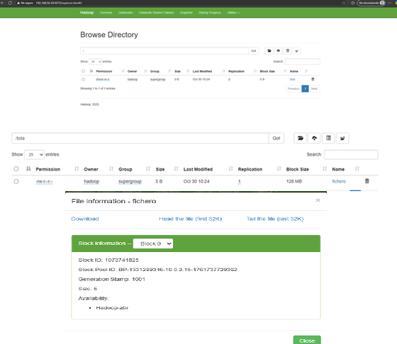


Copia de archivo de gran tamaño

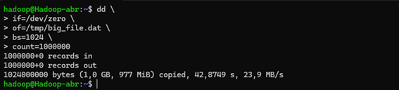

Miramos la información de este archivo(Como tiene más tamaño este está dividido en más bloques)

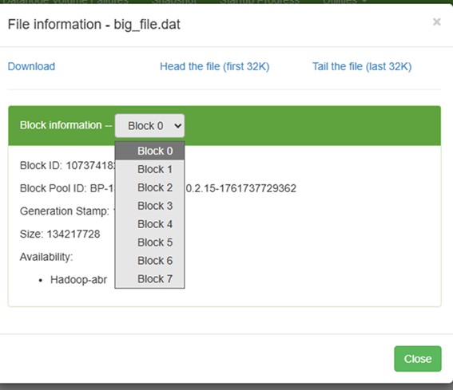

Podemos ver el espacio que ocupa

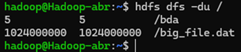

Para **borrar** el archivo, tendremos que borrarlo tanto en el local como en el hdfs

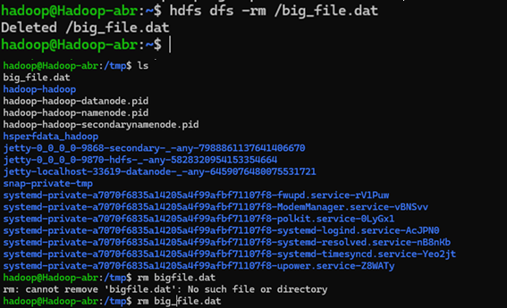