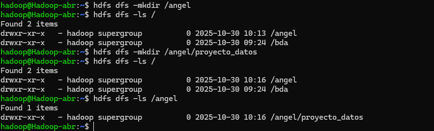

# PR0202. Uso del cliente HDFS

## ------------- ESPECIALIZACIÓN EN INTELIGENCIA ARTIFICIAL Y BIG DATA -------------
---------------------------------------------------------------------------------

Módulo:                     BIG DATA APLICADO
Profesor:                   Víctor J. González
Unidad de Trabajo:          UT02. HDFS. Almacenamiento distribuido
Práctica:                   PR0202. Uso del cliente HDFS
Resultados de aprendizaje:  RA1, RA2 y RA3


## Ejercicios 

**Preparación del entorno**
<ul>Crea un directorio personal en HDFS bajo /user con tu nombre de usuario y dentro de él un directorio llamado proyecto_datos.</ul>

Lo primero que tenemos que hacer es activar HDFS para que esté en funcionamiento.
Para ello, usamos el siguiente comando:

```bash
start-dfs.sh

```
Con esto ya podremos utilizar comandos para HDFS

Para crear el directorio personal /angel, usamos los siguientes comandos:

```bash
hdfs dfs -mkdir /angel
```

Y comprobamos que se ha creado el directorio

```bash
hdfs dfs -ls /
```
Luego creamos el directorio proyecto_datos, dentro del anterior

```bash
hdfs dfs -mkdir /angel/proyecto_datos
```
