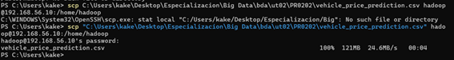
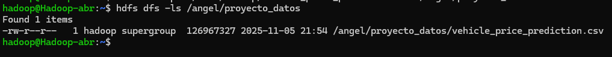
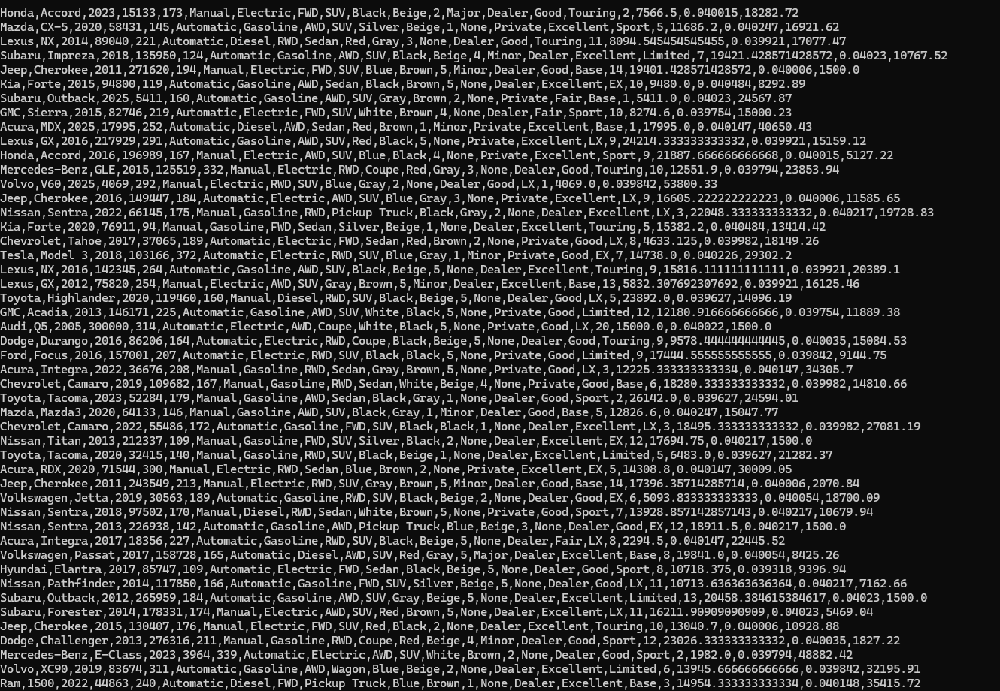
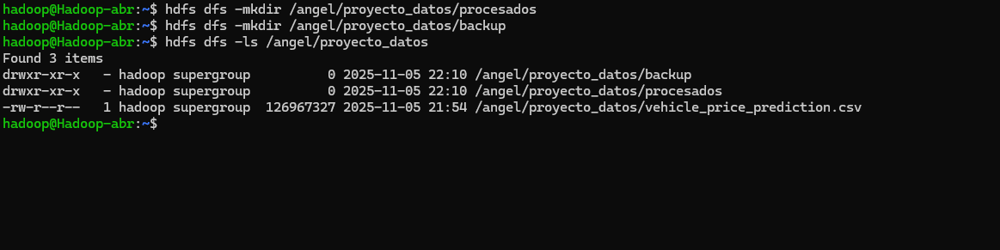
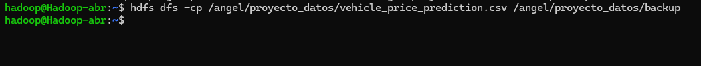
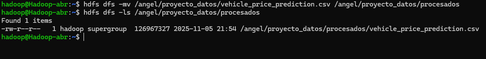
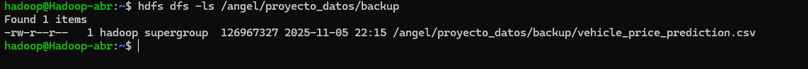
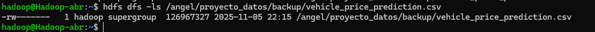
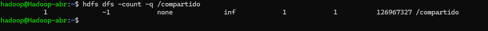

# PR0202. Uso del cliente HDFS

## ------------- ESPECIALIZACIÓN EN INTELIGENCIA ARTIFICIAL Y BIG DATA -------------
---------------------------------------------------------------------------------

Módulo:                     BIG DATA APLICADO
Profesor:                   Víctor J. González
Unidad de Trabajo:          UT02. HDFS. Almacenamiento distribuido
Práctica:                   PR0202. Uso del cliente HDFS
Resultados de aprendizaje:  RA1, RA2 y RA3


## Ejercicios 

**Preparación del entorno**
<ul>Crea un directorio personal en HDFS bajo /user con tu nombre de usuario y dentro de él un directorio llamado proyecto_datos.</ul>

Lo primero que tenemos que hacer es activar HDFS para que esté en funcionamiento.
Para ello, usamos el siguiente comando:

```bash
start-dfs.sh

```
Con esto ya podremos utilizar comandos para HDFS

Para crear el directorio personal /angel, usamos los siguientes comandos:

```bash
hdfs dfs -mkdir /angel
```

Y comprobamos que se ha creado el directorio

```bash
hdfs dfs -ls /
```
Luego creamos el directorio proyecto_datos, dentro del anterior

```bash
hdfs dfs -mkdir /angel/proyecto_datos
```


Descargamos el csv y los pasamos mediante scp  a la parte local de la máquina virtual



Y lo añadimos a la carpeta de hadoop creada anteriormente **/angel/proyecto_datos**

```bash
hdfs dfs -put /home/hadoop/vehicle_price_prediction.csv /angel/proyecto_datos
```


Comprobamos que tenemos el archivo con 

```bash
hdfs dfs -ls /angel/proyecto_datos
```


Visualizamos el contenido del fichero en HDFS
```bash
hdfs dfs -cat /angel/proyecto_datos/vehicle_price_prediction.csv
```



Contamos el número de líneas que tiene el fichero csv 

```bash
hdfs dfs -cat /angel/proyecto_datos/vehicle_price_prediction.csv | wc -l
```


Creamos los directorios **procesados** y **backup** dentro del directorio procesado_datos

```bash
hdfs dfs -mkdir /angel/proyecto_datos/backup
hdfs dfs -mkdir /angel/proyecto_datos/procesados
hdfs dfs -ls /angel/proyecto_datos
```


Copiamos el archivo original a backups con el siguiente comando

```bash
hdfs dfs -cp /angel/proyecto_datos/vehicle_price_prediction.csv /angel/proyecto_datos/backup
```



Pasamos el archivo original a **procesados**

```bash
hdfs dfs -mv /angel/proyecto_datos/vehicle_price_prediction.csv /angel/proyecto_datos/procesados
```



Creamos el directorio **compartido**

```bash
hdfs dfs -mkdir /compartido
```

Copiamos en compartido el csv

```bash
hdfs dfs -cp /angel/proyecto_datos/procesados/vehicle_price_prediction.csv /compartido
```
Descargamos el archivo desde HDFS y lo dejamos en el local(**/home/hadoop**)
```bash
hdfs dfs -get /angel/proyecto_datos/procesados/vehicle_price_prediction.csv /home/hadoop
```


Verificamos los permisos que tienen los archivos

```bash
hdfs dfs -ls /angel/proyecto_datos/backup
```



Cambia los permisos de un archivo de **backup** para que solo tú tengas acceso de lectura y escritura

```bash
hdfs dfs -chmod 600 /angel/proyecto_datos/backup/vehicle_price_prediction.csv
```



Eliminamos un archivo que creamos en **/angel**
```bash
hdfs dfs -rm /angel/vehicle_price_prediction.csv
```


Creamos una cuota de nombre para limitar el número de archivos en un directorio **/compartido**

```bash
hdfs dfsadmin -setQuota 1 /compartido
```
Revisamos cuota,Como ya teniamos un archivo en /compartido, intentamos añadir otro



```bash
hdfs dfs -touchz /compartido/fichero.txt
```

