# PR0203: Uso del cliente HDFS (2)

## ------------- ESPECIALIZACIÓN EN INTELIGENCIA ARTIFICIAL Y BIG DATA -------------
---------------------------------------------------------------------------------

Módulo:                     BIG DATA APLICADO
Profesor:                   Víctor J. González
Unidad de Trabajo:          UT02. HDFS. Almacenamiento distribuido
Práctica:                   PR0203: Uso del cliente HDFS (2)
Resultados de aprendizaje:  RA1, RA2 y RA3


## Ejercicios


Inicializamos el servicio con 

```bash
start-dfs.sh
```

Crea un directorio principal **/proyectos/ecommerce** en HDFS

```bash
hdfs dfs -mkdir /proyectos
hdfs dfs -mkdir /proyectos/ecommerce
```

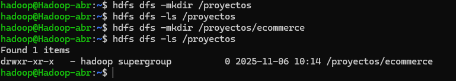

Creamos dentro de este directorio otros 3 subdirectorios */raw /procesados /backup*

```bash
hdfs dfs -mkdir /proyectos/ecommerce/raw
hdfs dfs -mkdir /proyectos/ecommerce/procesados
hdfs dfs -mkdir /proyectos/ecommerce/backup
```

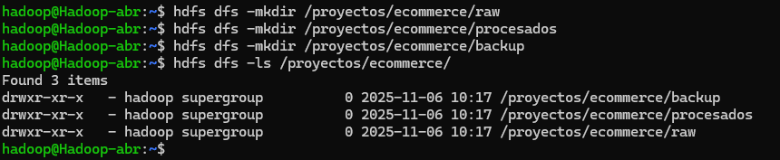

Utilizamos **wget** para descargar los logs de las web

```bash
wget https://vgonzalez165.github.io/practicas_bigdata/practicas/bda/ut02/access_log_20251002-131952.log
wget https://vgonzalez165.github.io/practicas_bigdata/practicas/bda/ut02/access_log_20251002-131938.log
wget https://vgonzalez165.github.io/practicas_bigdata/practicas/bda/ut02/access_log_20251002-132005.log
```

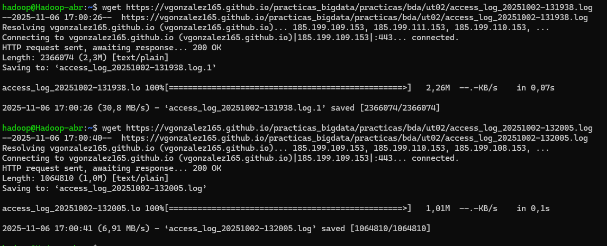

Ahora lo subimos del sistema de ficheros local a HDFS

```bash
hdfs dfs -put /home/hadoop/access_log_20251002-131938.log /proyectos/ecommerce/raw
hdfs dfs -put /home/hadoop/access_log_20251002-131938.log.1 /proyectos/ecommerce/raw
hdfs dfs -put /home/hadoop/access_log_20251002-132005.log /proyectos/ecommerce/raw
```

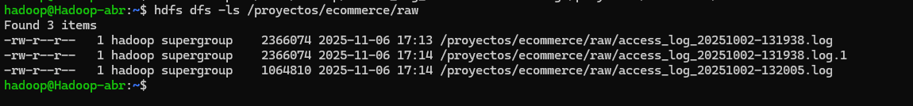

Contamos el número de líneas que tiene cada fichero

```bash
hdfs dfs -cat /proyectos/ecommerce/raw/access_log_20251002-131938.log | wc -l
hdfs dfs -cat /proyectos/ecommerce/raw/access_log_20251002-131938.log.1 | wc -l
hdfs dfs -cat /proyectos/ecommerce/raw/access_log_20251002-132005.log | wc -l
```

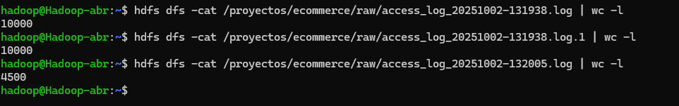

Copiamos los archivos de **raw** a **backup**

```bash
hdfs dfs -cp /proyectos/ecommerce/raw/access_log_20251002-131938.log /proyectos/ecommerce/backup
hdfs dfs -cp /proyectos/ecommerce/raw/access_log_20251002-131938.log.1 /proyectos/ecommerce/backup
hdfs dfs -cp /proyectos/ecommerce/raw/access_log_20251002-132005.log /proyectos/ecommerce/backup
```

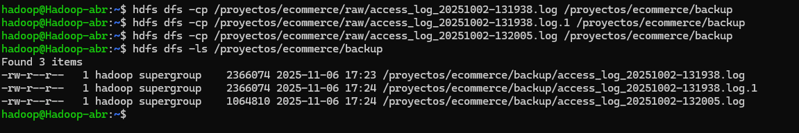

Movemos los archivos originales de **raw** a **procesados**

```bash
hdfs dfs -mv /proyectos/ecommerce/raw/access_log_20251002-131938.log /proyectos/ecommerce/procesados
hdfs dfs -mv /proyectos/ecommerce/raw/access_log_20251002-131938.log.1 /proyectos/ecommerce/procesados
hdfs dfs -mv /proyectos/ecommerce/raw/access_log_20251002-132005.log /proyectos/ecommerce/procesados
```

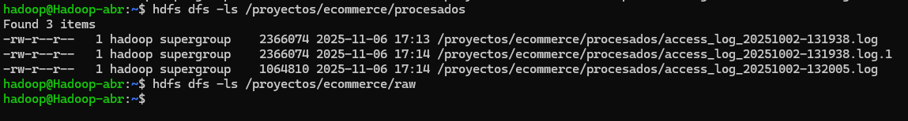

Revisamos los permisos de la carpeta **/proyectos/ecommerce**

```bash
hdfs dfs -ls  /proyectos/ecommerce
```

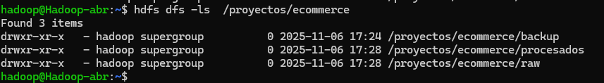

Cambiamos los permisos de **/procesados** para que todos los usuarios tengan solo permisos de lectura, pero no de escritura ni eliminación.

```bash
hdfs dfs -chmod 444 /proyectos/ecommerce/procesados
```
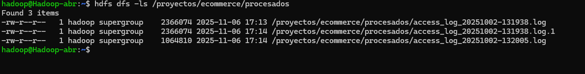

Como podemos ver aunque hemos asignado solo permisos de lectura, el propietario tiene tambíen de escritura

Borramos del directorio local los archivos de **logs**

```bash
rm access_log_20251002-131938.log
rm access_log_20251002-131938.log.1
rm access_log_20251002-132005.log
```

Nos disponemos a Descargar uno de los archivos desde HDFS hacia el Local

```bash
hdfs dfs -get /proyectos/ecommerce/procesados/access_log_20251002-131938.log /home/hadoop
```
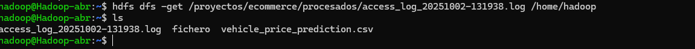


Subimos un archivo del directorio local a HDFS en **/raw**

```bash
hdfs dfs -put /home/hadoop/access_log_20251002-131938.log /proyectos/ecommerce/raw
```
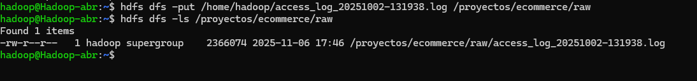


Eliminamos el archivo

```bash
hdfs dfs -rm /proyectos/ecommerce/raw/access_log_20251002-131938.log
```
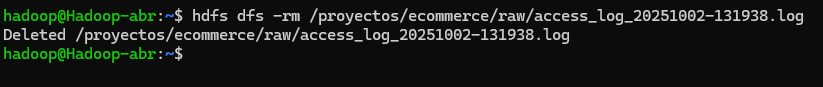

Configuramos una cuota de espacio en **/backup** (ejemplo: 10 MB)

```bash
hdfs dfsadmin -setSpaceQuota 10M /proyectos/ecommerce/backup
```
Comprobamos que se ha creado la cuota

```bash
hdfs dfs -count -q /proyectos/ecommerce/backup
```
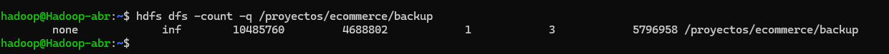

Creamos un archivo de mas de 10mb para ver si funciona
Lo primero lo creamos en linux local en /tmp/**archivo**y despues lo pasamos a Hadoop

```bash
dd if=/dev/zero of=/tmp/archivo10mb.dat bs=1M count=10
hdfs dfs -put /tmp/archivo10mb.dat /proyectos/ecommerce/backup
```
Nos saldrá el siguiente mensaje de error

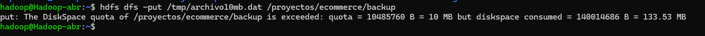