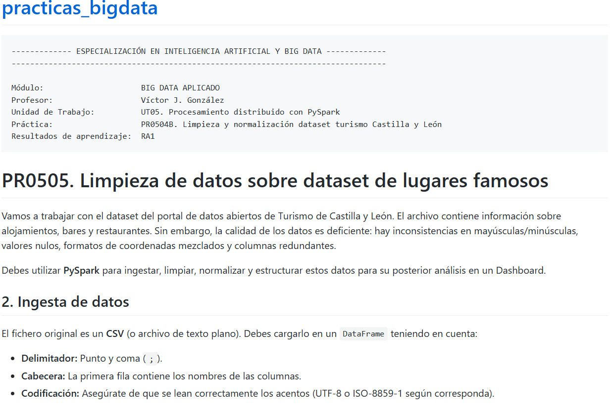
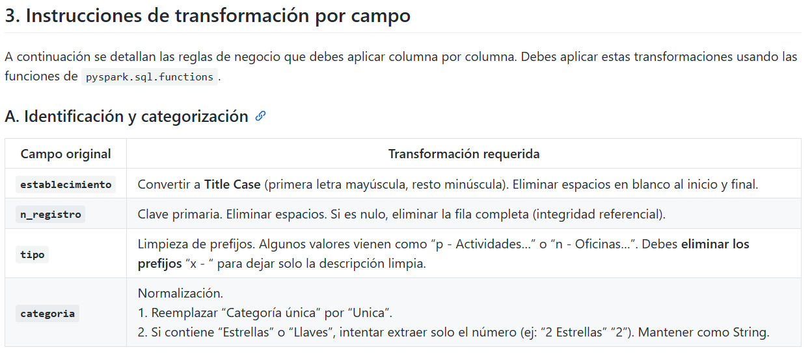
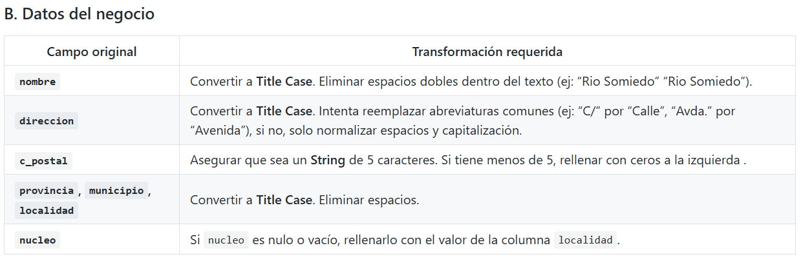
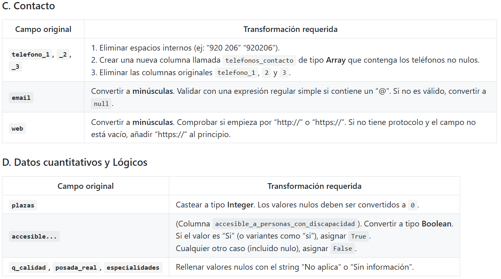
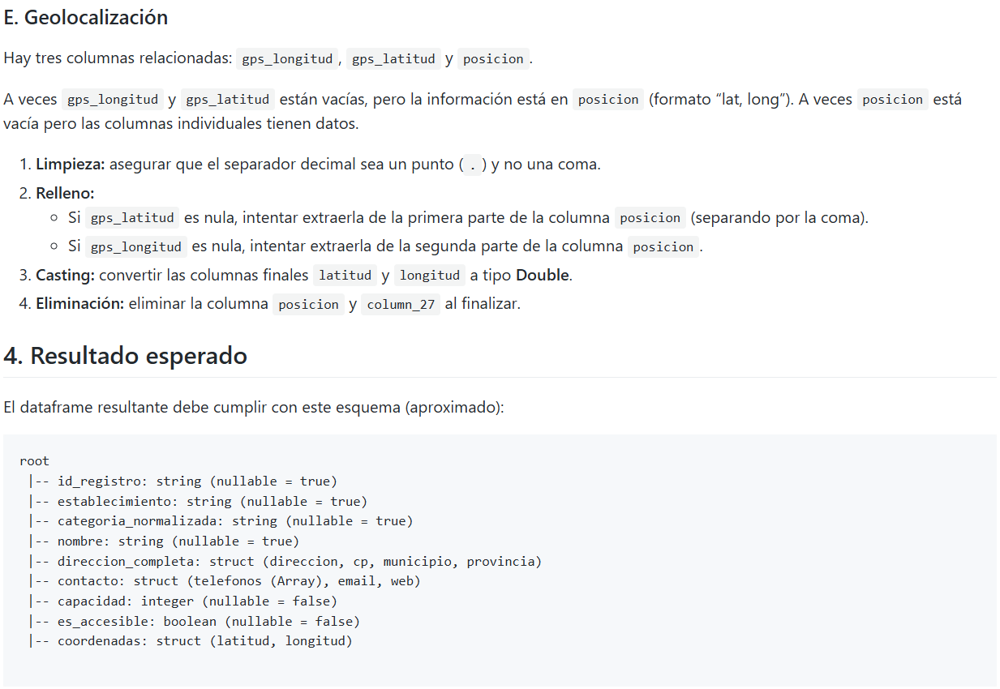

```python
#Creamos sesion de spark
from pyspark.sql import SparkSession

try:
    spark = ( SparkSession.builder
                .appName("angel_spark")
                .master("spark://spark-master:7077")
                .getOrCreate()
            )
    print("SparkSession iniciada correctamente.")
except Exception as e:
    print("Error en la conexion")
    print(e)

```

    SparkSession iniciada correctamente.


```python
from pyspark.sql.types import StructType, StructField, StringType, DoubleType, BooleanType,IntegerType, LongType
schema = StructType([
    StructField("Establecimiento",StringType(),True),
    StructField("n_registro",StringType(),True),
    StructField("codigo",StringType(),True),
    StructField("tipo",StringType(),True),
    StructField("categoria",StringType(),True),
    StructField("especialidades",StringType(),True),
    StructField("clase",StringType(),True),
    StructField("nombre",StringType(),True),
    StructField("direccion",StringType(),True),
    StructField("c_postal",IntegerType(),True),
    StructField("provincia",StringType(),True),
    StructField("municipio",StringType(),True),
    StructField("localidad",StringType(),True),
    StructField("nucleo",StringType(),True),
    StructField("tel1",IntegerType(),True),
    StructField("tel2",IntegerType(),True),
    StructField("tel3",IntegerType(),True),
    StructField("email",StringType(),True),
    StructField("web",StringType(),True),
    StructField("q_calidad",StringType(),True),
    StructField("posada_real",StringType(),True),
    StructField("plazas",IntegerType(),True), 
    StructField("gps_lon",DoubleType(),True),
    StructField("gps_lat",DoubleType(),True),
    StructField("personas_con_discapacidad",StringType(),True),
    StructField("column_27",StringType(),True),
    StructField("posicion",StringType(),True)
])
```


```python
df = (spark.read
        .format("csv")
        .option("header","true")
        .option("sep",";")
        .option("encoding", "ISO-8859-1")
        .schema(schema)
        .load("./registro-de-turismo-de-castilla-y-leon.csv")
     )
```




```python
from pyspark.sql.functions import col,trim,initcap,split,regexp_replace
df = (
    df
    .withColumn("Establecimiento",trim(initcap(col("Establecimiento"))))
    .withColumn("n_registro",trim(col("n_registro")))
    .withColumn("tipo",split(col("tipo"),"-")[1])
    .withColumn("categoria", regexp_replace(col("categoria"),"Categoría única","Unica"))
    .withColumn("categoria",regexp_replace(col("categoria"),"Estrellas",""))
)
df = df.where(col("n_registro").isNotNull())
```


```python
df.select(col("Establecimiento"),col("n_registro"),col("tipo"),col("categoria")).show(10)
```

    +--------------------+----------+----+-----------------+
    |     Establecimiento|n_registro|tipo|        categoria|
    +--------------------+----------+----+-----------------+
    |      Turismo Activo| 47/000047|NULL|             NULL|
    |Alojam. Turismo R...| 05/000788|NULL|               3 |
    |Alojam. Turismo R...| 05/000696|NULL|               4 |
    |Alojam. Turismo R...| 05/001050|NULL|               4 |
    |               Bares| 05/002525|NULL|Categoría única|
    |               Bares| 05/000864|NULL|Categoría única|
    |               Bares| 05/003351|NULL|Categoría única|
    |               Bares| 05/001762|NULL|Categoría única|
    |         Cafeterã­as| 05/000033|NULL|     2ª - 1 Taza|
    |         Cafeterã­as| 05/000032|NULL|     2ª - 1 Taza|
    +--------------------+----------+----+-----------------+
    only showing top 10 rows
    





```python
from pyspark.sql.functions import initcap,lpad,when
df = (
    df
    .withColumn("nombre",initcap(col("nombre")))
    .withColumn("nombre",regexp_replace(col("nombre"),"  "," "))
    .withColumn("direccion",initcap(col("direccion")))
    .withColumn("direccion",regexp_replace(col("direccion"),"C/","Calle"))
    .withColumn("direccion",regexp_replace(col("direccion"),"Avda","Avenida"))
    .withColumn("c_postal",lpad(col("c_postal"),5,"00000"))
    .withColumn("provincia",initcap(col("provincia")))
    .withColumn("municipio",initcap(col("municipio")))
    .withColumn("localidad",initcap(col("localidad")))
    .withColumn("provincia",trim(col("provincia")))
    .withColumn("municipio",trim(col("municipio")))
    .withColumn("localidad",trim(col("localidad")))
    .withColumn("nucleo",when(col("nucleo").isNotNull(),col("nucleo")).otherwise(col("localidad")))
)
```


```python
df.select(col("nombre"),col("direccion"),col("c_postal"),col("provincia"),col("municipio"),col("localidad"),col("nucleo")).show(7)
```

    +--------------------+--------------------+--------+---------+---------+---------------+---------------+
    |              nombre|           direccion|c_postal|provincia|municipio|      localidad|         nucleo|
    +--------------------+--------------------+--------+---------+---------+---------------+---------------+
    |Bernardo Moro Men...|Calle Rio Somiedo...|   33840| Asturias|  Somiedo|Pola De Somiedo|POLA DE SOMIEDO|
    |       La Sastrerãa|Calle Veintiocho ...|   05296|   Ávila|  Adanero|        Adanero|        ADANERO|
    |         Las Hazanas|       Plaza Mayor 4|   05296|   Ávila|  Adanero|        Adanero|        ADANERO|
    | La Casita Del Pajar|   Plaza Mayor 4   B|   05296|   Ávila|  Adanero|        Adanero|        ADANERO|
    |            Maracana|Calle 28 De Junio...|   05296|   Ávila|  Adanero|        Adanero|        ADANERO|
    |               Plaza|      Plaza Mayor, 7|   05296|   Ávila|  Adanero|        Adanero|        Adanero|
    |          La Oficina|    Calle Estanque 8|   05296|   Ávila|  Adanero|        Adanero|        ADANERO|
    +--------------------+--------------------+--------+---------+---------+---------------+---------------+
    only showing top 7 rows
    





```python
from pyspark.sql.functions import array,lower,concat,lit
df = (
    df
    .withColumn("tel1",regexp_replace(col("tel1")," ",""))
    .withColumn("tel2",regexp_replace(col("tel2")," ",""))
    .withColumn("tel3",regexp_replace(col("tel3")," ",""))
    .withColumn("telefonos_contactos",array(col("tel1"),col("tel2"),col("tel3")))
    .withColumn("email", lower(col("email")))
    .withColumn("email", when(col("email").like("%@%"),col("email")).otherwise(None))
    .withColumn("web",lower(col("web")))
    .withColumn("web",when((col("web").isNotNull())& ((col("web").like("https://%"))| (col("web").like("http://%"))),concat(lit("https://"),col("web"))).otherwise(None))
    
)
df = df.drop(col("tel1"),col("tel2"),col("tel3"))
```


```python
df.select(col("telefonos_contactos"),col("email"),col("web")).show(2)
```

    +--------------------+--------------------+----+
    | telefonos_contactos|               email| web|
    +--------------------+--------------------+----+
    |[616367277, NULL,...|bernardomoro@hotm...|NULL|
    |[920307158, 60694...|                NULL|NULL|
    +--------------------+--------------------+----+
    only showing top 2 rows
    





```python
df = (
    df
    .withColumn("plazas",col("plazas").cast("Integer"))
    .withColumn("plazas",when(col("plazas").isNull(),lit(0)).otherwise(col("plazas")))
    .withColumn("personas_con_discapacidad",when(col("personas_con_discapacidad") == "Si",True).otherwise(False))
    .withColumn("personas_con_discapacidad",col("personas_con_discapacidad").cast("Boolean"))
    
)
```


```python
df.select(col("plazas"),col("personas_con_discapacidad")).show(20)
```

    +------+-------------------------+
    |plazas|personas_con_discapacidad|
    +------+-------------------------+
    |     0|                    false|
    |     6|                    false|
    |     8|                    false|
    |     2|                    false|
    |    42|                     true|
    |     0|                    false|
    |    50|                    false|
    |     0|                    false|
    |    20|                    false|
    |    20|                     true|
    |   310|                    false|
    |     5|                     true|
    |    16|                    false|
    |     0|                    false|
    |     0|                    false|
    |    84|                    false|
    |     8|                    false|
    |     4|                    false|
    |     8|                    false|
    |     5|                     true|
    +------+-------------------------+
    only showing top 20 rows
    


```python
from pyspark.sql.functions import concat_ws
df = (
    df
    .withColumn("gps_lon",regexp_replace(col("gps_lon"),",","."))
    .withColumn("gps_lat",regexp_replace(col("gps_lat"),",","."))
    .withColumn("posicion", when(col("posicion").isNull(),concat_ws(", ",col("gps_lon"),col("gps_lat"))).otherwise(col("posicion")))
    .withColumn("gps_lon", when(col("posicion").isNull(),split(col("posicion"),",")[1]).otherwise(col("gps_lon")))
    .withColumn("gps_lat", when(col("posicion").isNull(),split(col("posicion"),",")[0]).otherwise(col("gps_lat")))
    )
```


```python
print("la latitud en posicion va primero que longitud")
df.select(col("gps_lat"),col("gps_lon"),col("posicion")).show(30)

```

    la latitud en posicion va primero que longitud
    +----------+----------+--------------------+
    |   gps_lat|   gps_lon|            posicion|
    +----------+----------+--------------------+
    |      NULL|      NULL|                    |
    |      NULL|      NULL|                    |
    |40.9438881|-4.6033331|40.9438881, -4.60...|
    |40.9438889|-4.6033333|40.9438889, -4.60...|
    |      NULL|      NULL|                    |
    |      NULL|      NULL|                    |
    |      NULL|      NULL|                    |
    |      NULL|      NULL|                    |
    |      NULL|      NULL|                    |
    |      NULL|      NULL|                    |
    |      NULL|      NULL|                    |
    |      NULL|      NULL|                    |
    | 40.966576| -4.626714|40.966576, -4.626714|
    | 40.310505| -4.660014|40.310505, -4.660014|
    |40.2988889|     -4.64|   40.2988889, -4.64|
    | 40.270923| -4.667272|40.270923, -4.667272|
    |40.3005145|-4.6366815|40.3005145, -4.63...|
    |      NULL|      NULL|                    |
    |40.3005145|-4.6366815|40.3005145, -4.63...|
    | 40.303637| -4.639196|40.303637, -4.639196|
    |      NULL|      NULL|                    |
    |  40.29953|  -4.63589|  40.29953, -4.63589|
    |      NULL|      NULL|                    |
    |40.2934554| -4.651727|40.2934554, -4.65...|
    |      NULL|      NULL|                    |
    |40.2995582|-4.6365342|40.2995582, -4.63...|
    |      NULL|      NULL|                    |
    |      NULL|      NULL|                    |
    |40.3072222|-4.6580556|40.3072222, -4.65...|
    |  40.30324|  -4.63881|  40.30324, -4.63881|
    +----------+----------+--------------------+
    only showing top 30 rows
    


```python
df.printSchema()
```

    root
     |-- Establecimiento: string (nullable = true)
     |-- n_registro: string (nullable = true)
     |-- codigo: string (nullable = true)
     |-- tipo: string (nullable = true)
     |-- categoria: string (nullable = true)
     |-- especialidades: string (nullable = true)
     |-- clase: string (nullable = true)
     |-- nombre: string (nullable = true)
     |-- direccion: string (nullable = true)
     |-- c_postal: string (nullable = true)
     |-- provincia: string (nullable = true)
     |-- municipio: string (nullable = true)
     |-- localidad: string (nullable = true)
     |-- nucleo: string (nullable = true)
     |-- email: string (nullable = true)
     |-- web: string (nullable = true)
     |-- q_calidad: string (nullable = true)
     |-- posada_real: string (nullable = true)
     |-- plazas: integer (nullable = true)
     |-- gps_lon: string (nullable = true)
     |-- gps_lat: string (nullable = true)
     |-- personas_con_discapacidad: boolean (nullable = false)
     |-- column_27: string (nullable = true)
     |-- posicion: string (nullable = true)
     |-- telefonos_contactos: array (nullable = false)
     |    |-- element: string (containsNull = true)
    

