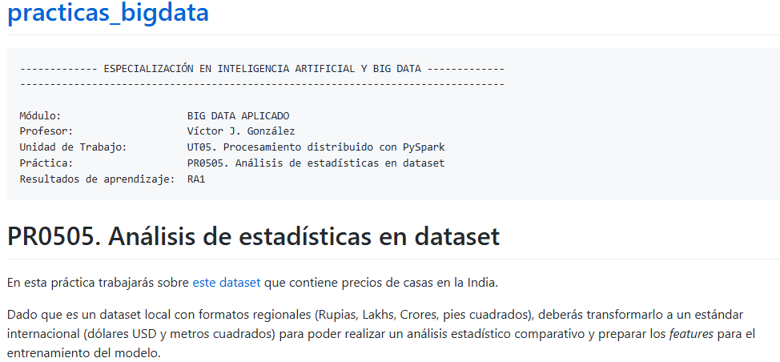
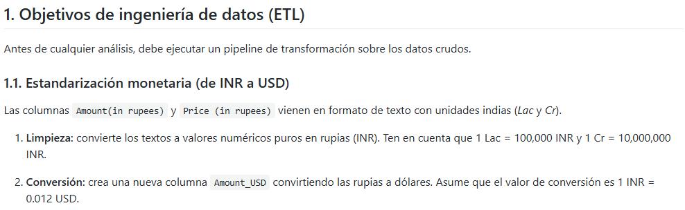
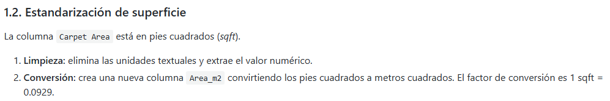
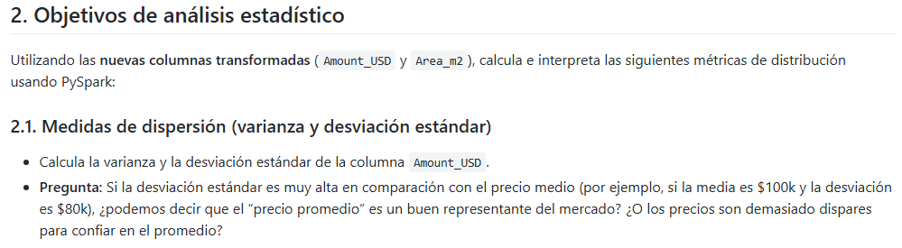
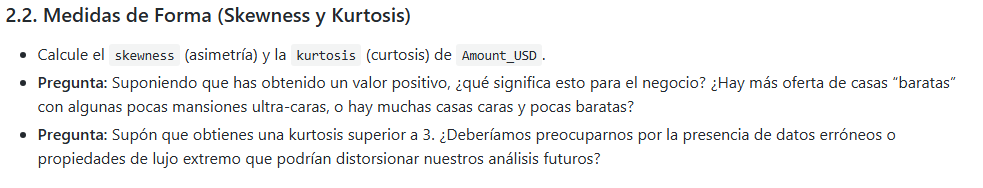
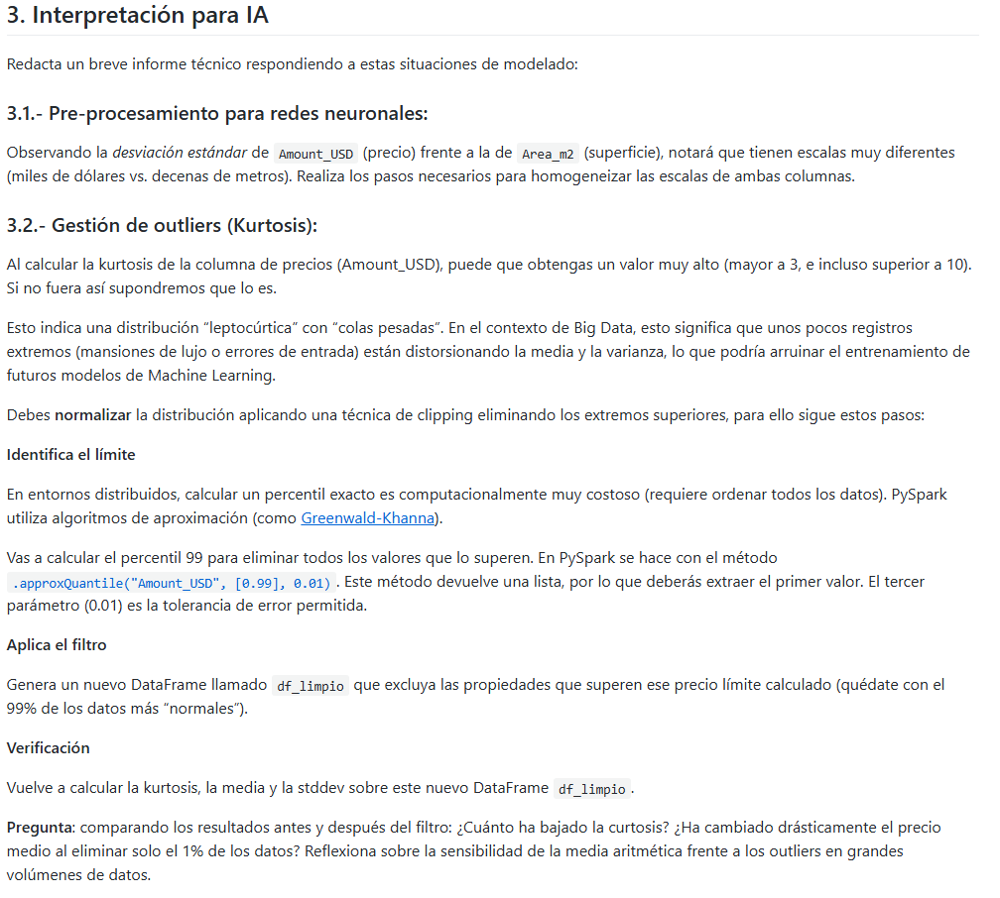
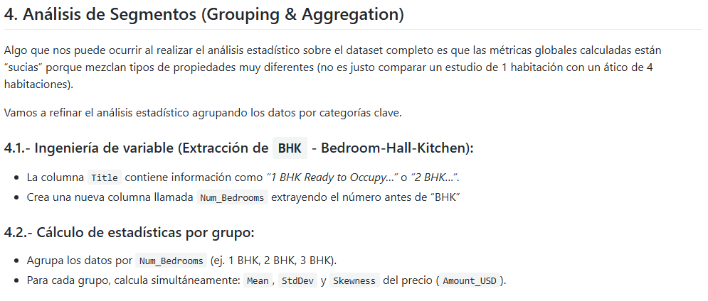
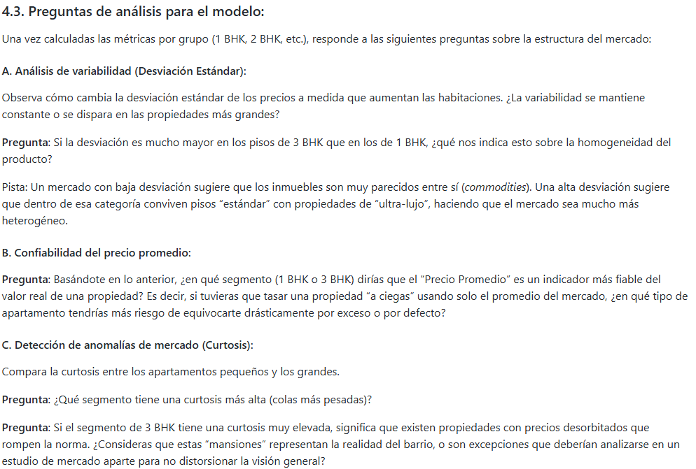

```python
#Creamos la sesion y cogemos los datos
from pyspark.sql import SparkSession

try:
    spark = ( SparkSession.builder
                .appName("angel_spark")
                .master("spark://spark-master:7077")
                .getOrCreate()
            )
    print("SparkSession iniciada correctamente.")
except Exception as e:
    print("Error en la conexion")
    print(e)
from pyspark.sql.types import StructType, StructField, StringType, DoubleType, BooleanType,IntegerType, LongType
schema2 = StructType([
    StructField("index",IntegerType(),True),
    StructField("Title",StringType(),True),
    StructField("Description",StringType(),True),
    StructField("Amount",StringType(),True),
    StructField("Price",StringType(),True),
    StructField("Location",StringType(),True),
    StructField("Carpet Area",StringType(),True),
    StructField("Status",StringType(),True),
    StructField("Floor",StringType(),True),
    StructField("Transaction",StringType(),True),
    StructField("Furnishing",StringType(),True),
    StructField("Facing",StringType(),True),
    StructField("Overlooking",StringType(),True),
    StructField("Society",StringType(),True),
    StructField("Bathroom",IntegerType(),True),
    StructField("Balcony",IntegerType(),True),
    StructField("Car Parking",StringType(),True),
    StructField("Ownership",StringType(),True),
    StructField("Super Area",StringType(),True),
    StructField("Dimensions",StringType(),True),
    StructField("Plot Area",StringType(),True)
])
df = (spark.read
        .format("csv")
        .option("header","true")
        .option("sep",",")
        .schema(schema2)
        .load("house_prices.csv")
     )

df.show(1)
```

    SparkSession iniciada correctamente.
    +-----+--------------------+--------------------+-------+-----+--------+-----------+-------------+------------+-----------+-----------+------+-----------+--------------------+--------+-------+-----------+---------+----------+----------+---------+
    |index|               Title|         Description| Amount|Price|Location|Carpet Area|       Status|       Floor|Transaction| Furnishing|Facing|Overlooking|             Society|Bathroom|Balcony|Car Parking|Ownership|Super Area|Dimensions|Plot Area|
    +-----+--------------------+--------------------+-------+-----+--------+-----------+-------------+------------+-----------+-----------+------+-----------+--------------------+--------+-------+-----------+---------+----------+----------+---------+
    |    0|1 BHK Ready to Oc...|Bhiwandi, Thane h...|42 Lac | 6000|   thane|   500 sqft|Ready to Move|10 out of 11|     Resale|Unfurnished|  NULL|       NULL|Srushti Siddhi Ma...|       1|      2|       NULL|     NULL|      NULL|      NULL|     NULL|
    +-----+--------------------+--------------------+-------+-----+--------+-----------+-------------+------------+-----------+-----------+------+-----------+--------------------+--------+-------+-----------+---------+----------+----------+---------+
    only showing top 1 row
    





```python
from pyspark.sql.functions import col, count
df = df.filter(col("Amount") != "Call for Price")
df = df.dropna(subset=["Price"])
```


```python
from pyspark.sql.functions import initcap,trim,regexp_replace,col,split

df = (
    df
    .withColumn("Amount_aux",regexp_replace(col("Amount"),"Lac","100000")) 
    .withColumn("Amount_aux",regexp_replace(col("Amount_aux"),"Cr","10000000")) 
    .withColumn("Amount_primer_valor",split(col("Amount_aux")," ")[0])
    .withColumn("Amount_segundo_valor",split(col("Amount_aux")," ")[1])
    .withColumn("Amount", (col("Amount_primer_valor") * col("Amount_segundo_valor")).cast("int"))
    .withColumn("Amount_USD",col("Amount")*0.012)
)


df.select("Amount","Price","Amount_USD").show(26)
```

    +--------+-----+----------+
    |  Amount|Price|Amount_USD|
    +--------+-----+----------+
    | 4200000| 6000|   50400.0|
    | 9800000|13799|  117600.0|
    |14000000|17500|  168000.0|
    |16000000|18824|  192000.0|
    | 4500000| 6618|   54000.0|
    | 1650000| 2538|   19800.0|
    | 6000000|10435|   72000.0|
    | 6000000|10000|   72000.0|
    |16000000|11150|  192000.0|
    |14000000|12174|  168000.0|
    |13600000|11674|  163200.0|
    |13500000|15995|  162000.0|
    |42500000|17526|  510000.0|
    | 7500000|11538|   90000.0|
    | 9000000|10000|  108000.0|
    | 3700000| 5736|   44400.0|
    | 3500000| 6481|   42000.0|
    | 9000000|11250|  108000.0|
    | 3500000| 6731|   42000.0|
    | 5400000| 8571|   64800.0|
    |16500000|15000|  198000.0|
    | 8500000|12213|  102000.0|
    |12800000|10940|  153600.0|
    | 4200000| 7241|   50400.0|
    | 2400000| 6648|   28800.0|
    | 6100000| 9683|   73200.0|
    +--------+-----+----------+
    only showing top 26 rows
    





```python
df = (
    df
    .withColumn("Carpet Area",regexp_replace(col("Carpet Area"),"sqft",""))
    .withColumn("Area_m2", col("Carpet Area")*0.0929)
)
df.select("Carpet Area","Area_m2").show(3)
```

    +-----------+------------------+
    |Carpet Area|           Area_m2|
    +-----------+------------------+
    |       500 |46.449999999999996|
    |       473 |           43.9417|
    |       779 |           72.3691|
    +-----------+------------------+
    only showing top 3 rows
    




Varianza


```python
from pyspark.sql.functions import variance,stddev
df.select(variance(col("Amount_USD"))).show(3)
```

    +--------------------+
    |var_samp(Amount_USD)|
    +--------------------+
    | 4.28676368458657E10|
    +--------------------+
    


```python
df.select(variance(col("Area_m2"))).show()
```

    +-----------------+
    |var_samp(Area_m2)|
    +-----------------+
    | 94290.2191090969|
    +-----------------+
    


Desviación Típico


```python
df.select(stddev(col("Amount_USD"))).show()
```

    +------------------+
    |stddev(Amount_USD)|
    +------------------+
    | 207045.0116420719|
    +------------------+
    


```python
df.select(stddev(col("Area_m2"))).show()
```

    +-----------------+
    |  stddev(Area_m2)|
    +-----------------+
    |307.0671247611781|
    +-----------------+
    


### **No podriamos confiar en el promedio ya que la disparidad entre los precios es muy grande**




```python
from pyspark.sql.functions import skewness
df.select(skewness(col("Amount_USD"))).show()
```

    +--------------------+
    |skewness(Amount_USD)|
    +--------------------+
    |   48.87848311102165|
    +--------------------+
    


```python
from pyspark.sql.functions import kurtosis
df.select(kurtosis(col("Amount_USD"))).show()
```

    +--------------------+
    |kurtosis(Amount_USD)|
    +--------------------+
    |    5606.95560101142|
    +--------------------+
    


## Pregunta 1

    Teniendo un valor positivo, significa que para el negocio que los datos están sesgados en este caso para la izquierda(Hay muchas ofertas de casas baratas y una pocas de casa ultra caras)

## Pregunta 2

    Teniendo un Kurtosis superior a 3, la probabilida de datos que son outliers es muy alta, teniendo que tratar los datos por la presencia de datos erroneos a casas de lujos en este caso
    



**Normalizamos**


```python
from pyspark.sql.functions import mean
stats = (df.agg(
    mean("Amount_USD").alias("Media"),
    stddev("Amount_USD").alias("Desviacion")
))
stats.show()
```

    +------------------+-----------------+
    |             Media|       Desviacion|
    +------------------+-----------------+
    |142602.42093646617|207045.0116420719|
    +------------------+-----------------+
    


```python
media,desviacion = stats.collect()[0]
#Collect te devuelve una lista de listas, como solo tengo una fila et devuelve = ((142602,207045)), entonces con el [0] coges la primera fila y con el desempaquetado los asiganas a variables
```


```python
media
```


    142602.42093646617


```python
desviacion
```


    207045.0116420719


```python
df_analisis = (
    df
    .withColumn("Z_SCORE",(col("Amount_USD") - media)/desviacion)
)
df_analisis.select("Z_SCORE").show(10)
```

    +--------------------+
    |             Z_SCORE|
    +--------------------+
    |-0.44532548842983316|
    |-0.12075838359095066|
    | 0.12266694503821121|
    | 0.23858376819495494|
    | -0.4279379649563216|
    | -0.5931194379546815|
    | -0.3410003475887638|
    | -0.3410003475887638|
    | 0.23858376819495494|
    | 0.12266694503821121|
    +--------------------+
    only showing top 10 rows
    


**Cliping**


```python
from pyspark.sql.functions import approx_percentile
percentiles = (
    df.agg(
        approx_percentile(col("Amount_USD"),0.99).alias("q99"),
        approx_percentile(col("Amount_USD"),0.01).alias("q01")
))

percentiles.show()
```

    +--------+-------+
    |     q99|    q01|
    +--------+-------+
    |840000.0|19200.0|
    +--------+-------+
    


                                                                                    


```python
q99,q01 = percentiles.collect()[0]
```


```python
q99
```


    840000.0


```python
q01
```


    19200.0


```python
# en vez de hacer clipping hacemos filter
df_limpio = df.filter(
    (col("Amount_USD") > q01) & 
    (col("Amount_USD") < q99)
)

```


```python
df_limpio.select("Amount_USD").show()
```

    +----------+
    |Amount_USD|
    +----------+
    |   50400.0|
    |  117600.0|
    |  168000.0|
    |  192000.0|
    |   54000.0|
    |   19800.0|
    |   72000.0|
    |   72000.0|
    |  192000.0|
    |  168000.0|
    |  163200.0|
    |  162000.0|
    |  510000.0|
    |   90000.0|
    |  108000.0|
    |   44400.0|
    |   42000.0|
    |  108000.0|
    |   42000.0|
    |   64800.0|
    +----------+
    only showing top 20 rows
    


Volvemos a calcular kurtois, media y desviación típica


```python
from pyspark.sql.functions import kurtosis
df_limpio.select(kurtosis(col("Amount_USD"))).show()
```

    +--------------------+
    |kurtosis(Amount_USD)|
    +--------------------+
    |   6.034717034641753|
    +--------------------+
    


                                                                                    


```python
stats = (df_limpio.agg(
    mean("Amount_USD").alias("Media"),
    stddev("Amount_USD").alias("Desviacion")
))
media,desviacion = stats.collect()[0]
```

                                                                                    


```python
media
```


    132818.70397111383


```python
desviacion
```


    114966.95083876402





```python
df = (
    df_limpio
    .withColumn("Num_Bedrooms",split(col("title")," BHK")[0])
    
)
```


```python
df.select("Num_Bedrooms","title").show()
```

    +------------+--------------------+
    |Num_Bedrooms|               title|
    +------------+--------------------+
    |           1|1 BHK Ready to Oc...|
    |           2|2 BHK Ready to Oc...|
    |           2|2 BHK Ready to Oc...|
    |           2|2 BHK Ready to Oc...|
    |           1|1 BHK Ready to Oc...|
    |           1|1 BHK Ready to Oc...|
    |           1|1 BHK Ready to Oc...|
    |           1|1 BHK Ready to Oc...|
    |           3|3 BHK Ready to Oc...|
    |           3|3 BHK Ready to Oc...|
    |           2|2 BHK Ready to Oc...|
    |           2|2 BHK Ready to Oc...|
    |           4|4 BHK Ready to Oc...|
    |           1|1 BHK Ready to Oc...|
    |           2|2 BHK Ready to Oc...|
    |           1|1 BHK Ready to Oc...|
    |           1|1 BHK Ready to Oc...|
    |           2|2 BHK Ready to Oc...|
    |           1|1 BHK Ready to Oc...|
    |           1|1 BHK Ready to Oc...|
    +------------+--------------------+
    only showing top 20 rows
    


```python
df.select("Num_Bedrooms").distinct().show(truncate = False)
```

    [Stage 125:=================================================>       (7 + 1) / 8]

    +------------------------------------------------------------+
    |Num_Bedrooms                                                |
    +------------------------------------------------------------+
    |7                                                           |
    |3                                                           |
    |> 10                                                        |
    |8                                                           |
    | Studio Apartment for sale in Mhatre Apt Nandivli           |
    | Studio Apartment for sale Kalyan                           |
    | Studio Apartment for sale Dombivli                         |
    |5                                                           |
    | Apartment for sale South Bopal, Bopal                      |
    |6                                                           |
    | Studio Apartment for sale Ghatkopar East                   |
    | Studio Apartment for sale Chembur                          |
    | Studio Apartment for sale Narolgam                         |
    | Apartment for sale S R Layout Murgesh Pallya               |
    | Studio Apartment for sale Badlapur (East) Thane            |
    | Studio Apartment for sale Nandivali Gaon                   |
    | Studio Apartment for sale Thane West                       |
    | Studio Apartment for sale Thakur Complex                   |
    | Studio Apartment for sale in Uniworld India Electronic City|
    | Studio Apartment for sale in Sun Flash Apartment Vashi     |
    +------------------------------------------------------------+
    only showing top 20 rows
    


                                                                                    


```python
df_habitaciones = (
    df.filter(col("Num_Bedrooms") >= 1)
)
```


```python
df_habitaciones.select("Num_Bedrooms").distinct().show()
```

    [Stage 128:=================================================>       (7 + 1) / 8]

    +------------+
    |Num_Bedrooms|
    +------------+
    |           7|
    |           3|
    |           8|
    |           5|
    |           6|
    |           9|
    |           1|
    |          10|
    |           4|
    |           2|
    +------------+
    


                                                                                    


```python
from pyspark.sql.functions import col, count, median
```


```python
df_agrupado = (
    df_habitaciones
    .groupBy("Num_Bedrooms")
    .agg(
        mean(col("Amount_USD")).alias("media"),
        median(col("Amount_USD")).alias("mediana"),
        stddev(col("Amount_USD")).alias("Desviacion"),
        skewness(col("Amount_USD")),
        kurtosis(col("Amount_USD")).alias("kurtosis"),
        count(col("Amount_USD")).alias("count"),
    )
)
```


```python
df_agrupado.show()
```

    [Stage 134:==============>                                          (2 + 6) / 8]

    +------------+------------------+--------+------------------+--------------------+--------------------+-----+
    |Num_Bedrooms|             media| mediana|        Desviacion|skewness(Amount_USD)|            kurtosis|count|
    +------------+------------------+--------+------------------+--------------------+--------------------+-----+
    |           7|269538.46153846156|222000.0|158009.01629580898| 0.43332821947377914|  -1.266064846902077|   13|
    |           3|159654.27508237024|126000.0|107988.74024566935|   2.165439848806813|  7.2381388206650925|75913|
    |           8|          486624.0|600000.0| 299155.5763812535| -0.7279657699001292| -0.8489282943749998|    5|
    |           5| 447969.3253724341|510000.0| 192177.8537308668|-0.37503129215028824|  -1.087387318471032|  682|
    |           6|       366459.9996|306000.0|227885.65477594017|  0.6403426809951196| -0.8188826753654324|   60|
    |           9|436285.71428571426|450000.0| 190736.9167952849| -0.2051309353148022| -1.4406103915346804|    7|
    |           1|44672.272170684875| 33480.0|32601.589767360485|   4.196965390372227|   34.53312128820507| 9374|
    |          10|          303600.0|283800.0|183832.34598016593|  0.4598530097953814| -0.4398441187152824|    8|
    |           4|296139.33260833455|321600.0| 148829.2674587024|  0.5244057888559659|0.023729346250544125|14446|
    |           2| 74823.06705347291| 65880.0| 46717.80517353504|  2.8573785486957735|   19.12199202261694|65435|
    +------------+------------------+--------+------------------+--------------------+--------------------+-----+
    


                                                                                    



Si la desviación es mayor, nos indica la presencia de habitaciones con valores muy extremos en el precio, haciendo que la distribucion no sea homogenea

Tendría más oportunidades de equivocarme en el que tuviera más variabilidad y con valores más atípicos(es decir con la Kurtosis más amplia) por lo tanto sera menos fiable la de 1 habitación

El segmento que tiene una curtosis más alta es: Habitaciones 1, son excepciones que deberian estudiarse para no estropear la visión general del mercado
