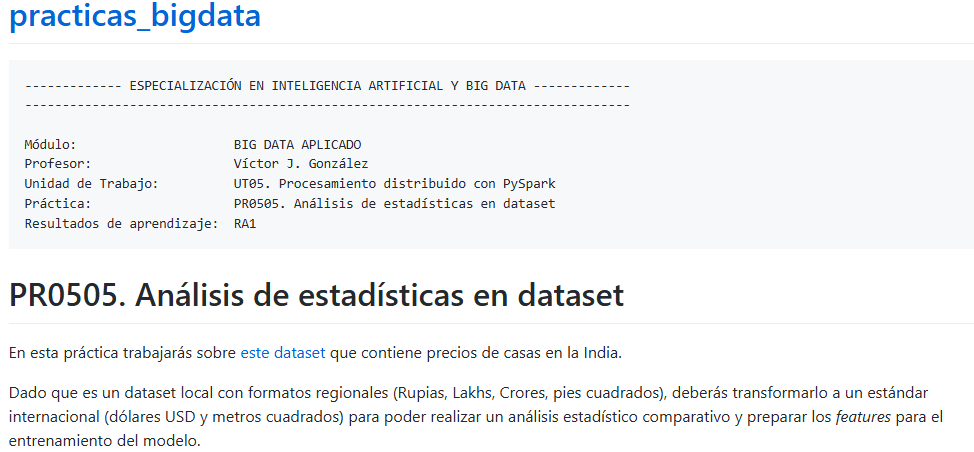
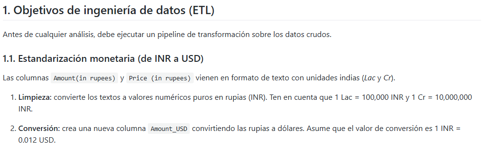
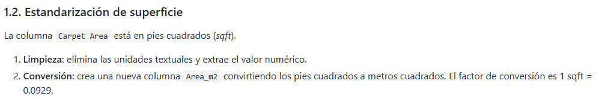
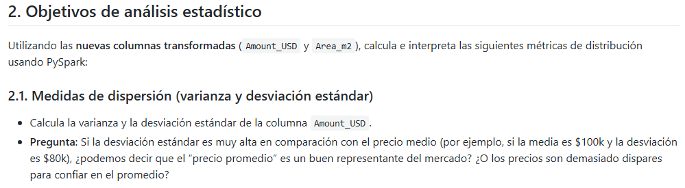
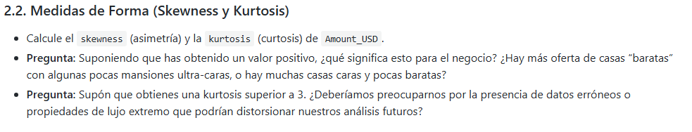
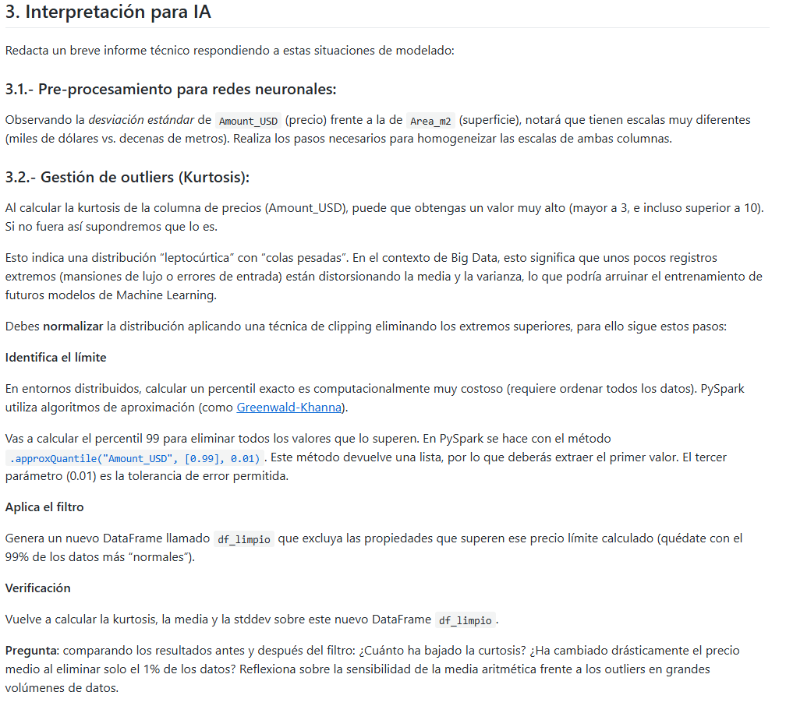
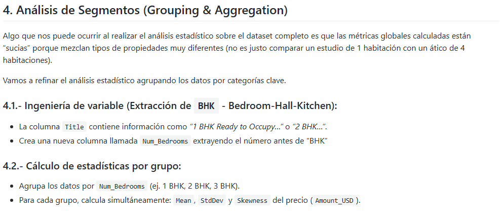
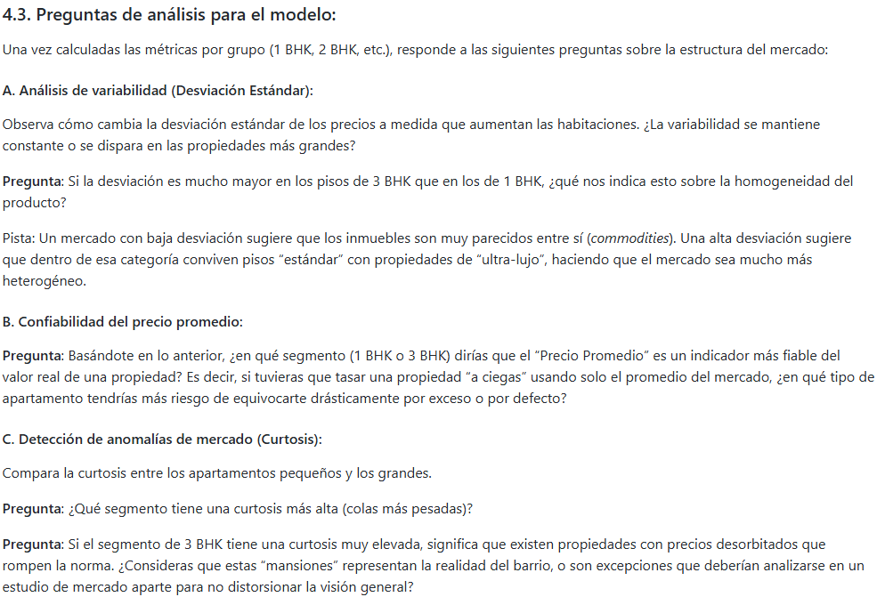

```python
#Creamos sesion de spark
from pyspark.sql import SparkSession

try:
    spark = ( SparkSession.builder
                .appName("angel_spark")
                .master("spark://spark-master:7077")
                .getOrCreate()
            )
    print("SparkSession iniciada correctamente.")
except Exception as e:
    print("Error en la conexion")
    print(e)

```

    Setting default log level to "WARN".
    To adjust logging level use sc.setLogLevel(newLevel). For SparkR, use setLogLevel(newLevel).
    26/03/06 22:16:07 WARN NativeCodeLoader: Unable to load native-hadoop library for your platform... using builtin-java classes where applicable


    SparkSession iniciada correctamente.





```python
from pyspark.sql.types import StructType, StructField, StringType, DoubleType, BooleanType,IntegerType, LongType
schema = StructType([
    StructField("Index",IntegerType(),True),
    StructField("Title",StringType(),True),
    StructField("Description",StringType(),True),
    StructField("Amount",StringType(),True),
    StructField("Price",IntegerType(),True),
    StructField("Location",StringType(),True),
    StructField("Carpet Area",StringType(),True),
    StructField("Status",StringType(),True),
    StructField("Floor",StringType(),True),
    StructField("Transaction",StringType(),True),
    StructField("Furnishing",StringType(),True),
    StructField("Facing",StringType(),True),
    StructField("Overlooking",StringType(),True),
    StructField("Society",StringType(),True),
    StructField("Bathroom",IntegerType(),True),
    StructField("Balcony",IntegerType(),True),
    StructField("Car Parking",StringType(),True),
    StructField("Ownership",StringType(),True),
    StructField("Super Area",StringType(),True),
    StructField("Dimensions",StringType(),True),
    StructField("Plot Aera",StringType(),True)
])
```


```python
df = (spark.read
        .format("csv")
        .option("header","true")
        .schema(schema)
        .load("./practicar_examen/house_prices.csv")
     )
df = df.filter(col("Amount") != "Call for Price")
df = df.dropna(subset=["Price"])
```




```python
from pyspark.sql.functions import col, count
df = df.filter(col("Amount") != "Call for Price")
df = df.dropna(subset=["Price"])
```


```python
from pyspark.sql.functions import split,col,lit,regexp_replace,cast

df = (
    df
    .withColumn("amount_aux1",split(col("Amount")," ")[0])
    .withColumn("amount_aux2",split(col("Amount")," ")[1])
    .withColumn("amount_aux2",regexp_replace(col("amount_aux2"),"Lac",lit(100000)))
    .withColumn("amount_aux2",regexp_replace(col("amount_aux2"),"Cr",lit(10000000)))
    .withColumn("Amount",col("amount_aux1") * col("amount_aux2"))
    .withColumn("Amount_USD",(col("Amount") * 0.012).cast("float"))
    .withColumn("area_aux",split(col("Carpet Area")," ")[1])
    .withColumn("Carpet Area",split(col("Carpet Area")," ")[0])
    .withColumn("area_aux",regexp_replace(col("area_aux"),"sqft",lit(0.0929)))
    .withColumn("Carpet Area",col("Carpet Area") * col("area_aux"))
)
```


```python
df.select(col("Amount"),col("amount_aux1"),col("amount_aux2"),col("Amount_USD"),col("Carpet Area")).show(2)
```

                                                                                    

    +---------+-----------+-----------+----------+------------------+
    |   Amount|amount_aux1|amount_aux2|Amount_USD|       Carpet Area|
    +---------+-----------+-----------+----------+------------------+
    |4200000.0|         42|     100000|   50400.0|46.449999999999996|
    |9800000.0|         98|     100000|  117600.0|           43.9417|
    +---------+-----------+-----------+----------+------------------+
    only showing top 2 rows
    


```python
df = (
    df
    .withColumn("Carpet Area",regexp_replace(col("Carpet Area"),"sqft",""))
    .withColumn("Area_m2", col("Carpet Area")*0.0929)
)
df.select("Carpet Area","Area_m2").show(3)
```

    +------------------+-----------------+
    |       Carpet Area|          Area_m2|
    +------------------+-----------------+
    |46.449999999999996|         4.315205|
    |           43.9417|4.082183929999999|
    |           72.3691|       6.72308939|
    +------------------+-----------------+
    only showing top 3 rows
    







```python
from pyspark.sql.functions import variance
df.select(variance(col("Amount_USD"))).show()
```

    [Stage 2:=======>                                                   (1 + 7) / 8]

    +--------------------+
    |var_samp(Amount_USD)|
    +--------------------+
    |2.329930767485002...|
    +--------------------+
    


                                                                                    


```python
from pyspark.sql.functions import stddev
desviacion_amount = df.select(stddev(col("Amount_USD")))
desviacion_amount.show()
```

    +------------------+
    |stddev(Amount_USD)|
    +------------------+
    |482693.56402224826|
    +------------------+
    


```python
df.select(variance(col("Area_m2"))).show()
```

    +-----------------+
    |var_samp(Area_m2)|
    +-----------------+
    |813.0769011890554|
    +-----------------+
    


Desviación Típico


```python
df.select(stddev(col("Amount_USD"))).show()
```

    +------------------+
    |stddev(Amount_USD)|
    +------------------+
    |482693.56402224826|
    +------------------+
    


```python
df.select(stddev(col("Area_m2"))).show()
```

    +------------------+
    |   stddev(Area_m2)|
    +------------------+
    |28.514503348104373|
    +------------------+
    


```python
df.select(stddev(col("Carpet Area"))).show()
```

    +-------------------+
    |stddev(Carpet Area)|
    +-------------------+
    |   306.937603316516|
    +-------------------+
    


```python
from pyspark.sql.functions import skewness
df.select(skewness(col("Amount_USD"))).show()
```

    +--------------------+
    |skewness(Amount_USD)|
    +--------------------+
    |   266.6590961033988|
    +--------------------+
    


```python
from pyspark.sql.functions import kurtosis
df.select(kurtosis(col("Amount_USD"))).show()

```

    +--------------------+
    |kurtosis(Amount_USD)|
    +--------------------+
    |   88286.05990384864|
    +--------------------+
    


### **No podriamos confiar en el promedio ya que la disparidad entre los precios es muy grande**

## Pregunta 1

    Teniendo un valor positivo, significa que para el negocio que los datos están sesgados en este caso para la izquierda(Hay muchas ofertas de casas baratas y una pocas de casa ultra caras)

## Pregunta 2

    Teniendo un Kurtosis superior a 3, la probabilida de datos que son outliers es muy alta, teniendo que tratar los datos por la presencia de datos erroneos a casas de lujos en este caso
    



**Normalizamos**


```python
from pyspark.sql.functions import mean
media_amount = df.select(mean("Amount_USD")).collect()[0][0]
media_area = df.select(mean("Carpet Area")).collect()[0][0]
desviacion_amount = df.select(stddev("Amount_USD")).collect()[0][0]
desviacion_area = df.select(stddev("Carpet Area")).collect()[0][0]
```


```python
df  = (
    df
    .withColumn("Amount_USD",(col("Amount_USD") - media_amount)/desviacion_amount)
    .withColumn("Carpet Area",(col("Carpet Area") - media_area)/desviacion_area)
)
df.select(col("Carpet Area"),col("Amount_USD")).show(4)

```

    +--------------------+--------------------+
    |         Carpet Area|          Amount_USD|
    +--------------------+--------------------+
    | -0.3871852501086609| -0.2978866326565552|
    | -0.3872118744751524|  -0.297886344235968|
    |-0.38691013165491583|-0.29788612792052765|
    | -0.3870521282762036| -0.2978860249131751|
    +--------------------+--------------------+
    only showing top 4 rows
    


```python
df.select(kurtosis(col("Amount_USD"))).show()
```

    +--------------------+
    |kurtosis(Amount_USD)|
    +--------------------+
    |   88286.05990384755|
    +--------------------+
    


**Cliping**


```python
from pyspark.sql.functions import approx_percentile
q_low_amount = df.select(approx_percentile(col("Amount_USD"),0.01)).collect()[0][0]
q_high_amount = df.select(approx_percentile(col("Amount_USD"),0.985)).collect()[0][0]
q_low_area = df.select(approx_percentile(col("Carpet Area"),0.01)).collect()[0][0]
q_high_area = df.select(approx_percentile(col("Carpet Area"),0.985)).collect()[0][0]
```

                                                                                    


```python
df = df.where((col("Amount_USD")>= q_low_amount )& (col("Amount_USD")<= q_high_amount))
df = df.where((col("Carpet Area")>= q_low_amount )& (col("Carpet Area")<= q_high_amount))
```


```python
df.show(1)
```

    +-----+--------------------+--------------------+---------+-----+--------+-------------------+-------------+------------+-----------+-----------+------+-----------+--------------------+--------+-------+-----------+---------+----------+----------+---------+-----------+-----------+--------------------+--------+--------+
    |Index|               Title|         Description|   Amount|Price|Location|        Carpet Area|       Status|       Floor|Transaction| Furnishing|Facing|Overlooking|             Society|Bathroom|Balcony|Car Parking|Ownership|Super Area|Dimensions|Plot Aera|amount_aux1|amount_aux2|          Amount_USD|area_aux| Area_m2|
    +-----+--------------------+--------------------+---------+-----+--------+-------------------+-------------+------------+-----------+-----------+------+-----------+--------------------+--------+-------+-----------+---------+----------+----------+---------+-----------+-----------+--------------------+--------+--------+
    |    0|1 BHK Ready to Oc...|Bhiwandi, Thane h...|4200000.0| 6000|   thane|-0.2350856534836696|Ready to Move|10 out of 11|     Resale|Unfurnished|  NULL|       NULL|Srushti Siddhi Ma...|       1|      2|       NULL|     NULL|      NULL|      NULL|     NULL|         42|     100000|-0.19347216097356845|  0.0929|4.315205|
    +-----+--------------------+--------------------+---------+-----+--------+-------------------+-------------+------------+-----------+-----------+------+-----------+--------------------+--------+-------+-----------+---------+----------+----------+---------+-----------+-----------+--------------------+--------+--------+
    only showing top 1 row
    


    26/03/06 22:18:49 WARN SparkStringUtils: Truncated the string representation of a plan since it was too large. This behavior can be adjusted by setting 'spark.sql.debug.maxToStringFields'.


```python
df.select(kurtosis(col("Amount_USD"))).show()
```

    +--------------------+
    |kurtosis(Amount_USD)|
    +--------------------+
    |   2.084685384019344|
    +--------------------+
    


                                                                                    


```python
df.select(kurtosis(col("Carpet Area"))).show()
```

    +---------------------+
    |kurtosis(Carpet Area)|
    +---------------------+
    |     4.38552174457681|
    +---------------------+
    


                                                                                    




```python
df.select(col("Title")).show(2)
```

    +--------------------+
    |               Title|
    +--------------------+
    |1 BHK Ready to Oc...|
    |2 BHK Ready to Oc...|
    +--------------------+
    only showing top 2 rows
    


```python
from pyspark.sql.functions import concat_ws
df = (
    df
    .withColumn("Num_Bedrooms",split(col("Title")," ")[0])
    .withColumn("Num_Bedrooms",concat_ws(" ",col("Num_Bedrooms"),lit("BHK")))
)
```


```python
stats = (
    df
    .groupBy("Num_Bedrooms")
    .agg(mean(col("Amount_USD")),
         stddev(col("Amount_USD")),
        skewness(col("Amount_USD"))
        )
)
```


```python
stats.show()
```

    [Stage 62:=======>                                                  (1 + 7) / 8]

    +------------+--------------------+--------------------+--------------------+
    |Num_Bedrooms|     avg(Amount_USD)|  stddev(Amount_USD)|skewness(Amount_USD)|
    +------------+--------------------+--------------------+--------------------+
    |         BHK|-0.10143861565380444|  0.2000482377054904|  3.6571852978656203|
    |       4 BHK|  0.3552182011812452|   0.264924438746839| 0.21938716127591282|
    |       > BHK| 0.11852702696890545|0.061526581300069154|                 0.0|
    |       2 BHK|-0.14223436779380266| 0.10490508246499246|   2.955947696193768|
    |       6 BHK| 0.36261781543889293|  0.3222299400058715|  0.6479286120097025|
    |       3 BHK| 0.04239580112330432|  0.2060659863826815|  1.3108894222589353|
    |       5 BHK|  0.6816037422013866|  0.3626194198543648|   -0.94457663756339|
    |      10 BHK|  0.3692036653556208|  0.2578589654745759|   0.314572792735227|
    |       1 BHK|-0.19087070165828376| 0.09367341294022352|   4.330394017815345|
    |      "3 BHK|-0.17606981582936673|                NULL|                NULL|
    |       7 BHK| 0.13095727350047812|  0.2051304548807465|  0.3699820527905141|
    +------------+--------------------+--------------------+--------------------+
    


                                                                                    



Si la desviación es mayor, nos indica la presencia de habitaciones con valores muy extremos en el precio, haciendo que la distribucion no sea homogenea

Tendría más oportunidades de equivocarme en el que tuviera más variabilidad y con valores más atípicos(es decir con la Kurtosis más amplia) por lo tanto sera menos fiable la de 1 habitación

El segmento que tiene una curtosis más alta es: Habitaciones 1, son excepciones que deberian estudiarse para no estropear la visión general del mercado
