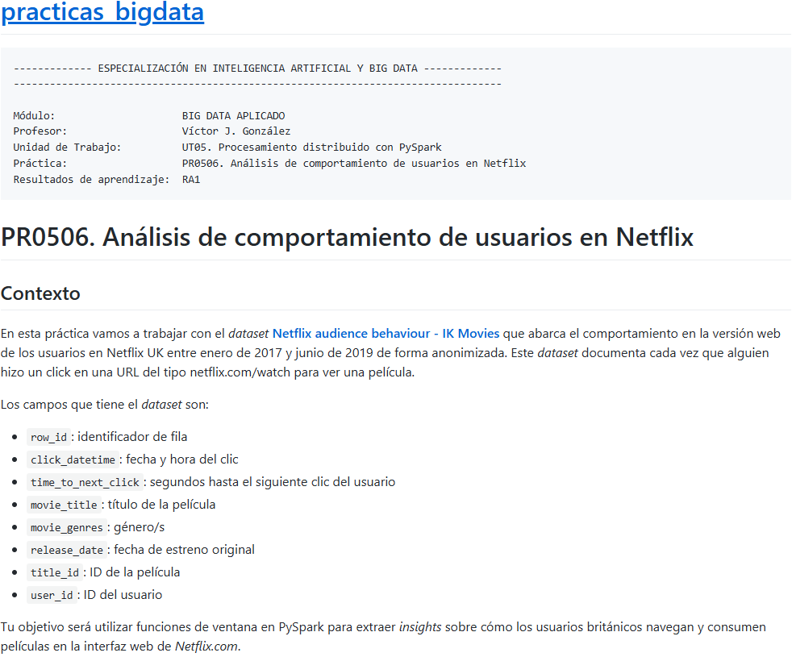
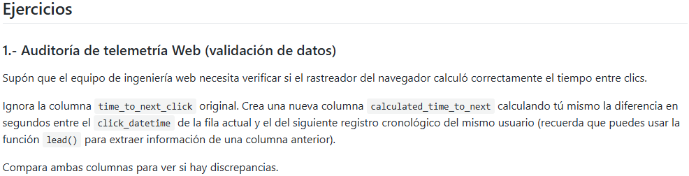
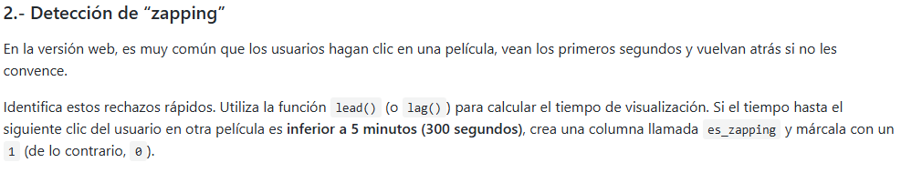
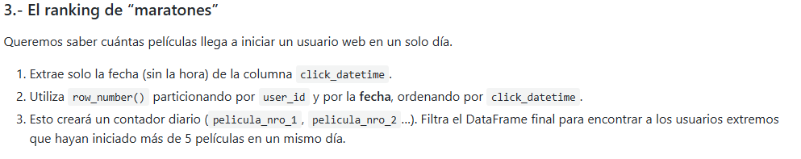
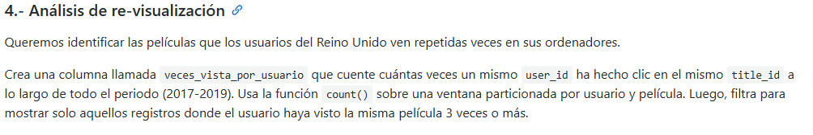

```python
#Creamos la sesion y creamos el esquema
from pyspark.sql import SparkSession

try:
    spark = ( SparkSession.builder
                .appName("angel_spark")
                .master("spark://spark-master:7077")
                .getOrCreate()
            )
    print("SparkSession iniciada correctamente.")
except Exception as e:
    print("Error en la conexion")
    print(e)

from pyspark.sql.types import StructType, StructField, StringType, DoubleType, BooleanType,IntegerType, LongType,TimestampType
schema = StructType([
    StructField("row_id",IntegerType(),True),
    StructField("click_dateTime",TimestampType(),True),
    StructField("time_to_next_click",DoubleType(),True),
    StructField("movie_title",StringType(),True),
    StructField("movie_genres",StringType(),True),
    StructField("release_date",TimestampType(),True),
    StructField("title_Id",StringType(),True),
    StructField("user_Id",StringType(),True)
])
df = (spark.read
        .format("csv")
        .option("header","true")
        .option("sep",",")
        .schema(schema)
        .load("vodclickstream_uk_movies_03.csv")
     )

df.show(1)
```

    SparkSession iniciada correctamente.
    +------+-------------------+------------------+--------------------+--------------------+-------------------+----------+----------+
    |row_id|     click_dateTime|time_to_next_click|         movie_title|        movie_genres|       release_date|  title_Id|   user_Id|
    +------+-------------------+------------------+--------------------+--------------------+-------------------+----------+----------+
    | 58773|2017-01-01 01:15:09|               0.0|Angus, Thongs and...|Comedy, Drama, Ro...|2008-07-25 00:00:00|26bd5987e8|1dea19f6fe|
    +------+-------------------+------------------+--------------------+--------------------+-------------------+----------+----------+
    only showing top 1 row
    





```python
#Si se hace con group by, me cargo los registros individuales de cada usuario por lo que no se podria mirar, por eso hacemos ventanas
from pyspark.sql.window import Window
auditoria = ( Window
              .partitionBy("user_Id")
              .orderBy("click_dateTime")
)
```


```python
from pyspark.sql.functions import lit,col,avg,lead,unix_timestamp,when


df = ( df
    .withColumn("next_date",lead("click_datetime").over(auditoria))
    .withColumn("calculated_time_to_next",unix_timestamp(col("next_date"))-unix_timestamp(col("click_dateTime")))
)

df.show(10)

```

    +------+-------------------+------------------+--------------------+--------------------+-------------------+----------+----------+-------------------+-----------------------+
    |row_id|     click_dateTime|time_to_next_click|         movie_title|        movie_genres|       release_date|  title_Id|   user_Id|          next_date|calculated_time_to_next|
    +------+-------------------+------------------+--------------------+--------------------+-------------------+----------+----------+-------------------+-----------------------+
    |139643|2017-05-19 20:21:43|               0.0|                XOXO|        Drama, Music|2016-08-26 00:00:00|7369676dec|0006ea6b5c|2017-05-20 21:54:34|                  91971|
    |140442|2017-05-20 21:54:34|               0.0|            Hot Fuzz|Action, Comedy, M...|2007-04-20 00:00:00|6467fee6b6|0006ea6b5c|2017-05-26 18:38:01|                 506607|
    |144717|2017-05-26 18:38:01|               0.0|         War Machine|  Comedy, Drama, War|2017-05-26 00:00:00|0f3b137f4e|0006ea6b5c|2017-05-26 23:31:46|                  17625|
    |144301|2017-05-26 23:31:46|               0.0|          Apocalypto|Action, Adventure...|2006-12-08 00:00:00|40dd7bf1f9|0006ea6b5c|2017-05-27 22:45:41|                  83635|
    |145323|2017-05-27 22:45:41|               0.0|Joshua: Teenager ...|         Documentary|2017-01-20 00:00:00|4a138aeefc|0006ea6b5c|2017-06-02 22:51:18|                 518737|
    |150621|2017-06-02 22:51:18|            1182.0|         Lucid Dream|    Sci-Fi, Thriller|2017-06-02 00:00:00|27b44a3183|0006ea6b5c|2017-06-02 23:11:00|                   1182|
    |150043|2017-06-02 23:11:00|               0.0|Stranger than Fic...|Comedy, Drama, Fa...|2006-11-10 00:00:00|73183024a6|0006ea6b5c|2017-06-03 21:54:46|                  81826|
    |151464|2017-06-03 21:54:46|            4200.0|Handsome: A Netfl...|     Comedy, Mystery|2017-05-05 00:00:00|9f2550ca52|0006ea6b5c|2017-06-03 23:04:46|                   4200|
    |150783|2017-06-03 23:04:46|               0.0|        Dragon Blade|Action, Adventure...|2015-09-04 00:00:00|ed515d444e|0006ea6b5c|2017-06-04 23:28:04|                  87798|
    |151782|2017-06-04 23:28:04|            1800.0|        Dragon Blade|Action, Adventure...|2015-09-04 00:00:00|ed515d444e|0006ea6b5c|2017-06-09 21:14:59|                 424015|
    +------+-------------------+------------------+--------------------+--------------------+-------------------+----------+----------+-------------------+-----------------------+
    only showing top 10 rows
    


                                                                                    




```python
df = (
    df
    .withColumn("es_zaping",when(col("calculated_time_to_next") < 300, 1).otherwise(0)) 
     )

df.show()
```

    +------+-------------------+------------------+--------------------+--------------------+-------------------+----------+----------+-------------------+-----------------------+---------+
    |row_id|     click_dateTime|time_to_next_click|         movie_title|        movie_genres|       release_date|  title_Id|   user_Id|          next_date|calculated_time_to_next|es_zaping|
    +------+-------------------+------------------+--------------------+--------------------+-------------------+----------+----------+-------------------+-----------------------+---------+
    |139643|2017-05-19 20:21:43|               0.0|                XOXO|        Drama, Music|2016-08-26 00:00:00|7369676dec|0006ea6b5c|2017-05-20 21:54:34|                  91971|        0|
    |140442|2017-05-20 21:54:34|               0.0|            Hot Fuzz|Action, Comedy, M...|2007-04-20 00:00:00|6467fee6b6|0006ea6b5c|2017-05-26 18:38:01|                 506607|        0|
    |144717|2017-05-26 18:38:01|               0.0|         War Machine|  Comedy, Drama, War|2017-05-26 00:00:00|0f3b137f4e|0006ea6b5c|2017-05-26 23:31:46|                  17625|        0|
    |144301|2017-05-26 23:31:46|               0.0|          Apocalypto|Action, Adventure...|2006-12-08 00:00:00|40dd7bf1f9|0006ea6b5c|2017-05-27 22:45:41|                  83635|        0|
    |145323|2017-05-27 22:45:41|               0.0|Joshua: Teenager ...|         Documentary|2017-01-20 00:00:00|4a138aeefc|0006ea6b5c|2017-06-02 22:51:18|                 518737|        0|
    |150621|2017-06-02 22:51:18|            1182.0|         Lucid Dream|    Sci-Fi, Thriller|2017-06-02 00:00:00|27b44a3183|0006ea6b5c|2017-06-02 23:11:00|                   1182|        0|
    |150043|2017-06-02 23:11:00|               0.0|Stranger than Fic...|Comedy, Drama, Fa...|2006-11-10 00:00:00|73183024a6|0006ea6b5c|2017-06-03 21:54:46|                  81826|        0|
    |151464|2017-06-03 21:54:46|            4200.0|Handsome: A Netfl...|     Comedy, Mystery|2017-05-05 00:00:00|9f2550ca52|0006ea6b5c|2017-06-03 23:04:46|                   4200|        0|
    |150783|2017-06-03 23:04:46|               0.0|        Dragon Blade|Action, Adventure...|2015-09-04 00:00:00|ed515d444e|0006ea6b5c|2017-06-04 23:28:04|                  87798|        0|
    |151782|2017-06-04 23:28:04|            1800.0|        Dragon Blade|Action, Adventure...|2015-09-04 00:00:00|ed515d444e|0006ea6b5c|2017-06-09 21:14:59|                 424015|        0|
    |156021|2017-06-09 21:14:59|               0.0|        Shimmer Lake|Crime, Drama, Mys...|2017-06-09 00:00:00|09a559f1ce|0006ea6b5c|2017-06-10 23:25:25|                  94226|        0|
    |156307|2017-06-10 23:25:25|            4800.0| Absolutely Anything|      Comedy, Sci-Fi|2017-05-12 00:00:00|1e7ac0d4d4|0006ea6b5c|2017-06-18 03:12:09|                 618404|        0|
    |162033|2017-06-18 03:12:09|               0.0|     A Plastic Ocean|         Documentary|2017-04-19 00:00:00|9ac5a606e0|0006ea6b5c|2017-06-19 21:42:14|                 153005|        0|
    |162421|2017-06-19 21:42:14|            4831.0|    Bulletproof Monk|Action, Comedy, F...|2003-04-16 00:00:00|42689f3587|0006ea6b5c|2017-06-29 00:05:28|                 786194|        0|
    |170114|2017-06-29 00:05:28|               0.0|                Okja|Action, Adventure...|2017-06-28 00:00:00|0b1cdb1a41|0006ea6b5c|               NULL|                   NULL|        0|
    |715907|2019-06-09 23:28:55|               0.0|         Last Breath|         Documentary|2019-04-05 00:00:00|d05f61119f|0007fc8621|2019-06-10 21:59:39|                  81044|        0|
    |716523|2019-06-10 21:59:39|               0.0|         Last Breath|         Documentary|2019-04-05 00:00:00|d05f61119f|0007fc8621|               NULL|                   NULL|        0|
    |370084|2018-03-15 21:30:54|            7652.0|        Annihilation|Adventure, Drama,...|2018-02-23 00:00:00|1f579d43c3|000800c223|               NULL|                   NULL|        0|
    |382347|2018-03-30 08:11:47|               0.0|David Brent: Life...|       Comedy, Music|2017-02-10 00:00:00|e391b33f60|0008d919a5|2018-03-31 23:36:52|                 141905|        0|
    |382935|2018-03-31 23:36:52|               0.0|Captain America: ...|Action, Adventure...|2014-04-04 00:00:00|5b27e079e9|0008d919a5|               NULL|                   NULL|        0|
    +------+-------------------+------------------+--------------------+--------------------+-------------------+----------+----------+-------------------+-----------------------+---------+
    only showing top 20 rows
    





```python
from pyspark.sql.functions import to_date,row_number
df = (
    df
    .withColumn("fecha_sin_hora",to_date(col("click_dateTime")))
     )
auditoria2 = ( Window
              .partitionBy("user_Id","fecha_sin_hora")
              .orderBy("click_dateTime")
)
df = (
    df
    .withColumn("row_number",row_number().over(auditoria2)) 
     )
df.select("fecha_sin_hora","row_number","user_id").show()
```

    +--------------+----------+----------+
    |fecha_sin_hora|row_number|   user_id|
    +--------------+----------+----------+
    |    2017-06-17|         1|000052a0a0|
    |    2017-06-17|         2|000052a0a0|
    |    2017-06-21|         1|000052a0a0|
    |    2018-12-30|         1|000296842d|
    |    2018-12-30|         2|000296842d|
    |    2017-05-06|         1|0002aab109|
    |    2017-02-09|         1|0006e547fc|
    |    2017-02-10|         1|0006e547fc|
    |    2017-05-20|         1|0006ea6b5c|
    |    2017-05-26|         1|0006ea6b5c|
    |    2017-05-26|         2|0006ea6b5c|
    |    2017-06-03|         1|0006ea6b5c|
    |    2017-06-03|         2|0006ea6b5c|
    |    2017-03-11|         1|0008c31833|
    |    2017-03-11|         2|0008c31833|
    |    2017-08-09|         1|000b217ed0|
    |    2017-08-09|         2|000b217ed0|
    |    2017-09-16|         1|000de1ca63|
    |    2018-07-01|         1|000ed9ca1c|
    |    2018-03-07|         1|000f073c97|
    +--------------+----------+----------+
    only showing top 20 rows
    


```python
df.filter("row_number >= 5").select("user_id","row_number","fecha_sin_hora").show()
```

    +----------+----------+--------------+
    |   user_id|row_number|fecha_sin_hora|
    +----------+----------+--------------+
    |00945e0131|         5|    2017-05-29|
    |009d1b0dc3|         5|    2017-05-07|
    |00b88bd923|         5|    2017-10-23|
    |00b88bd923|         6|    2017-10-23|
    |00b88bd923|         7|    2017-10-23|
    |00b88bd923|         8|    2017-10-23|
    |00b88bd923|         9|    2017-10-23|
    |00f86ba072|         5|    2019-06-28|
    |010ce0857b|         5|    2019-05-01|
    |0141ae3d9a|         5|    2019-02-20|
    |0141ae3d9a|         6|    2019-02-20|
    |015d339273|         5|    2019-01-20|
    |015d339273|         6|    2019-01-20|
    |01e52b4c4d|         5|    2018-02-23|
    |020c9c652a|         5|    2019-01-20|
    |020c9c652a|         6|    2019-01-20|
    |0218d05fe6|         5|    2017-07-10|
    |023d43562c|         5|    2017-05-28|
    |023d43562c|         6|    2017-05-28|
    |0244e5d9eb|         5|    2017-08-22|
    +----------+----------+--------------+
    only showing top 20 rows
    





```python
from pyspark.sql.functions import count
auditoria3 = ( Window
              .partitionBy("user_Id","movie_title")
              .orderBy("click_dateTime")
)

df = (
    df
    .withColumn("veces_vista_por_usuario",count(col("user_id")).over(auditoria3))
)
df.filter("veces_vista_por_usuario >= 3").select("veces_vista_por_usuario","user_id").show()
```

    +-----------------------+----------+
    |veces_vista_por_usuario|   user_id|
    +-----------------------+----------+
    |                      8|000052a0a0|
    |                      8|000052a0a0|
    |                      8|000052a0a0|
    |                      8|000052a0a0|
    |                      8|000052a0a0|
    |                      8|000052a0a0|
    |                      8|000052a0a0|
    |                      9|000052a0a0|
    |                      3|0012a95d5f|
    |                      3|0016c962c8|
    |                      4|0016c962c8|
    |                      3|0023e9b95e|
    |                      3|00305e5c73|
    |                      4|00305e5c73|
    |                      4|004ad258d2|
    |                      4|004ad258d2|
    |                      4|004ad258d2|
    |                      3|004e33f215|
    |                      3|004e33f215|
    |                      4|004e33f215|
    +-----------------------+----------+
    only showing top 20 rows
    

