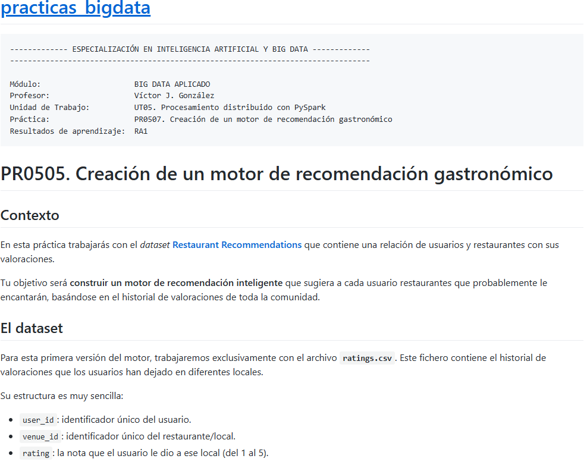
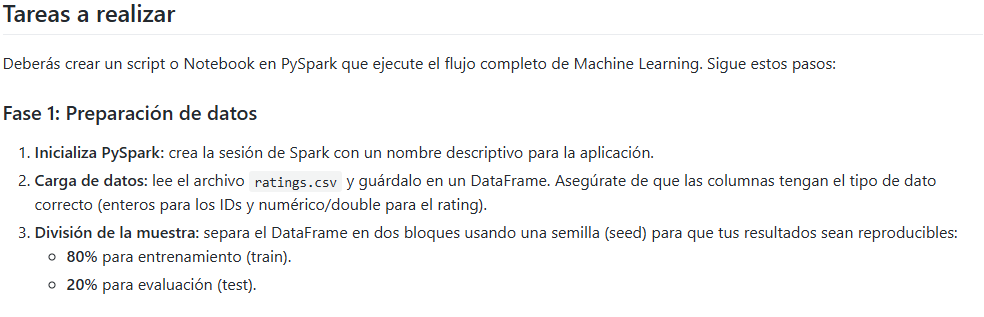
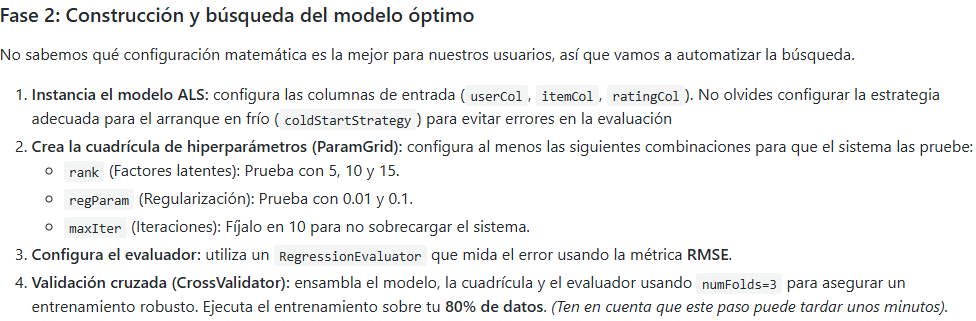
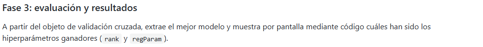
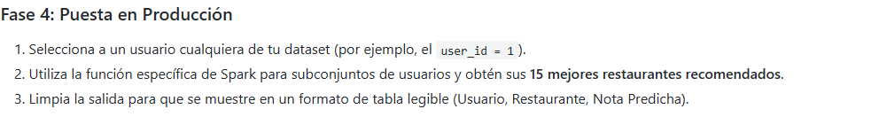

```python
#Creamos sesion de spark
from pyspark.sql import SparkSession

try:
    spark = ( SparkSession.builder
                .appName("angel_spark")
                .master("spark://spark-master:7077")
                .getOrCreate()
            )
    print("SparkSession iniciada correctamente.")
except Exception as e:
    print("Error en la conexion")
    print(e)

```

    SparkSession iniciada correctamente.


```python
from pyspark.sql.types import StructType, StructField, StringType, DoubleType, BooleanType,IntegerType, LongType,TimestampType
schema = StructType([
    StructField("user_id",IntegerType(),True),
    StructField("venue_id",IntegerType(),True),
     StructField("rating",DoubleType(),True),

])
```


```python
df = (spark.read
        .format("csv")
        .option("header","true")
        .schema(schema)
        .load("./ratings.csv")
     )
```



Reduzco el tamaño del Dataset al 10% (ya que para el entrenamiento el coste computacional es costoso)


```python
datos_reducidos1, datos_reducidos2 = (df
                                     .randomSplit([0.1,0.9],seed=42)
                                    )
datos_entrenamiento, datos_prueba = (datos_reducidos1
                                     .randomSplit([0.8,0.2],seed=42)
                                    )
print("Datos entrenamiento ", datos_entrenamiento.count())
print("Datos prueba ", datos_prueba.count())
print(datos_reducidos1.count(), datos_reducidos2.count())
```

                                                                                    

    Datos entrenamiento  224782
    Datos prueba  55923


                                                                                    

    280705 2528875


                                                                                    




```python
pip install numpy
```

    Requirement already satisfied: numpy in /usr/local/lib/python3.10/site-packages (2.2.6)
    WARNING: Running pip as the 'root' user can result in broken permissions and conflicting behaviour with the system package manager. It is recommended to use a virtual environment instead: https://pip.pypa.io/warnings/venv
    
    [notice] A new release of pip is available: 23.0.1 -> 26.0.1
    [notice] To update, run: pip install --upgrade pip
    Note: you may need to restart the kernel to use updated packages.


```python
from pyspark.ml.recommendation import ALS
als = ALS(
    maxIter=10,
    regParam=1.5,
    rank=2,
    userCol="user_id",
    itemCol="venue_id",
    ratingCol="rating",
    coldStartStrategy="drop"
)
```


```python
from pyspark.ml.tuning import ParamGridBuilder,CrossValidator
from pyspark.ml.evaluation import RegressionEvaluator


grid_params= (ParamGridBuilder()
             .addGrid(als.rank,[5,10,15])
              .addGrid(als.regParam,[0.01,0.1])
              .addGrid(als.maxIter,[10])
              .build()
             )
```


```python
validacion_cruzada = CrossValidator(
                    estimator=als,
                    estimatorParamMaps=grid_params,
                    evaluator=evaluador,
                    numFolds=3)
```


```python
modelo_op = validacion_cruzada.fit(datos_entrenamiento)
print("Modelo Entrenado")
```

                                                                                    

    Modelo Entrenado


```python
predicciones = modelo_op.transform(datos_prueba)

evaluador = RegressionEvaluator(
    metricName="rmse",
    labelCol="rating",
    predictionCol="prediction"
)
error_rmse = evaluador.evaluate(predicciones)
print(error_rmse)
```

    [Stage 5407:===========================>                           (5 + 5) / 10]

    2.7113395857491196


                                                                                    




```python
combinaciones = modelo_op.getEstimatorParamMaps()
combinaciones
```


    [{Param(parent='ALS_a711e269691e', name='rank', doc='rank of the factorization'): 5,
      Param(parent='ALS_a711e269691e', name='regParam', doc='regularization parameter (>= 0).'): 0.01,
      Param(parent='ALS_a711e269691e', name='maxIter', doc='max number of iterations (>= 0).'): 10},
     {Param(parent='ALS_a711e269691e', name='rank', doc='rank of the factorization'): 5,
      Param(parent='ALS_a711e269691e', name='regParam', doc='regularization parameter (>= 0).'): 0.1,
      Param(parent='ALS_a711e269691e', name='maxIter', doc='max number of iterations (>= 0).'): 10},
     {Param(parent='ALS_a711e269691e', name='rank', doc='rank of the factorization'): 10,
      Param(parent='ALS_a711e269691e', name='regParam', doc='regularization parameter (>= 0).'): 0.01,
      Param(parent='ALS_a711e269691e', name='maxIter', doc='max number of iterations (>= 0).'): 10},
     {Param(parent='ALS_a711e269691e', name='rank', doc='rank of the factorization'): 10,
      Param(parent='ALS_a711e269691e', name='regParam', doc='regularization parameter (>= 0).'): 0.1,
      Param(parent='ALS_a711e269691e', name='maxIter', doc='max number of iterations (>= 0).'): 10},
     {Param(parent='ALS_a711e269691e', name='rank', doc='rank of the factorization'): 15,
      Param(parent='ALS_a711e269691e', name='regParam', doc='regularization parameter (>= 0).'): 0.01,
      Param(parent='ALS_a711e269691e', name='maxIter', doc='max number of iterations (>= 0).'): 10},
     {Param(parent='ALS_a711e269691e', name='rank', doc='rank of the factorization'): 15,
      Param(parent='ALS_a711e269691e', name='regParam', doc='regularization parameter (>= 0).'): 0.1,
      Param(parent='ALS_a711e269691e', name='maxIter', doc='max number of iterations (>= 0).'): 10}]


```python
notas_rmse = modelo_op.avgMetrics
notas_rmse
```


    [np.float64(3.3590995751993105),
     np.float64(2.91859991484179),
     np.float64(2.969952527288507),
     np.float64(2.786268919562214),
     np.float64(2.8637791220370516),
     np.float64(2.758362461097627)]


```python
ranking = sorted(zip(notas_rmse,combinaciones),key=lambda x:x[0])
ranking
```


    [(np.float64(2.758362461097627),
      {Param(parent='ALS_a711e269691e', name='rank', doc='rank of the factorization'): 15,
       Param(parent='ALS_a711e269691e', name='regParam', doc='regularization parameter (>= 0).'): 0.1,
       Param(parent='ALS_a711e269691e', name='maxIter', doc='max number of iterations (>= 0).'): 10}),
     (np.float64(2.786268919562214),
      {Param(parent='ALS_a711e269691e', name='rank', doc='rank of the factorization'): 10,
       Param(parent='ALS_a711e269691e', name='regParam', doc='regularization parameter (>= 0).'): 0.1,
       Param(parent='ALS_a711e269691e', name='maxIter', doc='max number of iterations (>= 0).'): 10}),
     (np.float64(2.8637791220370516),
      {Param(parent='ALS_a711e269691e', name='rank', doc='rank of the factorization'): 15,
       Param(parent='ALS_a711e269691e', name='regParam', doc='regularization parameter (>= 0).'): 0.01,
       Param(parent='ALS_a711e269691e', name='maxIter', doc='max number of iterations (>= 0).'): 10}),
     (np.float64(2.91859991484179),
      {Param(parent='ALS_a711e269691e', name='rank', doc='rank of the factorization'): 5,
       Param(parent='ALS_a711e269691e', name='regParam', doc='regularization parameter (>= 0).'): 0.1,
       Param(parent='ALS_a711e269691e', name='maxIter', doc='max number of iterations (>= 0).'): 10}),
     (np.float64(2.969952527288507),
      {Param(parent='ALS_a711e269691e', name='rank', doc='rank of the factorization'): 10,
       Param(parent='ALS_a711e269691e', name='regParam', doc='regularization parameter (>= 0).'): 0.01,
       Param(parent='ALS_a711e269691e', name='maxIter', doc='max number of iterations (>= 0).'): 10}),
     (np.float64(3.3590995751993105),
      {Param(parent='ALS_a711e269691e', name='rank', doc='rank of the factorization'): 5,
       Param(parent='ALS_a711e269691e', name='regParam', doc='regularization parameter (>= 0).'): 0.01,
       Param(parent='ALS_a711e269691e', name='maxIter', doc='max number of iterations (>= 0).'): 10})]





```python
modelo_als = modelo_op.bestModel

```


```python
recomendaciones_finales = modelo_als.recommendForAllUsers(15)
#comprobar el nombre de la col del usuario para filtar y ver sus recomendaciones
recomendaciones_finales.show(1)
```

    [Stage 5464:====================================================>(99 + 1) / 100]

    +-------+--------------------+
    |user_id|     recommendations|
    +-------+--------------------+
    |     26|[{311, 4.9450903}...|
    +-------+--------------------+
    only showing top 1 row
    


                                                                                    

Comprobamos las recomendaciones para el usuario de id = 1


```python
recomendaciones_finales.where(col("user_id")==1).show()
```

    [Stage 5588:==============>                                         (1 + 3) / 4]

    +-------+--------------------+
    |user_id|     recommendations|
    +-------+--------------------+
    |      1|[{179991, 4.04702...|
    +-------+--------------------+
    


                                                                                    
