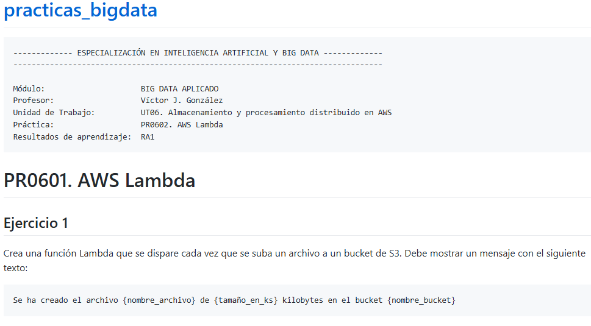


```python
def lambda_handler(event, context):
    # TODO 
    nombre_archivo = event["Records"][0]["s3"]["object"]["key"]
    tamaño_en_ks = event["Records"][0]["s3"]["object"]["size"]
    nombre_bucket = event["Records"][0]["s3"]["bucket"]["name"]
    tamaño_en_bytes = tamaño_en_ks /1024

    mensaje = f"Se ha creado el archivo {nombre_archivo} de {tamaño_en_bytes} bytes en el bucket {nombre_bucket} "
    return {
       'statusCode': 200,
       'body': mensaje
    }

```

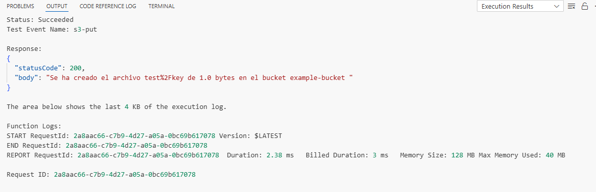

Agregamos desencadenantes

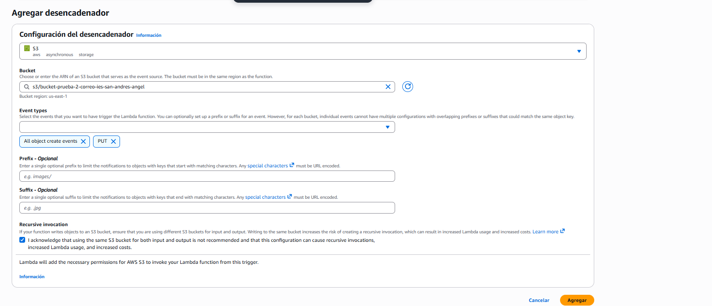

Subimos un archivo para comprobar

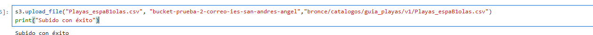

Comprobamos en CloudWatch

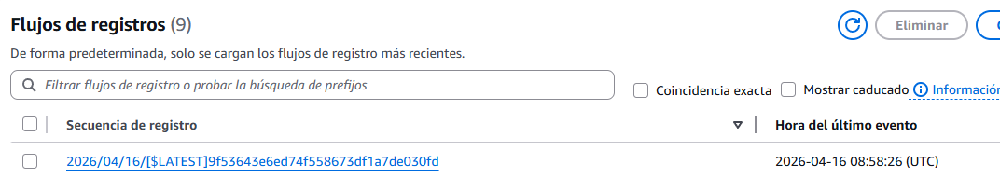

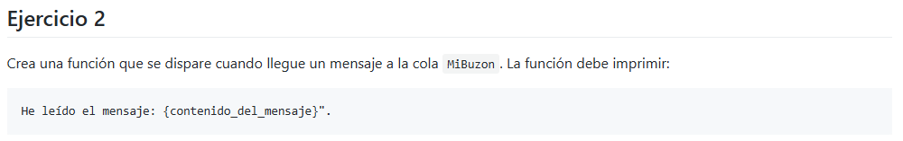


```python
import json

def lambda_handler(event, context):
    # TODO implement
    contenido = event["Records"][0]["body"]

    mensaje = f"He leido el mensaje: {contenido}"


    return {
        'statusCode': 200,
        'body': json.dumps(mensaje)
    }

```

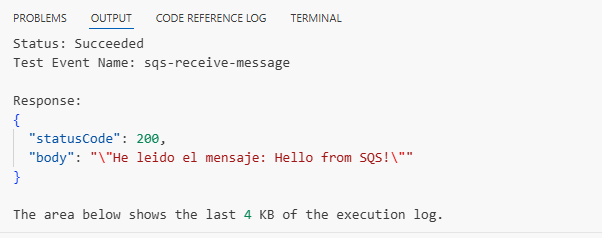

Creamos la cola

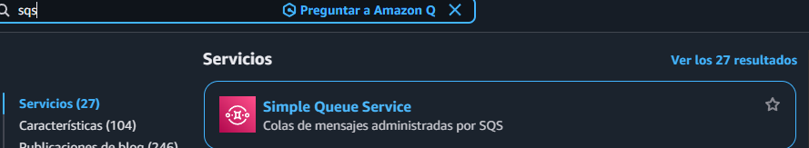

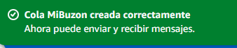

Agregamos el desencadenador a la cola creada

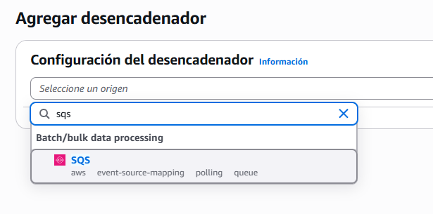

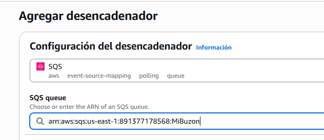

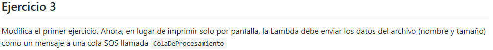


```python
import json
import boto3
def lambda_handler(event, context):
    # TODO 
    sqs = boto3.client('sqs')

    # URL de la cola
    queue_url = "https://sqs.us-east-1.amazonaws.com/891377178568/ColaDeProcesamiento"
    
    nombre_archivo = event["Records"][0]["s3"]["object"]["key"]
    tamaño = event["Records"][0]["s3"]["object"]["size"]

    mensaje = f"Archivo: {nombre_archivo}, Tamaño: {tamaño}"

    sqs.send_message(
        QueueUrl=queue_url,
        MessageBody=mensaje
    )

    return {
        'statusCode': 200,
        'body': 'Mensaje enviado a SQS'
    }


```

Creamos la cola 

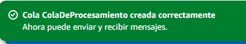

Agregamos desencadenante

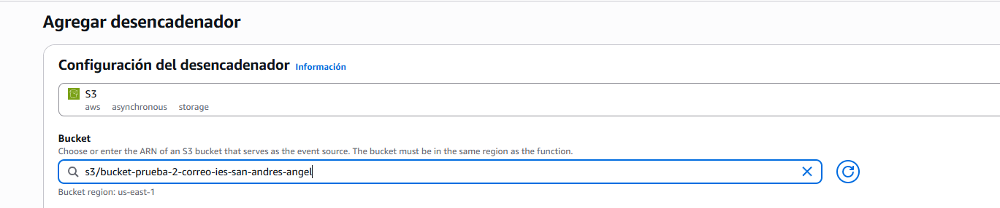

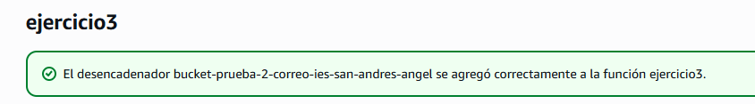

Subimos un archivo

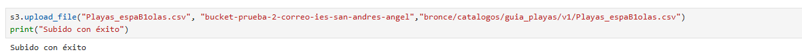

Comprobamos que el mensaje funciona

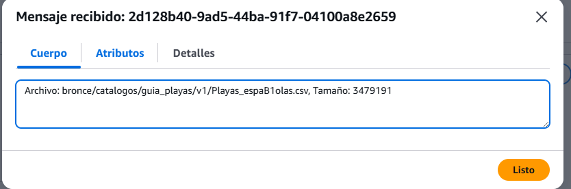


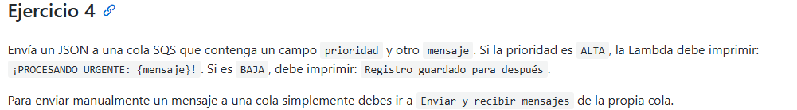


```python
import json

def lambda_handler(event, context):

    for record in event["Records"]:

        body = json.loads(record["body"])

        prioridad = body["prioridad"]
        mensaje = body["mensaje"]

        if prioridad == "ALTA":
            print(f"¡PROCESANDO URGENTE: {mensaje}!")
        elif prioridad == "BAJA":
            print("Registro guardado para después")

    return {
        "statusCode": 200
    }
```

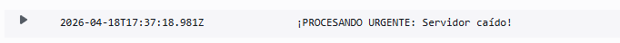

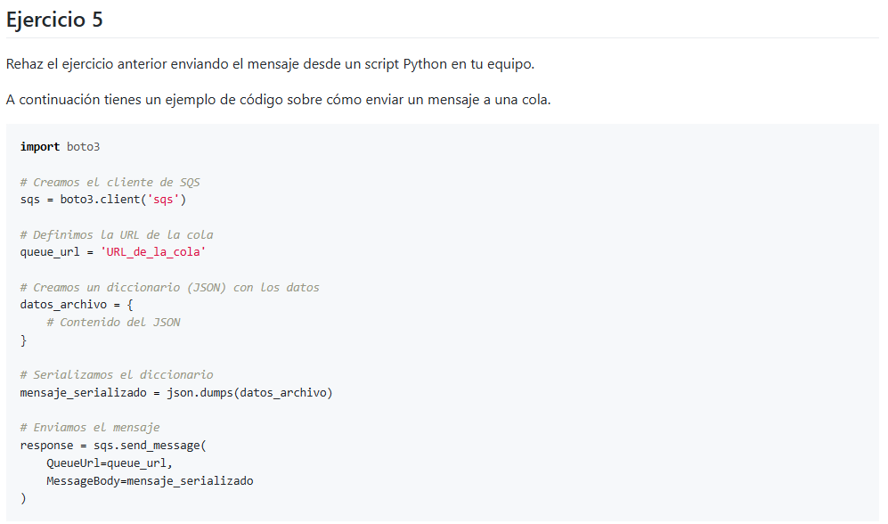


```python
import boto3
import json
# Creamos el cliente de SQS
sqs = boto3.client('sqs', region_name="us-east-1")

# Definimos la URL de la cola
queue_url = 'https://sqs.us-east-1.amazonaws.com/891377178568/ejercicio4'

# Creamos un diccionario (JSON) con los datos
datos_archivo = {
    # Contenido del JSON
     "prioridad": "ALTA",
    "mensaje": "Servidor caído"
}

# Serializamos el diccionario
mensaje_serializado = json.dumps(datos_archivo)

# Enviamos el mensaje
response = sqs.send_message(
    QueueUrl=queue_url,
    MessageBody=mensaje_serializado
)
print("Enviado correctamente")
```

    Enviado correctamente


Comprobamos en CloudWatch que el registro se gestionó correctamente
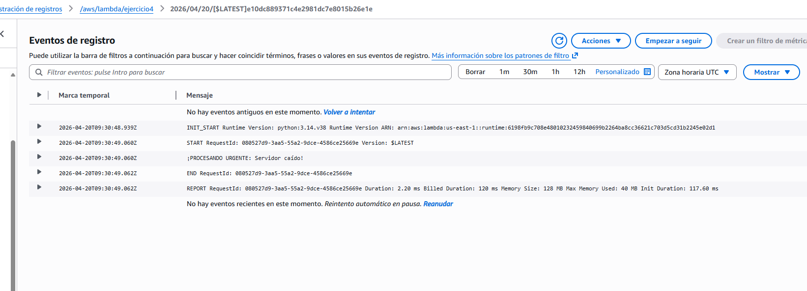


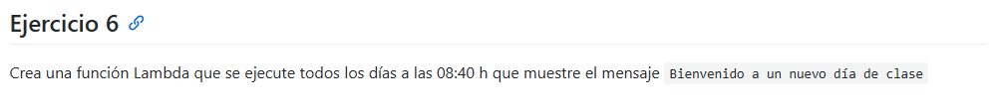


```python
import json

def lambda_handler(event, context):
    mensaje = f"Bienvenido a un nuevo dia de clase"
    return {
        'statusCode': 200,
        'body': json.dumps(mensaje)
    }

```

Configuramos el desencadenante

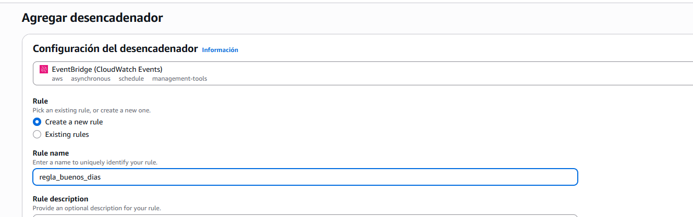

Configuramos el horario de despliegue

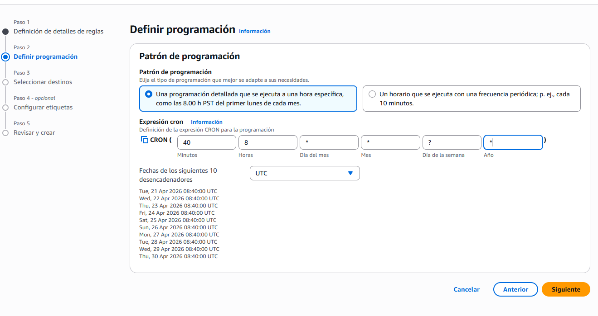 
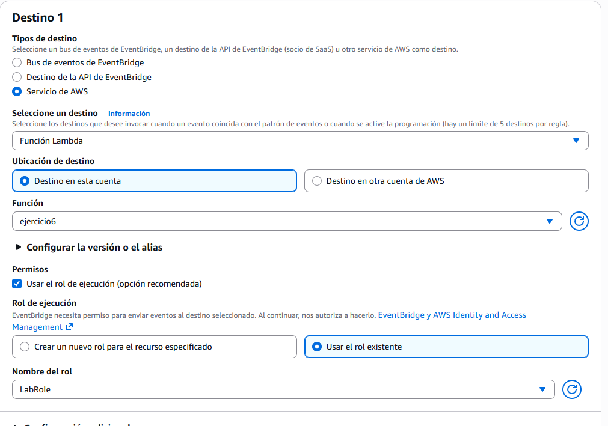
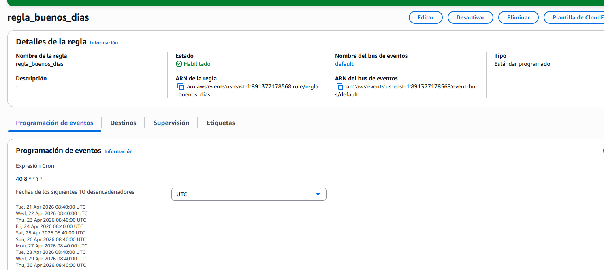

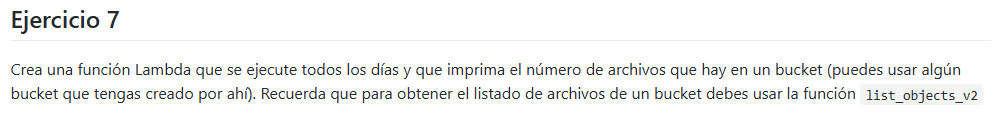


```python
import json
import boto3

def lambda_handler(event, context):
    
    s3 = boto3.client('s3')
    
    bucket_name = 'NOMBRE-DE-TU-BUCKET'
    
    response = s3.list_objects_v2(Bucket=bucket_name)
    
    cantidad_archivos = response.get('KeyCount', 0)
    
    print(f"El bucket {bucket_name} tiene {cantidad_archivos} archivos")
    
    return {
        'statusCode': 200,
        'body': json.dumps(f"El bucket {bucket_name} tiene {cantidad_archivos} archivos")
    }

```

Creamos desencadenante
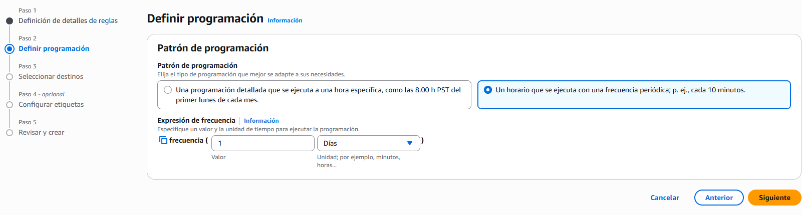
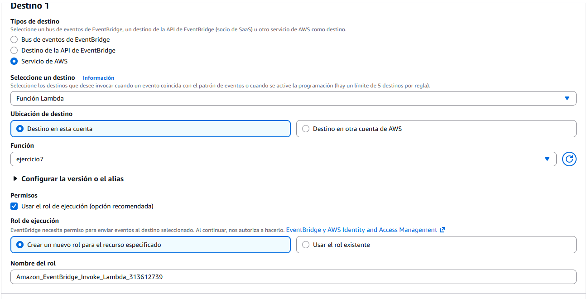


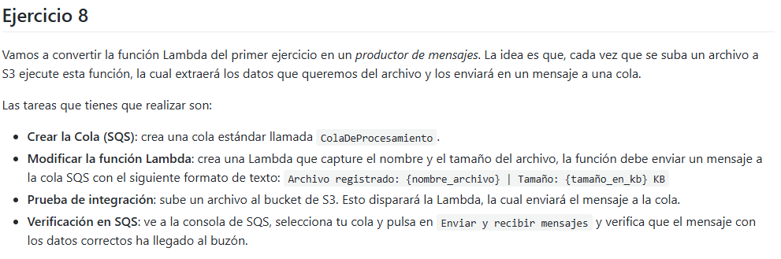

Creamos el lambda
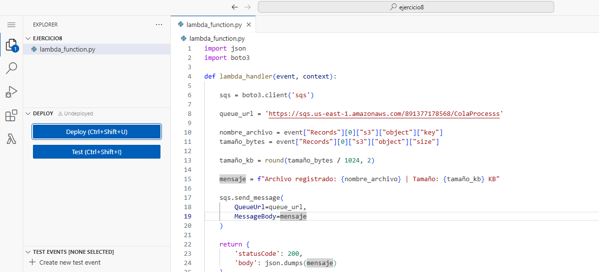
Creamos la cola

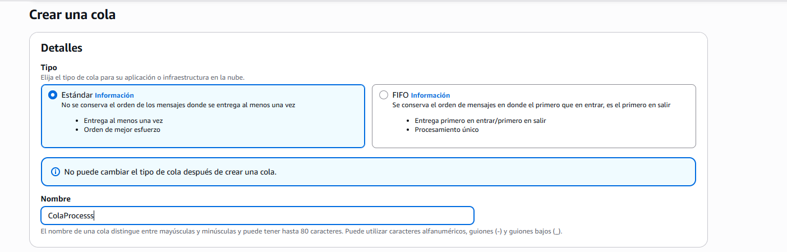

Configuramos Desencadenante

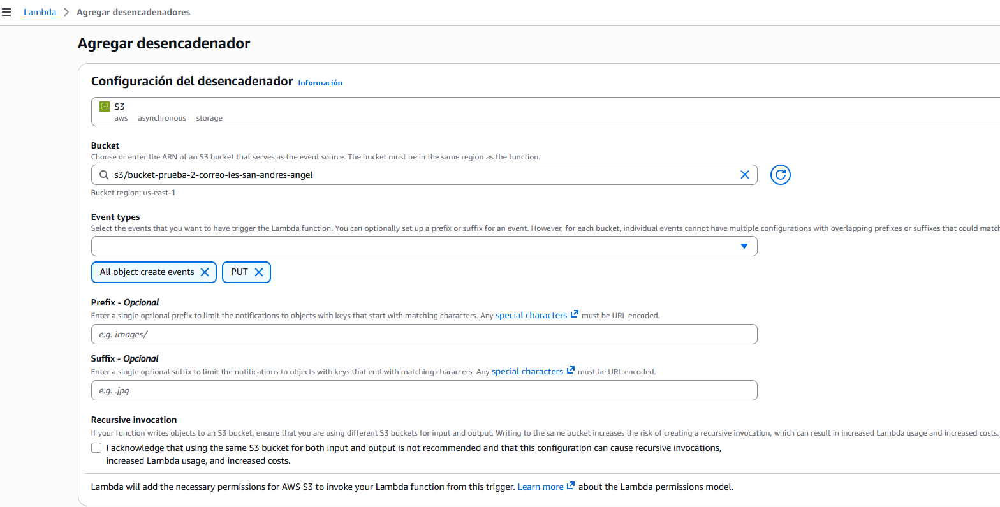

Subimos archivo 
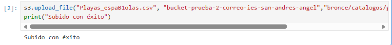

Comprobamos en el registro

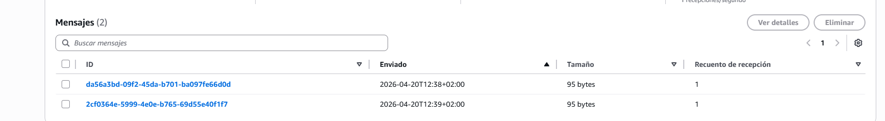


