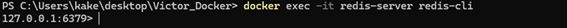
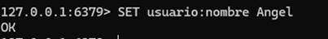
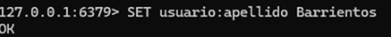
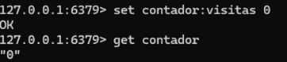
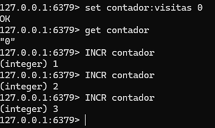
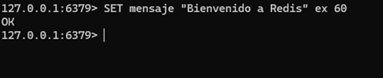
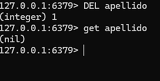

# PR0201: Cadenas en Redis
### ------------- ESPECIALIZACIÓN EN INTELIGENCIA ARTIFICIAL Y BIG DATA -------------
---------------------------------------------------------------------------------

Módulo:                     SISTEMAS DE BIG DATA

Profesor:                   Víctor J. González

Unidad de Trabajo:          UT02. Almacenamiento de datos

Práctica:                   PR0201: Cadenas en Redis

Resultados de aprendizaje:  RA3


## 1. Trabajo con Redis CLI


**0-** Conéctate al CLI de Redis y realiza las siguientes operaciones paso a paso:

Para conectarnos al CLI realizamos la siguiente operación

```bash
docker exec -it redis-server redis-cli
```


**1-** Crea una clave usuario:nombre con tu nombre.

```bash
SET usuario:nombre Angel
```



**2-** Crea una clave usuario:apellido con tu apellido

```bash
SET usuario:apellido Barrientos
```



**3-** Recupera el valor de ambas claves con GET.

```bash
Get nombre
Get apellido
```


**4-** Almacena en usuario:email un correo ficticio y recupéralo

```bash
SET usuario:email angelbarrientossimo@gmail.com
get email
```


**5-** Cambia el valor de usuario:nombre para que aparezca en mayúsculas

```bash
SET usuario:nombre ANGEL
GET nombre
```


**6-** Crea la clave contador:visitas con valor 0

```bash
SET contador:visitas 0
GET contador
```


**7-** Incrementa en 1 el valor de contador:visitas tres veces

```bash
INCR contador
INCR contador
INCR contador
```


**8-** Decrementa en 1 el valor de contador:visitas.

```bash
DECR contador
```


**9-** Guarda en la clave mensaje el texto "Bienvenido a Redis".

```bash
SET mensaje "Bienvenido a Redis"
```


**10-** Establece un tiempo de expiración de 60 segundos para la clave mensaje.

```bash
SET mensaje "Bienvenido a Redis" ex 60
```


**11-** Elimina la clave usuario:apellido.

```bash
DEL apellido
```


**12-**	Elimina el resto de claves que hayas creado

```bash
Flushall
```
