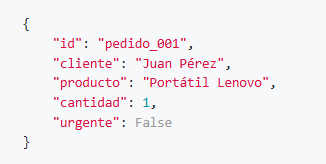
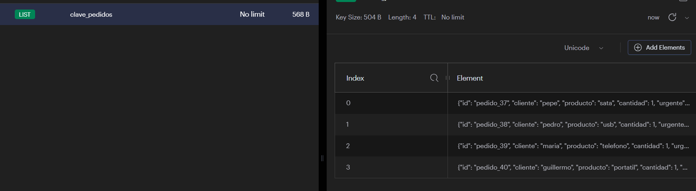
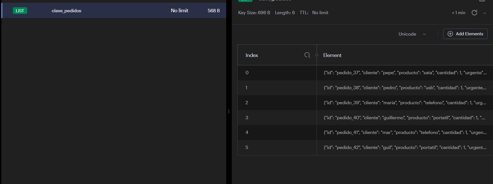
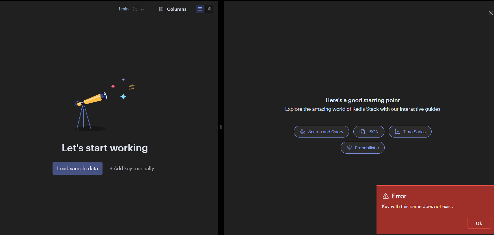
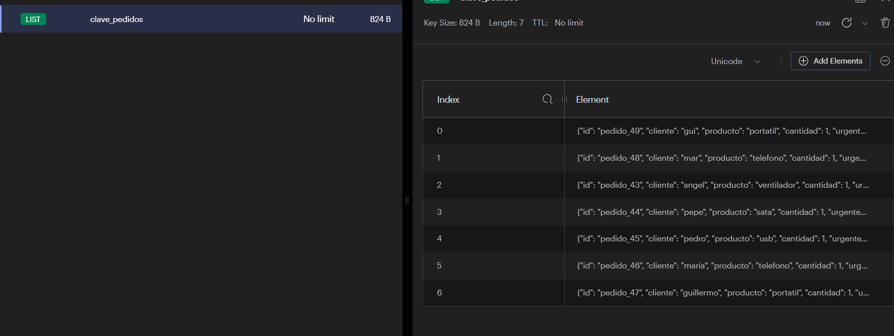

```python
!pip install redis
```

    Requirement already satisfied: redis in /opt/conda/lib/python3.11/site-packages (7.0.1)


------------- ESPECIALIZACIÓN EN INTELIGENCIA ARTIFICIAL Y BIG DATA -------------
---------------------------------------------------------------------------------


Módulo:                     SISTEMAS DE BIG DATA

Profesor:                   Víctor J. González

Unidad de Trabajo:          UT02. Almacenamiento de datos

Práctica:                   PR0202: Listas en Redis

Resultados de aprendizaje:  RA3

# PR0202: Listas en Redis

Crea un script en Python que use la librería redis.


```python
import redis
r = redis.Redis(
host="Redis",
port=6379,
db=0,
decode_responses=True
)
import json
```

Define una función agregar_pedido(cliente, producto) que reciba el nombre del cliente y el producto comprado, cree un pedido en formato de diccionario, lo convierta a cadena (ej. JSON) y lo inserte en la lista pedidos usando RPUSH. El formato del JSON será de la forma:



Por ahora, cantidad siempre será 1 y el valor de urgente será False.

Para convertir una estructura de datos a JSON deberás importar la librería json y usar el método json.dumps(). 

El proceso inverso (recuperar la estructura de datos a partir del JSON) lo puedes realizar con el método json.loads(). 
Tienes un ejemplo en esta página.

Define una función procesar_pedido() que extraiga un pedido de la lista pedidos usando LPOP, lo convierta de nuevo en diccionario y muestre en pantalla qué pedido se está procesando.

Inserta 5 pedidos iniciales llamando a la función agregar_pedido.

Muestra todos los pedidos actuales en la cola con LRANGE.


```python
numeroPedidos
numeroPedidos = 0
def agregar_pedido(cliente, producto):
    global numeroPedidos
    numeroPedidos += 1 
    pedido = {
     "id": f"pedido_{numeroPedidos}",
     "cliente": cliente,
     "producto": producto,
     "cantidad": 1,
     "urgente": False
     }
    pedido_json = json.dumps(pedido)
    r.rpush("clave_pedidos",pedido_json)
```


```python
agregar_pedido("angel","ventilador")
agregar_pedido("pepe","sata")
agregar_pedido("pedro","usb")
agregar_pedido("maria","telefono")
agregar_pedido("guillermo","portatil")
```


```python
def procesar_pedido():
    pedido = r.lpop("clave_pedidos")
    pedido = json.loads(pedido)
    print(pedido)
```


```python
procesar_pedido()
```

    {'id': 'pedido_36', 'cliente': 'angel', 'producto': 'ventilador', 'cantidad': 1, 'urgente': False}





```python
r.lrange("clave_pedidos",0,-1)
```


    ['{"id": "pedido_37", "cliente": "pepe", "producto": "sata", "cantidad": 1, "urgente": false}',
     '{"id": "pedido_38", "cliente": "pedro", "producto": "usb", "cantidad": 1, "urgente": false}',
     '{"id": "pedido_39", "cliente": "maria", "producto": "telefono", "cantidad": 1, "urgente": false}',
     '{"id": "pedido_40", "cliente": "guillermo", "producto": "portatil", "cantidad": 1, "urgente": false}']


```python
agregar_pedido("mar","telefono")
agregar_pedido("guil","portatil")
```



Procesa todos los pedidos de la cola llamando repetidamente a procesar_pedido() hasta que no queden más pedidos.
Inserta un pedido urgente con LPUSH (puede implementarse en una versión extendida de la función agregar_pedido) y procésalo antes que el resto.


```python
for pedido in r.lrange("clave_pedidos",0,-1):
    r.lpop("clave_pedidos")
```




```python
def agregar_pedido_urgente(cliente, producto):
    global numeroPedidos
    numeroPedidos += 1 
    pedido = {
     "id": f"pedido_{numeroPedidos}",
     "cliente": cliente,
     "producto": producto,
     "cantidad": 1,
     "urgente": True
     }
    pedido_json = json.dumps(pedido)
    r.lpush("clave_pedidos",pedido_json)
```


```python
agregar_pedido("angel","ventilador")
agregar_pedido("pepe","sata")
agregar_pedido("pedro","usb")
agregar_pedido("maria","telefono")
agregar_pedido("guillermo","portatil")
agregar_pedido_urgente("mar","telefono")
agregar_pedido_urgente("gui","portatil")
```




