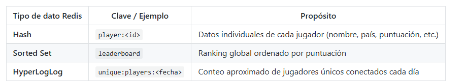

------------- ESPECIALIZACIÓN EN INTELIGENCIA ARTIFICIAL Y BIG DATA -------------
---------------------------------------------------------------------------------

Módulo:                     SISTEMAS DE BIG DATA

Profesor:                   Víctor J. González

Unidad de Trabajo:          UT02. Almacenamiento de datos

Práctica:                   PR0203: Estructuras de datos avanzadas: hashes, sorted sets e hyperloglogs

Resultados de aprendizaje:  RA3

# PR0203: Estructuras de datos avanzadas: hashes, sorted sets e hyperloglogs

En esta práctica vamos a desarrollar una aplicación en Python que gestione la información de jugadores y su clasificación en un torneo online, utilizando Redis como base de datos en memoria.

El ejercicio combina Hashes, Sorted Sets y HyperLogLog para modelar distintos aspectos del sistema.

Imagina que trabajas en el backend de un juego online multijugador. Tu aplicación debe:

Registrar jugadores.

Actualizar sus puntuaciones tras cada partida.

Mantener un ranking global.

Calcular el número aproximado de jugadores únicos que se conectan diariamente (sin consumir demasiada memoria).

Para ello, utilizaremos las siguientes estructuras de datos:



## Tareas a realizar

Tienes que crear las siguientes funciones:

#### Gestión de jugadores (Hash + Sorted Set)

Función add_player(id, name, country, score)

Crear el hash player:<id> con los campos:

    name, country, games_played, score

Insertar el jugador en el sorted set leaderboard con la puntuación inicial.


```python
!pip install redis
```

    Requirement already satisfied: redis in /opt/conda/lib/python3.11/site-packages (7.0.1)


```python
import redis
r = redis.Redis(
host="Redis",
port=6379,
db=0,
decode_responses=True
)

```


```python
id = 0
def add_player(name, country):
    global id
    score = 0
    id += 1
    r.hset(f"player:<{id}>","nombre",name)
    r.hset(f"player:<{id}>","country",country)
    r.hset(f"player:<{id}>","games_played",0)
    r.hset(f"player:<{id}>","score",score)
    
    r.zadd("leaderboard",{f"player:<{id}>":score})
    
    print("Jugador - >",r.hget(f"player:<{id}>","nombre"), "creado correctamente")
```


```python
add_player("angel","España")
```

    Jugador - > angel creado correctamente


Función update_score(id, points)

Incrementa el campo score del jugador, actualiza, su puntuación en el sorted set e incrementa el campo games_played.


```python
def update_score(id, points):
    
    juegosActuales = int(r.hget(f"player:<{id}>","games_played"))
    r.hdel(f"player:<{id}>","games_played")
    juegosActuales += 1
    r.hset(f"player:<{id}>","games_played",juegosActuales)
    
    if points >=  int(r.hget(f"player:<{id}>","score")):
        
        r.hdel(f"player:<{id}>","score")
        r.hset(f"player:<{id}>","score",points)
        
        r.zrem("leaderboard",f"player:<{id}>")
        r.zadd("leaderboard",{f"player:<{id}>":points})
        
        print("La puntuación actual es", points)

    else:
        print("La puntuación actual es menor a la de tu score \n mantenemos tu puntuación anterior")
```


```python
update_score(1,1000)
```

    La puntuación actual es 1000


**Función player_info(id)**

Muestra todos los datos almacenados en el hash player:<id>.


```python
def player_info(id):
    return r.hvals(f"player:<{id}>")
```


```python
player_info(1)
```


    ['angel', 'España', '2', '1000']


**Función show_top_players(n)**

Muestra los n mejores jugadores del ranking (leaderboard) con nombre, país y puntuación de cada jugador.


```python
def show_top_players(n):
    return r.zrange("leaderboard",0,n)
```


```python
show_top_players(1)
```


    ['player:<1>']


## Registro de actividad diaria (HyperLogLog)

Función register_login(player_id)

Cada vez que un jugador inicia sesión, añadir su ID al HyperLogLog diario.


```python
from datetime import date

def register_login(player_id):
    diario = date.today().isoformat()
    jugador = r.hget(f"player:<{player_id}>","nombre")
    r.pfadd(f"Hyperlog_{diario}",jugador)
```


```python
register_login(1)
```

### Función count_unique_logins(date)

Obtiene el número aproximado de jugadores únicos que se conectaron ese día usando:


```python
def  count_unique_logins(date):
    print(r.pfcount(date))
count_unique_logins("2025-11-11")
```

    0


**Función weekly_report(dates)**

Dada una lista de fechas, calcula el total aproximado de jugadores únicos en toda la semana con:


```python
def weekly_report(dates):
    keys_to_merge = dates  

    report_key = "unique:players:week"

    r.pfmerge(report_key, *keys_to_merge)

    total_unique = r.pfcount(report_key)

    r.delete(report_key)

    return total_unique
weekly_report(["2025-11-11", "2025-11-12", "2025-11-13"])
```


    0


