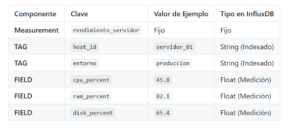

------------- ESPECIALIZACIÓN EN INTELIGENCIA ARTIFICIAL Y BIG DATA -------------
---------------------------------------------------------------------------------

Módulo:                     SISTEMAS DE BIG DATA

Profesor:                   Víctor J. González

Unidad de Trabajo:          UT02. Almacenamiento de datos

Práctica:                   PR0205: Escritura de datos en InfluxDB

Resultados de aprendizaje:  RA3

Práctica: Monitorización de rendimiento del servidor con Python

# PARTE I: Obtención de métricas

Para esta práctica, utilizaremos la librería psutil para obtener las métricas de rendimiento de la máquina en la que se ejecuta el script.

El siguiente código muestra cómo obtener los porcentajes de uso de CPU y RAM, así como el total de RAM utilizada:


```python
import psutil
import time

# Obtener estadísticas de uso
def obtener_metricas_sistema(host_id):
    # Uso de CPU (promedio de los últimos segundos)
    cpu_usage = psutil.cpu_percent(interval=1)
    
    # Uso de RAM
    mem = psutil.virtual_memory()
    ram_used_gb = round(mem.used / (1024**3), 2) # Conversión a GB
    ram_percent = mem.percent
    
    # Uso de disco (en el punto de montaje raíz)
    disk = psutil.disk_usage('/')
    disk_percent = disk.percent
    
    return {
        'host': host_id,
        'cpu_percent': cpu_usage,
        'ram_used_gb': ram_used_gb,
        'ram_percent': ram_percent,
        'disk_percent': disk_percent
    }


# Ejemplo de uso:
# metrics = obtener_metricas_sistema("servidor_01")
# print(metrics)
```

# PARTE II: Modelado y escritura en lote
1. Diseño del modelo InfluxDB
El modelo debe asegurar que las métricas sean fáciles de consultar por máquina (host).



# 2. Tareas de Implementación
Desarrolla el script Python principal (agente_monitoreo.py) para:

Inicialización: configurar el cliente y la WriteAPI en modo Batching (asíncrono) para optimizar el rendimiento.

Bucle de lectura: crear un bucle infinito que: 

a. Llame a obtener_metricas_sistema("servidor_A") cada segundo. 

b. Construya un nuevo objeto Point por cada lectura, respetando el modelo de datos anterior. 

c. Use la write_api.write() para enviar el punto al buffer.

Cierre: Asegurarse de que el script llama a write_api.close() antes de salir (p.ej., en una excepción de teclado) para vaciar cualquier punto que quede en el buffer.


```python
def agente_monitoreo():
    import influxdb_client
    from influxdb_client.client.write_api import ASYNCHRONOUS, WriteOptions
    from influxdb_client.client.exceptions import InfluxDBError
    from urllib3.exceptions import NewConnectionError

    INFLUX_URL = "http://influxdb2:8086"
    INFLUX_TOKEN = "MyInitialAdminToken0="

    print("--- Iniciando conexión a InfluxDB ---")

    client = None
    write_api = None
    try:
        client = influxdb_client.InfluxDBClient(
            url=INFLUX_URL,
            token=INFLUX_TOKEN,
            org="dev_pruebas"
        )

        print(f"Verificando estado de salud de InfluxDB en {INFLUX_URL}...")
        health = client.health()
    
        if health.status == "pass":
            print("[INFO] ¡Conexión exitosa!")
            print(f"[INFO] Versión del servidor: {health.version}")
        else:
            print(f"[ERROR] Conexión fallida. Estado: {health.status}")
            print(f"[INFO] Mensaje: {health.message}")

        
        write_options = WriteOptions(
            batch_size=500,
            flush_interval=1000,
            write_type=ASYNCHRONOUS
        )
 
        write_api = client.write_api(write_options=write_options)
        
        from influxdb_client import Point
        while True:
            metricas = obtener_metricas_sistema("servidor_A") 
            punto = (
                Point("rendimiento_servidor")
                .tag("host_id", "servidor_A")
                .tag("entorno", "PRODUCCION")
                .field("cpu", metricas["cpu_percent"])
                .field("ram", metricas["ram_percent"])
                .field("disk", metricas["disk_percent"])
            )
            print(metricas)
            write_api.write(bucket="prueba", org="docs", record=punto)

    except KeyboardInterrupt:
        print("\n[INFO] Interrupción por teclado recibida. Cerrando el script...")
    
    finally:
       
        if write_api:
            write_api.close()
            print("write_api cerrado")


```


```python
agente_monitoreo()
```

    --- Iniciando conexión a InfluxDB ---
    Verificando estado de salud de InfluxDB en http://influxdb2:8086...
    [INFO] ¡Conexión exitosa!
    [INFO] Versión del servidor: v2.7.12
    {'host': 'servidor_A', 'cpu_percent': 1.9, 'ram_used_gb': 1.29, 'ram_percent': 9.9, 'disk_percent': 3.9}
    {'host': 'servidor_A', 'cpu_percent': 1.1, 'ram_used_gb': 1.28, 'ram_percent': 9.8, 'disk_percent': 3.9}
    {'host': 'servidor_A', 'cpu_percent': 0.0, 'ram_used_gb': 1.28, 'ram_percent': 9.8, 'disk_percent': 3.9}
    {'host': 'servidor_A', 'cpu_percent': 0.8, 'ram_used_gb': 1.28, 'ram_percent': 9.8, 'disk_percent': 3.9}
    {'host': 'servidor_A', 'cpu_percent': 0.0, 'ram_used_gb': 1.28, 'ram_percent': 9.8, 'disk_percent': 3.9}
    {'host': 'servidor_A', 'cpu_percent': 0.0, 'ram_used_gb': 1.28, 'ram_percent': 9.8, 'disk_percent': 3.9}
    {'host': 'servidor_A', 'cpu_percent': 0.7, 'ram_used_gb': 1.28, 'ram_percent': 9.8, 'disk_percent': 3.9}
    {'host': 'servidor_A', 'cpu_percent': 0.1, 'ram_used_gb': 1.28, 'ram_percent': 9.8, 'disk_percent': 3.9}
    {'host': 'servidor_A', 'cpu_percent': 0.6, 'ram_used_gb': 1.29, 'ram_percent': 9.9, 'disk_percent': 3.9}
    {'host': 'servidor_A', 'cpu_percent': 0.3, 'ram_used_gb': 1.28, 'ram_percent': 9.8, 'disk_percent': 3.9}
    {'host': 'servidor_A', 'cpu_percent': 1.5, 'ram_used_gb': 1.28, 'ram_percent': 9.8, 'disk_percent': 3.9}
    {'host': 'servidor_A', 'cpu_percent': 0.6, 'ram_used_gb': 1.28, 'ram_percent': 9.8, 'disk_percent': 3.9}
    {'host': 'servidor_A', 'cpu_percent': 0.1, 'ram_used_gb': 1.28, 'ram_percent': 9.8, 'disk_percent': 3.9}
    {'host': 'servidor_A', 'cpu_percent': 0.1, 'ram_used_gb': 1.28, 'ram_percent': 9.8, 'disk_percent': 3.9}
    {'host': 'servidor_A', 'cpu_percent': 0.7, 'ram_used_gb': 1.28, 'ram_percent': 9.8, 'disk_percent': 3.9}
    {'host': 'servidor_A', 'cpu_percent': 1.0, 'ram_used_gb': 1.28, 'ram_percent': 9.8, 'disk_percent': 3.9}
    {'host': 'servidor_A', 'cpu_percent': 0.1, 'ram_used_gb': 1.28, 'ram_percent': 9.8, 'disk_percent': 3.9}
    {'host': 'servidor_A', 'cpu_percent': 0.0, 'ram_used_gb': 1.28, 'ram_percent': 9.8, 'disk_percent': 3.9}
    {'host': 'servidor_A', 'cpu_percent': 0.1, 'ram_used_gb': 1.28, 'ram_percent': 9.8, 'disk_percent': 3.9}
    {'host': 'servidor_A', 'cpu_percent': 0.6, 'ram_used_gb': 1.28, 'ram_percent': 9.8, 'disk_percent': 3.9}
    {'host': 'servidor_A', 'cpu_percent': 1.5, 'ram_used_gb': 1.28, 'ram_percent': 9.8, 'disk_percent': 3.9}
    {'host': 'servidor_A', 'cpu_percent': 0.3, 'ram_used_gb': 1.28, 'ram_percent': 9.8, 'disk_percent': 3.9}
    {'host': 'servidor_A', 'cpu_percent': 0.1, 'ram_used_gb': 1.28, 'ram_percent': 9.8, 'disk_percent': 3.9}
    {'host': 'servidor_A', 'cpu_percent': 0.0, 'ram_used_gb': 1.28, 'ram_percent': 9.8, 'disk_percent': 3.9}
    {'host': 'servidor_A', 'cpu_percent': 1.1, 'ram_used_gb': 1.28, 'ram_percent': 9.8, 'disk_percent': 3.9}
    {'host': 'servidor_A', 'cpu_percent': 0.0, 'ram_used_gb': 1.28, 'ram_percent': 9.8, 'disk_percent': 3.9}
    {'host': 'servidor_A', 'cpu_percent': 0.0, 'ram_used_gb': 1.28, 'ram_percent': 9.8, 'disk_percent': 3.9}
    {'host': 'servidor_A', 'cpu_percent': 0.0, 'ram_used_gb': 1.28, 'ram_percent': 9.8, 'disk_percent': 3.9}
    {'host': 'servidor_A', 'cpu_percent': 0.0, 'ram_used_gb': 1.28, 'ram_percent': 9.8, 'disk_percent': 3.9}
    {'host': 'servidor_A', 'cpu_percent': 2.6, 'ram_used_gb': 1.28, 'ram_percent': 9.9, 'disk_percent': 3.9}
    {'host': 'servidor_A', 'cpu_percent': 0.2, 'ram_used_gb': 1.28, 'ram_percent': 9.9, 'disk_percent': 3.9}
    {'host': 'servidor_A', 'cpu_percent': 0.1, 'ram_used_gb': 1.28, 'ram_percent': 9.9, 'disk_percent': 3.9}
    {'host': 'servidor_A', 'cpu_percent': 0.0, 'ram_used_gb': 1.28, 'ram_percent': 9.9, 'disk_percent': 3.9}
    {'host': 'servidor_A', 'cpu_percent': 0.8, 'ram_used_gb': 1.29, 'ram_percent': 9.9, 'disk_percent': 3.9}
    {'host': 'servidor_A', 'cpu_percent': 0.5, 'ram_used_gb': 1.29, 'ram_percent': 9.9, 'disk_percent': 3.9}
    {'host': 'servidor_A', 'cpu_percent': 0.0, 'ram_used_gb': 1.29, 'ram_percent': 9.9, 'disk_percent': 3.9}
    {'host': 'servidor_A', 'cpu_percent': 0.0, 'ram_used_gb': 1.29, 'ram_percent': 9.9, 'disk_percent': 3.9}
    {'host': 'servidor_A', 'cpu_percent': 0.1, 'ram_used_gb': 1.29, 'ram_percent': 9.9, 'disk_percent': 3.9}
    {'host': 'servidor_A', 'cpu_percent': 1.1, 'ram_used_gb': 1.28, 'ram_percent': 9.9, 'disk_percent': 3.9}
    
    [INFO] Interrupción por teclado recibida. Cerrando el script...
    [INFO] write_api cerrado correctamente.


```python

```
