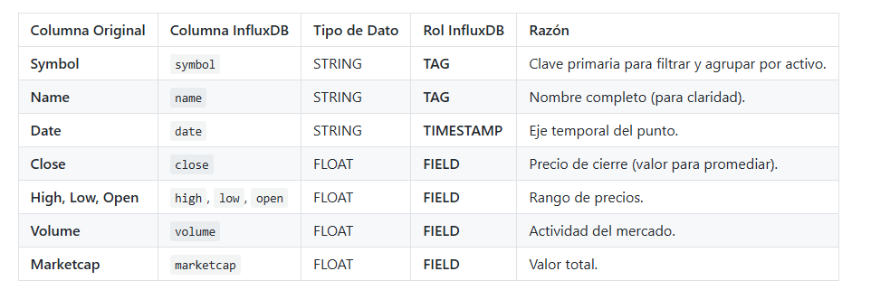
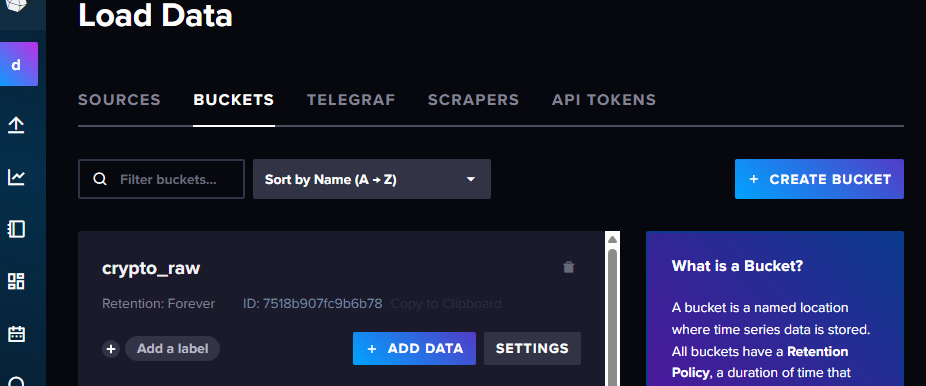
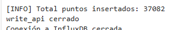
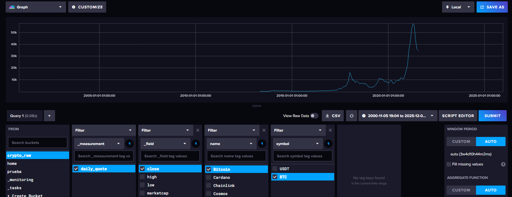

------------- ESPECIALIZACIÓN EN INTELIGENCIA ARTIFICIAL Y BIG DATA -------------
---------------------------------------------------------------------------------

Módulo:                     SISTEMAS DE BIG DATA

Profesor:                   Víctor J. González

Unidad de Trabajo:          UT02. Almacenamiento de datos

Práctica:                   PR0206: Ingesta de datos en Influx

Resultados de aprendizaje:  RA3


# PR0206: Ingesta de datos financieros en InfluxDB

## Objetivo de la Práctica

En esta práctica vamos a crear un un agente de ingestión en Python que lea múltiples ficheros CSV de cotizaciones, los procese y los almacene de manera eficiente en un Bucket de InfluxDB, aplicando el modelo de datos correcto (Tags y Fields).

Para ello vamos a trabajar con el dataset Cryptocurrency Historical Prices de Kaggle, que contiene datos sobre la evolución de precios de 23 criptomonedas entre los años 2017 y 2021.


### Tareas a realizar

Para realizar esta práctica tienes que tener en cuenta lo siguiente:

Nombre del bucket: crypto_raw.

Measurement: daily_quote

Y Mapearás las siguientes columnas del fichero CSV.




Debes desarrollar el script ingesta_crypto.py que realice los siguientes pasos:

Usa el módulo os para listar los 23 ficheros en el directorio /data/crypto_files

/.
Configura el InfluxDBClient y la WriteAPI en modo Asíncrono (ASYNCHRONOUS) con un tamaño de batch definido (p.e. 5000 punto

s).
Inicializa un contador global de puntos inserta

dos.
Dentro del bucle de lectura de ficheros (usando el módulo csv.reader para manejo de 

CSV):
Omite la primera línea (cabecera) de cada fi

chero.
Asegúrate de convertir los campos (Close, Volume, Marketcap, etc.) float antes de ser asignados al

 Point.
Por cada fila, construye un objeto Point que respete el modelo definido, usando el campo Date como el Timestamp de

l punto.
Después de procesar cada fichero, imprime un mensaje (Ej: Fichero BTC.csv pr

ocesado).
Al finalizar el bucle de ficheros, llamar a write_api.close() para vaciar los puntos restantes del buffer antes de que el script termine.





```python
!ls /home/jovyan/work/data/crypto_files/
```

    'Cadenas en Redis.ipynb'	 PR0203_Estructurasdedatosavanzadas.ipynb
     conexion_influx.ipynb		 PR0204.ipynb
     data				 PR0206.ipynb
    'Introduccion Redis.ipynb'	 PR205.ipynb
     locations.py			 __pycache__
    'PR0202_Listas en Redis.ipynb'	 Untitled.ipynb


```python
import os
import csv
import psutil
import time
from datetime import datetime, timezone

import influxdb_client
from influxdb_client.client.write_api import ASYNCHRONOUS, WriteOptions
from influxdb_client.client.exceptions import InfluxDBError
from urllib3.exceptions import NewConnectionError
from influxdb_client import Point


def convertir_fecha(date_str):
    dt = datetime.strptime(date_str, "%Y-%m-%d %H:%M:%S")
    dt_utc = dt.replace(tzinfo=timezone.utc)
    return dt_utc.isoformat().replace("+00:00", "Z")


def ingesta_crypto():

    INFLUX_URL = "http://influxdb-influxdb2-1:8086"
    INFLUX_TOKEN = "MyInitialAdminToken0="
    ORG = "docs"
    BUCKET = "crypto_raw"

    client = None
    write_api = None

    try:
        client = influxdb_client.InfluxDBClient(
            url=INFLUX_URL,
            token=INFLUX_TOKEN,
            org=ORG
        )

        health = client.health()
        if health.status != "pass":
            return

        write_options = WriteOptions(
            batch_size=5000,
            flush_interval=2000,
            write_type=ASYNCHRONOUS
        )

        write_api = client.write_api(write_options=write_options)

        carpeta = "/home/jovyan/work/data/crypto_files/"
        archivos = os.listdir(carpeta)

        total_puntos = 0

        for nombre_csv in archivos:
            ruta = os.path.join(carpeta, nombre_csv)

            with open(ruta, "r") as f:
                reader = csv.reader(f)
                next(reader)

                for fila in reader:
                    date_str = fila[3]
                    open_p = float(fila[4])
                    high = float(fila[5])
                    low = float(fila[6])
                    close = float(fila[7])
                    volume = float(fila[8])
                    marketcap = float(fila[9])

                    symbol = fila[2]
                    name = fila[1]

                    fecha = convertir_fecha(date_str)

                    punto = (
                        Point("daily_quote")
                        .tag("symbol", symbol)
                        .tag("name", name)
                        .field("open", open_p)
                        .field("high", high)
                        .field("low", low)
                        .field("close", close)
                        .field("volume", volume)
                        .field("marketcap", marketcap)
                        .time(fecha)
                    )
                    print("Insertando:", punto.to_line_protocol())
                    write_api.write(bucket=BUCKET, org=ORG, record=punto)
                    total_puntos += 1

        print(f"Total de puntos{total_puntos}")

    except (InfluxDBError, NewConnectionError) as e:
        print(e)

    except KeyboardInterrupt:
        print("Interrumpido")

    finally:
        if write_api:
            write_api.close()
        if client:
            client.close()
```


```python
ingesta_crypto()
```




