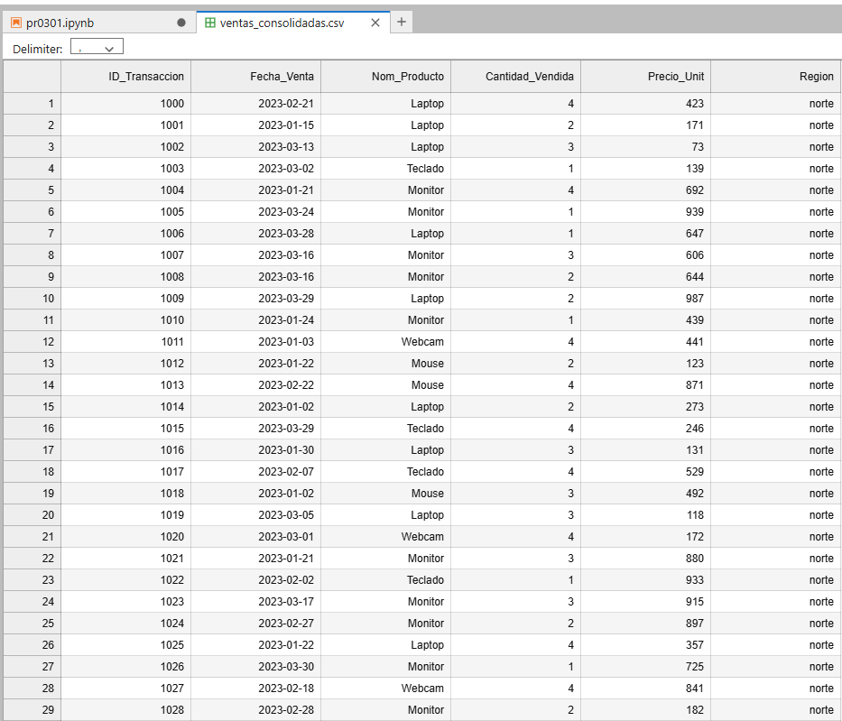

------------- ESPECIALIZACIÓN EN INTELIGENCIA ARTIFICIAL Y BIG DATA -------------
---------------------------------------------------------------------------------

Módulo:                     SISTEMAS DE BIG DATA

Profesor:                   Víctor J. González

Unidad de Trabajo:          UT03. Gestión de los datos

Práctica:                   PR0301: Lectura de datos de archivos

Resultados de aprendizaje: 

# PR0301: Lectura de datos de archivos

Objetivo de la Práctica

Supón que trabajas para una empresa que acaba de fusionar sus operaciones de tres regiones distintas (Norte, Sur y Este). El problema es que cada región gestionaba sus datos de ventas con sistemas diferentes y necesitas un Dataset Maestro unificado para el Dashboard de BI.

Las fuentes de datos son:

**Región Norte (ventas_norte.csv): un sistema legado que exporta archivos de texto separados por punto y coma (;).**

**Región Sur (ventas_sur.xlsx): el equipo de ventas usa Excel. El archivo contiene múltiples pestañas (una por mes).**

**Región Este (ventas_este.json): Datos provenientes de una API moderna. La información del producto y del cliente está anidada dentro de diccionarios.**

Las cosas que tienes que tener en cuenta son:

    - Ingesta CSV: cargar los datos del Norte correctamente.


```python
import pandas as pd

df = pd.read_csv("ventas_norte.csv",sep=";")
df.head(2)
```


<div>
<style scoped>
    .dataframe tbody tr th:only-of-type {
        vertical-align: middle;
    }

    .dataframe tbody tr th {
        vertical-align: top;
    }

    .dataframe thead th {
        text-align: right;
    }
</style>
<table border="1" class="dataframe">
  <thead>
    <tr style="text-align: right;">
      <th></th>
      <th>ID_Transaccion</th>
      <th>Fecha_Venta</th>
      <th>Nom_Producto</th>
      <th>Cantidad_Vendida</th>
      <th>Precio_Unit</th>
    </tr>
  </thead>
  <tbody>
    <tr>
      <th>0</th>
      <td>1000</td>
      <td>2023-02-21</td>
      <td>Laptop</td>
      <td>4</td>
      <td>423</td>
    </tr>
    <tr>
      <th>1</th>
      <td>1001</td>
      <td>2023-01-15</td>
      <td>Laptop</td>
      <td>2</td>
      <td>171</td>
    </tr>
  </tbody>
</table>
</div>


    - Ingesta Excel: leer todas las pestañas del archivo Excel del Sur y combinarlas en un solo DataFrame.


```python
!pip install openpyxl
!pip install xlrd
```

    Requirement already satisfied: openpyxl in /opt/conda/lib/python3.11/site-packages (3.1.2)
    Requirement already satisfied: et-xmlfile in /opt/conda/lib/python3.11/site-packages (from openpyxl) (1.1.0)
    Requirement already satisfied: xlrd in /opt/conda/lib/python3.11/site-packages (2.0.1)


```python
df_excel = pd.read_excel("ventas_sur.xlsx",sheet_name = None,names=["ID_Transaccion", "Fecha_Venta", "Nom_Producto", "Cantidad_Vendida", "Precio_Unit"])
df_excel["Enero"] # df_excel es un diccionario con 3 elementos enero febrero y marzo
```


<div>
<style scoped>
    .dataframe tbody tr th:only-of-type {
        vertical-align: middle;
    }

    .dataframe tbody tr th {
        vertical-align: top;
    }

    .dataframe thead th {
        text-align: right;
    }
</style>
<table border="1" class="dataframe">
  <thead>
    <tr style="text-align: right;">
      <th></th>
      <th>ID_Transaccion</th>
      <th>Fecha_Venta</th>
      <th>Nom_Producto</th>
      <th>Cantidad_Vendida</th>
      <th>Precio_Unit</th>
    </tr>
  </thead>
  <tbody>
    <tr>
      <th>0</th>
      <td>2000</td>
      <td>2023-03-01</td>
      <td>Monitor</td>
      <td>6</td>
      <td>624</td>
    </tr>
    <tr>
      <th>1</th>
      <td>2001</td>
      <td>2023-03-04</td>
      <td>Laptop</td>
      <td>7</td>
      <td>941</td>
    </tr>
    <tr>
      <th>2</th>
      <td>2002</td>
      <td>2023-03-26</td>
      <td>Mouse</td>
      <td>3</td>
      <td>989</td>
    </tr>
    <tr>
      <th>3</th>
      <td>2003</td>
      <td>2023-02-01</td>
      <td>Webcam</td>
      <td>3</td>
      <td>621</td>
    </tr>
    <tr>
      <th>4</th>
      <td>2004</td>
      <td>2023-03-28</td>
      <td>Mouse</td>
      <td>5</td>
      <td>437</td>
    </tr>
    <tr>
      <th>5</th>
      <td>2005</td>
      <td>2023-02-02</td>
      <td>Mouse</td>
      <td>6</td>
      <td>134</td>
    </tr>
    <tr>
      <th>6</th>
      <td>2006</td>
      <td>2023-03-08</td>
      <td>Laptop</td>
      <td>9</td>
      <td>636</td>
    </tr>
    <tr>
      <th>7</th>
      <td>2007</td>
      <td>2023-01-18</td>
      <td>Teclado</td>
      <td>5</td>
      <td>922</td>
    </tr>
    <tr>
      <th>8</th>
      <td>2008</td>
      <td>2023-01-25</td>
      <td>Mouse</td>
      <td>1</td>
      <td>215</td>
    </tr>
    <tr>
      <th>9</th>
      <td>2009</td>
      <td>2023-02-23</td>
      <td>Monitor</td>
      <td>4</td>
      <td>845</td>
    </tr>
    <tr>
      <th>10</th>
      <td>2010</td>
      <td>2023-02-27</td>
      <td>Teclado</td>
      <td>5</td>
      <td>520</td>
    </tr>
    <tr>
      <th>11</th>
      <td>2011</td>
      <td>2023-03-08</td>
      <td>Webcam</td>
      <td>5</td>
      <td>645</td>
    </tr>
    <tr>
      <th>12</th>
      <td>2012</td>
      <td>2023-02-15</td>
      <td>Laptop</td>
      <td>7</td>
      <td>512</td>
    </tr>
    <tr>
      <th>13</th>
      <td>2013</td>
      <td>2023-01-24</td>
      <td>Webcam</td>
      <td>4</td>
      <td>94</td>
    </tr>
    <tr>
      <th>14</th>
      <td>2014</td>
      <td>2023-02-01</td>
      <td>Teclado</td>
      <td>1</td>
      <td>432</td>
    </tr>
    <tr>
      <th>15</th>
      <td>2015</td>
      <td>2023-02-16</td>
      <td>Teclado</td>
      <td>5</td>
      <td>395</td>
    </tr>
    <tr>
      <th>16</th>
      <td>2016</td>
      <td>2023-03-27</td>
      <td>Teclado</td>
      <td>7</td>
      <td>439</td>
    </tr>
    <tr>
      <th>17</th>
      <td>2017</td>
      <td>2023-01-23</td>
      <td>Webcam</td>
      <td>6</td>
      <td>748</td>
    </tr>
    <tr>
      <th>18</th>
      <td>2018</td>
      <td>2023-03-07</td>
      <td>Teclado</td>
      <td>5</td>
      <td>296</td>
    </tr>
    <tr>
      <th>19</th>
      <td>2019</td>
      <td>2023-01-27</td>
      <td>Webcam</td>
      <td>4</td>
      <td>780</td>
    </tr>
    <tr>
      <th>20</th>
      <td>2020</td>
      <td>2023-01-02</td>
      <td>Teclado</td>
      <td>2</td>
      <td>695</td>
    </tr>
    <tr>
      <th>21</th>
      <td>2021</td>
      <td>2023-03-31</td>
      <td>Monitor</td>
      <td>4</td>
      <td>413</td>
    </tr>
    <tr>
      <th>22</th>
      <td>2022</td>
      <td>2023-01-17</td>
      <td>Teclado</td>
      <td>3</td>
      <td>888</td>
    </tr>
    <tr>
      <th>23</th>
      <td>2023</td>
      <td>2023-02-02</td>
      <td>Webcam</td>
      <td>1</td>
      <td>476</td>
    </tr>
    <tr>
      <th>24</th>
      <td>2024</td>
      <td>2023-01-09</td>
      <td>Mouse</td>
      <td>8</td>
      <td>939</td>
    </tr>
    <tr>
      <th>25</th>
      <td>2025</td>
      <td>2023-02-12</td>
      <td>Teclado</td>
      <td>5</td>
      <td>211</td>
    </tr>
    <tr>
      <th>26</th>
      <td>2026</td>
      <td>2023-02-17</td>
      <td>Mouse</td>
      <td>4</td>
      <td>758</td>
    </tr>
    <tr>
      <th>27</th>
      <td>2027</td>
      <td>2023-02-08</td>
      <td>Monitor</td>
      <td>8</td>
      <td>708</td>
    </tr>
    <tr>
      <th>28</th>
      <td>2028</td>
      <td>2023-02-11</td>
      <td>Laptop</td>
      <td>7</td>
      <td>118</td>
    </tr>
    <tr>
      <th>29</th>
      <td>2029</td>
      <td>2023-01-26</td>
      <td>Monitor</td>
      <td>2</td>
      <td>567</td>
    </tr>
    <tr>
      <th>30</th>
      <td>2030</td>
      <td>2023-02-19</td>
      <td>Teclado</td>
      <td>1</td>
      <td>997</td>
    </tr>
    <tr>
      <th>31</th>
      <td>2031</td>
      <td>2023-01-25</td>
      <td>Mouse</td>
      <td>4</td>
      <td>115</td>
    </tr>
    <tr>
      <th>32</th>
      <td>2032</td>
      <td>2023-01-24</td>
      <td>Mouse</td>
      <td>8</td>
      <td>683</td>
    </tr>
    <tr>
      <th>33</th>
      <td>2033</td>
      <td>2023-01-13</td>
      <td>Webcam</td>
      <td>2</td>
      <td>682</td>
    </tr>
    <tr>
      <th>34</th>
      <td>2034</td>
      <td>2023-03-01</td>
      <td>Mouse</td>
      <td>3</td>
      <td>209</td>
    </tr>
    <tr>
      <th>35</th>
      <td>2035</td>
      <td>2023-01-07</td>
      <td>Webcam</td>
      <td>1</td>
      <td>755</td>
    </tr>
    <tr>
      <th>36</th>
      <td>2036</td>
      <td>2023-02-26</td>
      <td>Laptop</td>
      <td>1</td>
      <td>56</td>
    </tr>
    <tr>
      <th>37</th>
      <td>2037</td>
      <td>2023-02-05</td>
      <td>Teclado</td>
      <td>3</td>
      <td>799</td>
    </tr>
    <tr>
      <th>38</th>
      <td>2038</td>
      <td>2023-02-14</td>
      <td>Webcam</td>
      <td>5</td>
      <td>388</td>
    </tr>
    <tr>
      <th>39</th>
      <td>2039</td>
      <td>2023-01-20</td>
      <td>Laptop</td>
      <td>3</td>
      <td>714</td>
    </tr>
    <tr>
      <th>40</th>
      <td>2040</td>
      <td>2023-03-06</td>
      <td>Mouse</td>
      <td>1</td>
      <td>544</td>
    </tr>
    <tr>
      <th>41</th>
      <td>2041</td>
      <td>2023-01-08</td>
      <td>Mouse</td>
      <td>1</td>
      <td>298</td>
    </tr>
    <tr>
      <th>42</th>
      <td>2042</td>
      <td>2023-01-16</td>
      <td>Laptop</td>
      <td>8</td>
      <td>236</td>
    </tr>
    <tr>
      <th>43</th>
      <td>2043</td>
      <td>2023-01-14</td>
      <td>Mouse</td>
      <td>2</td>
      <td>886</td>
    </tr>
    <tr>
      <th>44</th>
      <td>2044</td>
      <td>2023-03-17</td>
      <td>Laptop</td>
      <td>3</td>
      <td>892</td>
    </tr>
    <tr>
      <th>45</th>
      <td>2045</td>
      <td>2023-03-28</td>
      <td>Webcam</td>
      <td>2</td>
      <td>817</td>
    </tr>
    <tr>
      <th>46</th>
      <td>2046</td>
      <td>2023-01-15</td>
      <td>Webcam</td>
      <td>3</td>
      <td>292</td>
    </tr>
    <tr>
      <th>47</th>
      <td>2047</td>
      <td>2023-03-07</td>
      <td>Laptop</td>
      <td>7</td>
      <td>900</td>
    </tr>
    <tr>
      <th>48</th>
      <td>2048</td>
      <td>2023-02-01</td>
      <td>Webcam</td>
      <td>1</td>
      <td>81</td>
    </tr>
    <tr>
      <th>49</th>
      <td>2049</td>
      <td>2023-03-28</td>
      <td>Webcam</td>
      <td>8</td>
      <td>615</td>
    </tr>
  </tbody>
</table>
</div>


```python
df_sur = pd.concat(df_excel.values(),ignore_index=True)
df_sur
```


<div>
<style scoped>
    .dataframe tbody tr th:only-of-type {
        vertical-align: middle;
    }

    .dataframe tbody tr th {
        vertical-align: top;
    }

    .dataframe thead th {
        text-align: right;
    }
</style>
<table border="1" class="dataframe">
  <thead>
    <tr style="text-align: right;">
      <th></th>
      <th>ID_Transaccion</th>
      <th>Fecha_Venta</th>
      <th>Nom_Producto</th>
      <th>Cantidad_Vendida</th>
      <th>Precio_Unit</th>
    </tr>
  </thead>
  <tbody>
    <tr>
      <th>0</th>
      <td>2000</td>
      <td>2023-03-01</td>
      <td>Monitor</td>
      <td>6</td>
      <td>624</td>
    </tr>
    <tr>
      <th>1</th>
      <td>2001</td>
      <td>2023-03-04</td>
      <td>Laptop</td>
      <td>7</td>
      <td>941</td>
    </tr>
    <tr>
      <th>2</th>
      <td>2002</td>
      <td>2023-03-26</td>
      <td>Mouse</td>
      <td>3</td>
      <td>989</td>
    </tr>
    <tr>
      <th>3</th>
      <td>2003</td>
      <td>2023-02-01</td>
      <td>Webcam</td>
      <td>3</td>
      <td>621</td>
    </tr>
    <tr>
      <th>4</th>
      <td>2004</td>
      <td>2023-03-28</td>
      <td>Mouse</td>
      <td>5</td>
      <td>437</td>
    </tr>
    <tr>
      <th>...</th>
      <td>...</td>
      <td>...</td>
      <td>...</td>
      <td>...</td>
      <td>...</td>
    </tr>
    <tr>
      <th>145</th>
      <td>2045</td>
      <td>2023-03-25</td>
      <td>Mouse</td>
      <td>5</td>
      <td>192</td>
    </tr>
    <tr>
      <th>146</th>
      <td>2046</td>
      <td>2023-03-29</td>
      <td>Teclado</td>
      <td>9</td>
      <td>319</td>
    </tr>
    <tr>
      <th>147</th>
      <td>2047</td>
      <td>2023-03-10</td>
      <td>Laptop</td>
      <td>1</td>
      <td>664</td>
    </tr>
    <tr>
      <th>148</th>
      <td>2048</td>
      <td>2023-02-03</td>
      <td>Laptop</td>
      <td>5</td>
      <td>345</td>
    </tr>
    <tr>
      <th>149</th>
      <td>2049</td>
      <td>2023-01-06</td>
      <td>Monitor</td>
      <td>6</td>
      <td>429</td>
    </tr>
  </tbody>
</table>
<p>150 rows × 5 columns</p>
</div>


    - Ingesta JSON (Semi-estructurado): cargar los datos del Este. Deberás usar pd.json_normalize para aplanar la información anidada 
    - (desglosar el diccionario de productos en columnas individuales).


```python
import json
with open("ventas_este.json") as f:
    data = json.load(f)
    
df_json = pd.json_normalize(data)
df_json

```


<div>
<style scoped>
    .dataframe tbody tr th:only-of-type {
        vertical-align: middle;
    }

    .dataframe tbody tr th {
        vertical-align: top;
    }

    .dataframe thead th {
        text-align: right;
    }
</style>
<table border="1" class="dataframe">
  <thead>
    <tr style="text-align: right;">
      <th></th>
      <th>id_orden</th>
      <th>timestamp</th>
      <th>detalles_producto.nombre</th>
      <th>detalles_producto.categoria</th>
      <th>detalles_producto.specs.cantidad</th>
      <th>detalles_producto.specs.precio</th>
      <th>cliente.nombre</th>
      <th>cliente.email</th>
    </tr>
  </thead>
  <tbody>
    <tr>
      <th>0</th>
      <td>ORD-3000</td>
      <td>2023-03-09 00:00:00</td>
      <td>Monitor</td>
      <td>Electrónica</td>
      <td>2</td>
      <td>244</td>
      <td>Cliente_0</td>
      <td>cliente0@mail.com</td>
    </tr>
    <tr>
      <th>1</th>
      <td>ORD-3001</td>
      <td>2023-01-20 00:00:00</td>
      <td>Laptop</td>
      <td>Electrónica</td>
      <td>2</td>
      <td>578</td>
      <td>Cliente_1</td>
      <td>cliente1@mail.com</td>
    </tr>
    <tr>
      <th>2</th>
      <td>ORD-3002</td>
      <td>2023-01-01 00:00:00</td>
      <td>Mouse</td>
      <td>Electrónica</td>
      <td>2</td>
      <td>339</td>
      <td>Cliente_2</td>
      <td>cliente2@mail.com</td>
    </tr>
    <tr>
      <th>3</th>
      <td>ORD-3003</td>
      <td>2023-02-07 00:00:00</td>
      <td>Webcam</td>
      <td>Electrónica</td>
      <td>2</td>
      <td>158</td>
      <td>Cliente_3</td>
      <td>cliente3@mail.com</td>
    </tr>
    <tr>
      <th>4</th>
      <td>ORD-3004</td>
      <td>2023-03-18 00:00:00</td>
      <td>Monitor</td>
      <td>Electrónica</td>
      <td>1</td>
      <td>692</td>
      <td>Cliente_4</td>
      <td>cliente4@mail.com</td>
    </tr>
    <tr>
      <th>...</th>
      <td>...</td>
      <td>...</td>
      <td>...</td>
      <td>...</td>
      <td>...</td>
      <td>...</td>
      <td>...</td>
      <td>...</td>
    </tr>
    <tr>
      <th>95</th>
      <td>ORD-3095</td>
      <td>2023-03-28 00:00:00</td>
      <td>Webcam</td>
      <td>Electrónica</td>
      <td>1</td>
      <td>857</td>
      <td>Cliente_95</td>
      <td>cliente95@mail.com</td>
    </tr>
    <tr>
      <th>96</th>
      <td>ORD-3096</td>
      <td>2023-01-18 00:00:00</td>
      <td>Webcam</td>
      <td>Electrónica</td>
      <td>2</td>
      <td>375</td>
      <td>Cliente_96</td>
      <td>cliente96@mail.com</td>
    </tr>
    <tr>
      <th>97</th>
      <td>ORD-3097</td>
      <td>2023-02-10 00:00:00</td>
      <td>Mouse</td>
      <td>Electrónica</td>
      <td>1</td>
      <td>696</td>
      <td>Cliente_97</td>
      <td>cliente97@mail.com</td>
    </tr>
    <tr>
      <th>98</th>
      <td>ORD-3098</td>
      <td>2023-01-25 00:00:00</td>
      <td>Mouse</td>
      <td>Electrónica</td>
      <td>2</td>
      <td>618</td>
      <td>Cliente_98</td>
      <td>cliente98@mail.com</td>
    </tr>
    <tr>
      <th>99</th>
      <td>ORD-3099</td>
      <td>2023-03-27 00:00:00</td>
      <td>Webcam</td>
      <td>Electrónica</td>
      <td>1</td>
      <td>844</td>
      <td>Cliente_99</td>
      <td>cliente99@mail.com</td>
    </tr>
  </tbody>
</table>
<p>100 rows × 8 columns</p>
</div>


```python
df_json2 = df_json[["id_orden","timestamp","detalles_producto.nombre","detalles_producto.specs.cantidad","detalles_producto.specs.precio"]]
df_json2 = df_json2.rename(columns={
    "id_orden":"ID_Transaccion",
    "timestamp":"Fecha_Venta",
    "detalles_producto.nombre":"Nom_Producto",
    "detalles_producto.specs.cantidad":"Cantidad_Vendida",
    "detalles_producto.specs.precio":"Precio_Unit"
                           
})

df_json2
```


<div>
<style scoped>
    .dataframe tbody tr th:only-of-type {
        vertical-align: middle;
    }

    .dataframe tbody tr th {
        vertical-align: top;
    }

    .dataframe thead th {
        text-align: right;
    }
</style>
<table border="1" class="dataframe">
  <thead>
    <tr style="text-align: right;">
      <th></th>
      <th>ID_Transaccion</th>
      <th>Fecha_Venta</th>
      <th>Nom_Producto</th>
      <th>Cantidad_Vendida</th>
      <th>Precio_Unit</th>
    </tr>
  </thead>
  <tbody>
    <tr>
      <th>0</th>
      <td>ORD-3000</td>
      <td>2023-03-09 00:00:00</td>
      <td>Monitor</td>
      <td>2</td>
      <td>244</td>
    </tr>
    <tr>
      <th>1</th>
      <td>ORD-3001</td>
      <td>2023-01-20 00:00:00</td>
      <td>Laptop</td>
      <td>2</td>
      <td>578</td>
    </tr>
    <tr>
      <th>2</th>
      <td>ORD-3002</td>
      <td>2023-01-01 00:00:00</td>
      <td>Mouse</td>
      <td>2</td>
      <td>339</td>
    </tr>
    <tr>
      <th>3</th>
      <td>ORD-3003</td>
      <td>2023-02-07 00:00:00</td>
      <td>Webcam</td>
      <td>2</td>
      <td>158</td>
    </tr>
    <tr>
      <th>4</th>
      <td>ORD-3004</td>
      <td>2023-03-18 00:00:00</td>
      <td>Monitor</td>
      <td>1</td>
      <td>692</td>
    </tr>
    <tr>
      <th>...</th>
      <td>...</td>
      <td>...</td>
      <td>...</td>
      <td>...</td>
      <td>...</td>
    </tr>
    <tr>
      <th>95</th>
      <td>ORD-3095</td>
      <td>2023-03-28 00:00:00</td>
      <td>Webcam</td>
      <td>1</td>
      <td>857</td>
    </tr>
    <tr>
      <th>96</th>
      <td>ORD-3096</td>
      <td>2023-01-18 00:00:00</td>
      <td>Webcam</td>
      <td>2</td>
      <td>375</td>
    </tr>
    <tr>
      <th>97</th>
      <td>ORD-3097</td>
      <td>2023-02-10 00:00:00</td>
      <td>Mouse</td>
      <td>1</td>
      <td>696</td>
    </tr>
    <tr>
      <th>98</th>
      <td>ORD-3098</td>
      <td>2023-01-25 00:00:00</td>
      <td>Mouse</td>
      <td>2</td>
      <td>618</td>
    </tr>
    <tr>
      <th>99</th>
      <td>ORD-3099</td>
      <td>2023-03-27 00:00:00</td>
      <td>Webcam</td>
      <td>1</td>
      <td>844</td>
    </tr>
  </tbody>
</table>
<p>100 rows × 5 columns</p>
</div>


**Transformación y Limpieza:**

    - Asegúrate de que las columnas tengan nombres estándar en los tres DataFrames (ej: fecha, producto, cantidad, precio_unitario, region). Esto puedes hacerlo con la función rename() de Pandas.

    - Crea una columna nueva llamada region que indique de dónde viene cada fila (“Norte”, “Sur”, “Este”).

    - Consolidación: concatena los tres DataFrames en uno solo (df_total). Recuerda que puedes concatenar varios dataframes de Pandas con la función concat()


```python
#Ya les tengo con los nombre estandarizados
df["Region"] = "norte"                                                                                                                                                                         
df_sur["Region"] = "sur"
df_json2["Region"] = "este"
```


```python
df
```


<div>
<style scoped>
    .dataframe tbody tr th:only-of-type {
        vertical-align: middle;
    }

    .dataframe tbody tr th {
        vertical-align: top;
    }

    .dataframe thead th {
        text-align: right;
    }
</style>
<table border="1" class="dataframe">
  <thead>
    <tr style="text-align: right;">
      <th></th>
      <th>ID_Transaccion</th>
      <th>Fecha_Venta</th>
      <th>Nom_Producto</th>
      <th>Cantidad_Vendida</th>
      <th>Precio_Unit</th>
      <th>Region</th>
    </tr>
  </thead>
  <tbody>
    <tr>
      <th>0</th>
      <td>1000</td>
      <td>2023-02-21</td>
      <td>Laptop</td>
      <td>4</td>
      <td>423</td>
      <td>norte</td>
    </tr>
    <tr>
      <th>1</th>
      <td>1001</td>
      <td>2023-01-15</td>
      <td>Laptop</td>
      <td>2</td>
      <td>171</td>
      <td>norte</td>
    </tr>
    <tr>
      <th>2</th>
      <td>1002</td>
      <td>2023-03-13</td>
      <td>Laptop</td>
      <td>3</td>
      <td>73</td>
      <td>norte</td>
    </tr>
    <tr>
      <th>3</th>
      <td>1003</td>
      <td>2023-03-02</td>
      <td>Teclado</td>
      <td>1</td>
      <td>139</td>
      <td>norte</td>
    </tr>
    <tr>
      <th>4</th>
      <td>1004</td>
      <td>2023-01-21</td>
      <td>Monitor</td>
      <td>4</td>
      <td>692</td>
      <td>norte</td>
    </tr>
    <tr>
      <th>...</th>
      <td>...</td>
      <td>...</td>
      <td>...</td>
      <td>...</td>
      <td>...</td>
      <td>...</td>
    </tr>
    <tr>
      <th>95</th>
      <td>1095</td>
      <td>2023-02-10</td>
      <td>Laptop</td>
      <td>3</td>
      <td>516</td>
      <td>norte</td>
    </tr>
    <tr>
      <th>96</th>
      <td>1096</td>
      <td>2023-01-29</td>
      <td>Monitor</td>
      <td>3</td>
      <td>321</td>
      <td>norte</td>
    </tr>
    <tr>
      <th>97</th>
      <td>1097</td>
      <td>2023-01-15</td>
      <td>Laptop</td>
      <td>4</td>
      <td>200</td>
      <td>norte</td>
    </tr>
    <tr>
      <th>98</th>
      <td>1098</td>
      <td>2023-02-14</td>
      <td>Mouse</td>
      <td>4</td>
      <td>626</td>
      <td>norte</td>
    </tr>
    <tr>
      <th>99</th>
      <td>1099</td>
      <td>2023-03-06</td>
      <td>Mouse</td>
      <td>3</td>
      <td>118</td>
      <td>norte</td>
    </tr>
  </tbody>
</table>
<p>100 rows × 6 columns</p>
</div>


```python
df_sur
```


<div>
<style scoped>
    .dataframe tbody tr th:only-of-type {
        vertical-align: middle;
    }

    .dataframe tbody tr th {
        vertical-align: top;
    }

    .dataframe thead th {
        text-align: right;
    }
</style>
<table border="1" class="dataframe">
  <thead>
    <tr style="text-align: right;">
      <th></th>
      <th>ID_Transaccion</th>
      <th>Fecha_Venta</th>
      <th>Nom_Producto</th>
      <th>Cantidad_Vendida</th>
      <th>Precio_Unit</th>
      <th>Region</th>
    </tr>
  </thead>
  <tbody>
    <tr>
      <th>0</th>
      <td>2000</td>
      <td>2023-03-01</td>
      <td>Monitor</td>
      <td>6</td>
      <td>624</td>
      <td>sur</td>
    </tr>
    <tr>
      <th>1</th>
      <td>2001</td>
      <td>2023-03-04</td>
      <td>Laptop</td>
      <td>7</td>
      <td>941</td>
      <td>sur</td>
    </tr>
    <tr>
      <th>2</th>
      <td>2002</td>
      <td>2023-03-26</td>
      <td>Mouse</td>
      <td>3</td>
      <td>989</td>
      <td>sur</td>
    </tr>
    <tr>
      <th>3</th>
      <td>2003</td>
      <td>2023-02-01</td>
      <td>Webcam</td>
      <td>3</td>
      <td>621</td>
      <td>sur</td>
    </tr>
    <tr>
      <th>4</th>
      <td>2004</td>
      <td>2023-03-28</td>
      <td>Mouse</td>
      <td>5</td>
      <td>437</td>
      <td>sur</td>
    </tr>
    <tr>
      <th>...</th>
      <td>...</td>
      <td>...</td>
      <td>...</td>
      <td>...</td>
      <td>...</td>
      <td>...</td>
    </tr>
    <tr>
      <th>145</th>
      <td>2045</td>
      <td>2023-03-25</td>
      <td>Mouse</td>
      <td>5</td>
      <td>192</td>
      <td>sur</td>
    </tr>
    <tr>
      <th>146</th>
      <td>2046</td>
      <td>2023-03-29</td>
      <td>Teclado</td>
      <td>9</td>
      <td>319</td>
      <td>sur</td>
    </tr>
    <tr>
      <th>147</th>
      <td>2047</td>
      <td>2023-03-10</td>
      <td>Laptop</td>
      <td>1</td>
      <td>664</td>
      <td>sur</td>
    </tr>
    <tr>
      <th>148</th>
      <td>2048</td>
      <td>2023-02-03</td>
      <td>Laptop</td>
      <td>5</td>
      <td>345</td>
      <td>sur</td>
    </tr>
    <tr>
      <th>149</th>
      <td>2049</td>
      <td>2023-01-06</td>
      <td>Monitor</td>
      <td>6</td>
      <td>429</td>
      <td>sur</td>
    </tr>
  </tbody>
</table>
<p>150 rows × 6 columns</p>
</div>


```python
df_json2
```


<div>
<style scoped>
    .dataframe tbody tr th:only-of-type {
        vertical-align: middle;
    }

    .dataframe tbody tr th {
        vertical-align: top;
    }

    .dataframe thead th {
        text-align: right;
    }
</style>
<table border="1" class="dataframe">
  <thead>
    <tr style="text-align: right;">
      <th></th>
      <th>ID_Transaccion</th>
      <th>Fecha_Venta</th>
      <th>Nom_Producto</th>
      <th>Cantidad_Vendida</th>
      <th>Precio_Unit</th>
      <th>Region</th>
    </tr>
  </thead>
  <tbody>
    <tr>
      <th>0</th>
      <td>ORD-3000</td>
      <td>2023-03-09 00:00:00</td>
      <td>Monitor</td>
      <td>2</td>
      <td>244</td>
      <td>este</td>
    </tr>
    <tr>
      <th>1</th>
      <td>ORD-3001</td>
      <td>2023-01-20 00:00:00</td>
      <td>Laptop</td>
      <td>2</td>
      <td>578</td>
      <td>este</td>
    </tr>
    <tr>
      <th>2</th>
      <td>ORD-3002</td>
      <td>2023-01-01 00:00:00</td>
      <td>Mouse</td>
      <td>2</td>
      <td>339</td>
      <td>este</td>
    </tr>
    <tr>
      <th>3</th>
      <td>ORD-3003</td>
      <td>2023-02-07 00:00:00</td>
      <td>Webcam</td>
      <td>2</td>
      <td>158</td>
      <td>este</td>
    </tr>
    <tr>
      <th>4</th>
      <td>ORD-3004</td>
      <td>2023-03-18 00:00:00</td>
      <td>Monitor</td>
      <td>1</td>
      <td>692</td>
      <td>este</td>
    </tr>
    <tr>
      <th>...</th>
      <td>...</td>
      <td>...</td>
      <td>...</td>
      <td>...</td>
      <td>...</td>
      <td>...</td>
    </tr>
    <tr>
      <th>95</th>
      <td>ORD-3095</td>
      <td>2023-03-28 00:00:00</td>
      <td>Webcam</td>
      <td>1</td>
      <td>857</td>
      <td>este</td>
    </tr>
    <tr>
      <th>96</th>
      <td>ORD-3096</td>
      <td>2023-01-18 00:00:00</td>
      <td>Webcam</td>
      <td>2</td>
      <td>375</td>
      <td>este</td>
    </tr>
    <tr>
      <th>97</th>
      <td>ORD-3097</td>
      <td>2023-02-10 00:00:00</td>
      <td>Mouse</td>
      <td>1</td>
      <td>696</td>
      <td>este</td>
    </tr>
    <tr>
      <th>98</th>
      <td>ORD-3098</td>
      <td>2023-01-25 00:00:00</td>
      <td>Mouse</td>
      <td>2</td>
      <td>618</td>
      <td>este</td>
    </tr>
    <tr>
      <th>99</th>
      <td>ORD-3099</td>
      <td>2023-03-27 00:00:00</td>
      <td>Webcam</td>
      <td>1</td>
      <td>844</td>
      <td>este</td>
    </tr>
  </tbody>
</table>
<p>100 rows × 6 columns</p>
</div>


```python
df_total = pd.concat([df,df_sur,df_json2])
df_total
```


<div>
<style scoped>
    .dataframe tbody tr th:only-of-type {
        vertical-align: middle;
    }

    .dataframe tbody tr th {
        vertical-align: top;
    }

    .dataframe thead th {
        text-align: right;
    }
</style>
<table border="1" class="dataframe">
  <thead>
    <tr style="text-align: right;">
      <th></th>
      <th>ID_Transaccion</th>
      <th>Fecha_Venta</th>
      <th>Nom_Producto</th>
      <th>Cantidad_Vendida</th>
      <th>Precio_Unit</th>
      <th>Region</th>
    </tr>
  </thead>
  <tbody>
    <tr>
      <th>0</th>
      <td>1000</td>
      <td>2023-02-21</td>
      <td>Laptop</td>
      <td>4</td>
      <td>423</td>
      <td>norte</td>
    </tr>
    <tr>
      <th>1</th>
      <td>1001</td>
      <td>2023-01-15</td>
      <td>Laptop</td>
      <td>2</td>
      <td>171</td>
      <td>norte</td>
    </tr>
    <tr>
      <th>2</th>
      <td>1002</td>
      <td>2023-03-13</td>
      <td>Laptop</td>
      <td>3</td>
      <td>73</td>
      <td>norte</td>
    </tr>
    <tr>
      <th>3</th>
      <td>1003</td>
      <td>2023-03-02</td>
      <td>Teclado</td>
      <td>1</td>
      <td>139</td>
      <td>norte</td>
    </tr>
    <tr>
      <th>4</th>
      <td>1004</td>
      <td>2023-01-21</td>
      <td>Monitor</td>
      <td>4</td>
      <td>692</td>
      <td>norte</td>
    </tr>
    <tr>
      <th>...</th>
      <td>...</td>
      <td>...</td>
      <td>...</td>
      <td>...</td>
      <td>...</td>
      <td>...</td>
    </tr>
    <tr>
      <th>95</th>
      <td>ORD-3095</td>
      <td>2023-03-28 00:00:00</td>
      <td>Webcam</td>
      <td>1</td>
      <td>857</td>
      <td>este</td>
    </tr>
    <tr>
      <th>96</th>
      <td>ORD-3096</td>
      <td>2023-01-18 00:00:00</td>
      <td>Webcam</td>
      <td>2</td>
      <td>375</td>
      <td>este</td>
    </tr>
    <tr>
      <th>97</th>
      <td>ORD-3097</td>
      <td>2023-02-10 00:00:00</td>
      <td>Mouse</td>
      <td>1</td>
      <td>696</td>
      <td>este</td>
    </tr>
    <tr>
      <th>98</th>
      <td>ORD-3098</td>
      <td>2023-01-25 00:00:00</td>
      <td>Mouse</td>
      <td>2</td>
      <td>618</td>
      <td>este</td>
    </tr>
    <tr>
      <th>99</th>
      <td>ORD-3099</td>
      <td>2023-03-27 00:00:00</td>
      <td>Webcam</td>
      <td>1</td>
      <td>844</td>
      <td>este</td>
    </tr>
  </tbody>
</table>
<p>350 rows × 6 columns</p>
</div>


**Exportación Estandarizada:**

    - Guarda el resultado final en un archivo CSV llamado ventas_consolidadas.csv. Para ello tienes la función to_csv() de Pandas. El archivo resultante debe usar coma (,) como separador, codificación utf-8 y no debe incluir el índice numérico del DataFrame (parámetro index=False).


```python
df_total.to_csv("ventas_consolidadas.csv",sep=",", encoding="utf-8",index=False)
```


