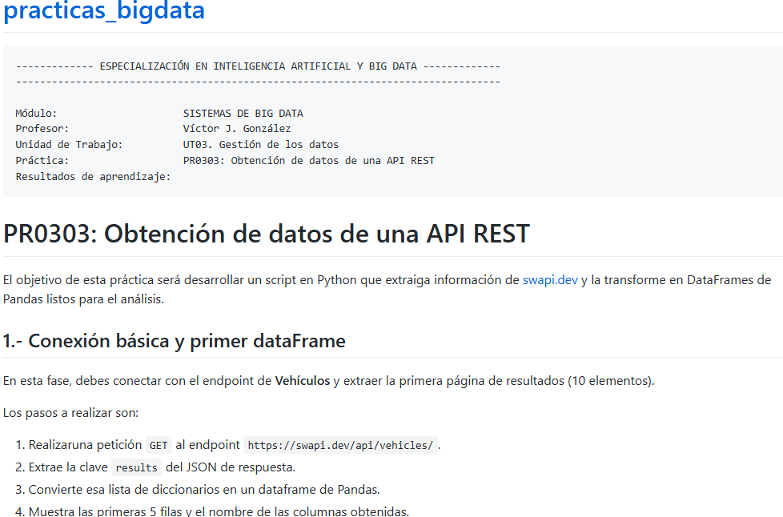
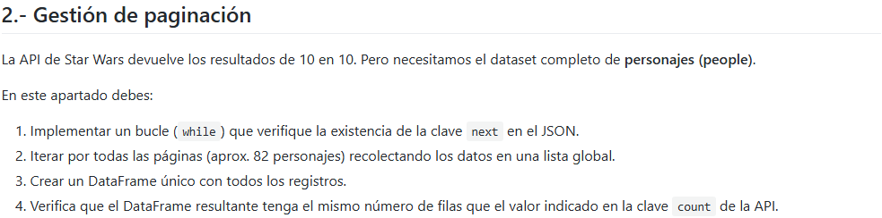
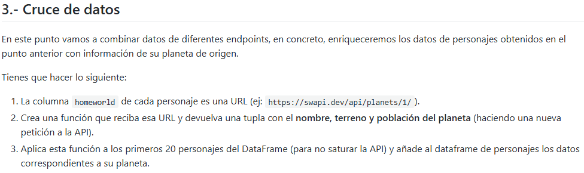
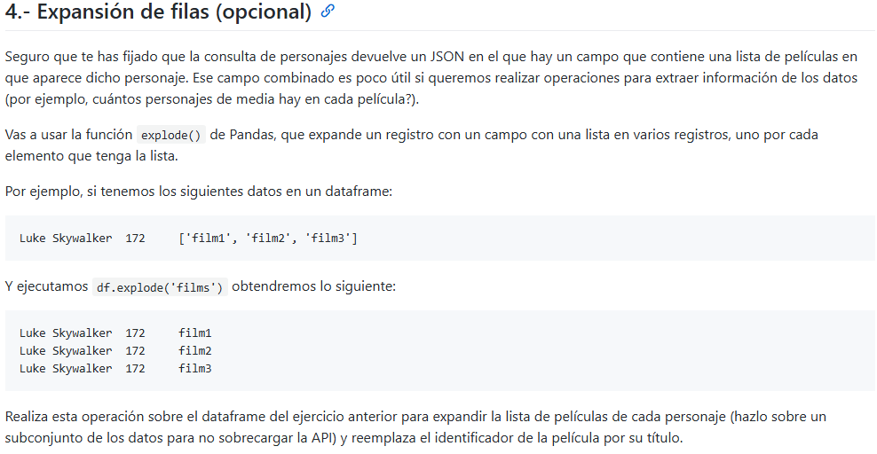

```python
!pip install requests
```

    Requirement already satisfied: requests in /opt/conda/lib/python3.11/site-packages (2.31.0)
    Requirement already satisfied: charset-normalizer<4,>=2 in /opt/conda/lib/python3.11/site-packages (from requests) (3.3.0)
    Requirement already satisfied: idna<4,>=2.5 in /opt/conda/lib/python3.11/site-packages (from requests) (3.4)
    Requirement already satisfied: urllib3<3,>=1.21.1 in /opt/conda/lib/python3.11/site-packages (from requests) (2.0.7)
    Requirement already satisfied: certifi>=2017.4.17 in /opt/conda/lib/python3.11/site-packages (from requests) (2023.7.22)


```python
import requests

url = "https://swapi.dev/api/vehicles"

response = requests.get(url)
if response.status_code == 200:
    print("!Éxito¡ Conexión Establecida.")
    datos = response.json()
    print(datos["results"])
else:
    print(f"Error. {response.status_code}")

```

    !Éxito¡ Conexión Establecida.
    [{'name': 'Sand Crawler', 'model': 'Digger Crawler', 'manufacturer': 'Corellia Mining Corporation', 'cost_in_credits': '150000', 'length': '36.8 ', 'max_atmosphering_speed': '30', 'crew': '46', 'passengers': '30', 'cargo_capacity': '50000', 'consumables': '2 months', 'vehicle_class': 'wheeled', 'pilots': [], 'films': ['https://swapi.dev/api/films/1/', 'https://swapi.dev/api/films/5/'], 'created': '2014-12-10T15:36:25.724000Z', 'edited': '2014-12-20T21:30:21.661000Z', 'url': 'https://swapi.dev/api/vehicles/4/'}, {'name': 'T-16 skyhopper', 'model': 'T-16 skyhopper', 'manufacturer': 'Incom Corporation', 'cost_in_credits': '14500', 'length': '10.4 ', 'max_atmosphering_speed': '1200', 'crew': '1', 'passengers': '1', 'cargo_capacity': '50', 'consumables': '0', 'vehicle_class': 'repulsorcraft', 'pilots': [], 'films': ['https://swapi.dev/api/films/1/'], 'created': '2014-12-10T16:01:52.434000Z', 'edited': '2014-12-20T21:30:21.665000Z', 'url': 'https://swapi.dev/api/vehicles/6/'}, {'name': 'X-34 landspeeder', 'model': 'X-34 landspeeder', 'manufacturer': 'SoroSuub Corporation', 'cost_in_credits': '10550', 'length': '3.4 ', 'max_atmosphering_speed': '250', 'crew': '1', 'passengers': '1', 'cargo_capacity': '5', 'consumables': 'unknown', 'vehicle_class': 'repulsorcraft', 'pilots': [], 'films': ['https://swapi.dev/api/films/1/'], 'created': '2014-12-10T16:13:52.586000Z', 'edited': '2014-12-20T21:30:21.668000Z', 'url': 'https://swapi.dev/api/vehicles/7/'}, {'name': 'TIE/LN starfighter', 'model': 'Twin Ion Engine/Ln Starfighter', 'manufacturer': 'Sienar Fleet Systems', 'cost_in_credits': 'unknown', 'length': '6.4', 'max_atmosphering_speed': '1200', 'crew': '1', 'passengers': '0', 'cargo_capacity': '65', 'consumables': '2 days', 'vehicle_class': 'starfighter', 'pilots': [], 'films': ['https://swapi.dev/api/films/1/', 'https://swapi.dev/api/films/2/', 'https://swapi.dev/api/films/3/'], 'created': '2014-12-10T16:33:52.860000Z', 'edited': '2014-12-20T21:30:21.670000Z', 'url': 'https://swapi.dev/api/vehicles/8/'}, {'name': 'Snowspeeder', 'model': 't-47 airspeeder', 'manufacturer': 'Incom corporation', 'cost_in_credits': 'unknown', 'length': '4.5', 'max_atmosphering_speed': '650', 'crew': '2', 'passengers': '0', 'cargo_capacity': '10', 'consumables': 'none', 'vehicle_class': 'airspeeder', 'pilots': ['https://swapi.dev/api/people/1/', 'https://swapi.dev/api/people/18/'], 'films': ['https://swapi.dev/api/films/2/'], 'created': '2014-12-15T12:22:12Z', 'edited': '2014-12-20T21:30:21.672000Z', 'url': 'https://swapi.dev/api/vehicles/14/'}, {'name': 'TIE bomber', 'model': 'TIE/sa bomber', 'manufacturer': 'Sienar Fleet Systems', 'cost_in_credits': 'unknown', 'length': '7.8', 'max_atmosphering_speed': '850', 'crew': '1', 'passengers': '0', 'cargo_capacity': 'none', 'consumables': '2 days', 'vehicle_class': 'space/planetary bomber', 'pilots': [], 'films': ['https://swapi.dev/api/films/2/', 'https://swapi.dev/api/films/3/'], 'created': '2014-12-15T12:33:15.838000Z', 'edited': '2014-12-20T21:30:21.675000Z', 'url': 'https://swapi.dev/api/vehicles/16/'}, {'name': 'AT-AT', 'model': 'All Terrain Armored Transport', 'manufacturer': 'Kuat Drive Yards, Imperial Department of Military Research', 'cost_in_credits': 'unknown', 'length': '20', 'max_atmosphering_speed': '60', 'crew': '5', 'passengers': '40', 'cargo_capacity': '1000', 'consumables': 'unknown', 'vehicle_class': 'assault walker', 'pilots': [], 'films': ['https://swapi.dev/api/films/2/', 'https://swapi.dev/api/films/3/'], 'created': '2014-12-15T12:38:25.937000Z', 'edited': '2014-12-20T21:30:21.677000Z', 'url': 'https://swapi.dev/api/vehicles/18/'}, {'name': 'AT-ST', 'model': 'All Terrain Scout Transport', 'manufacturer': 'Kuat Drive Yards, Imperial Department of Military Research', 'cost_in_credits': 'unknown', 'length': '2', 'max_atmosphering_speed': '90', 'crew': '2', 'passengers': '0', 'cargo_capacity': '200', 'consumables': 'none', 'vehicle_class': 'walker', 'pilots': ['https://swapi.dev/api/people/13/'], 'films': ['https://swapi.dev/api/films/2/', 'https://swapi.dev/api/films/3/'], 'created': '2014-12-15T12:46:42.384000Z', 'edited': '2014-12-20T21:30:21.679000Z', 'url': 'https://swapi.dev/api/vehicles/19/'}, {'name': 'Storm IV Twin-Pod cloud car', 'model': 'Storm IV Twin-Pod', 'manufacturer': 'Bespin Motors', 'cost_in_credits': '75000', 'length': '7', 'max_atmosphering_speed': '1500', 'crew': '2', 'passengers': '0', 'cargo_capacity': '10', 'consumables': '1 day', 'vehicle_class': 'repulsorcraft', 'pilots': [], 'films': ['https://swapi.dev/api/films/2/'], 'created': '2014-12-15T12:58:50.530000Z', 'edited': '2014-12-20T21:30:21.681000Z', 'url': 'https://swapi.dev/api/vehicles/20/'}, {'name': 'Sail barge', 'model': 'Modified Luxury Sail Barge', 'manufacturer': 'Ubrikkian Industries Custom Vehicle Division', 'cost_in_credits': '285000', 'length': '30', 'max_atmosphering_speed': '100', 'crew': '26', 'passengers': '500', 'cargo_capacity': '2000000', 'consumables': 'Live food tanks', 'vehicle_class': 'sail barge', 'pilots': [], 'films': ['https://swapi.dev/api/films/3/'], 'created': '2014-12-18T10:44:14.217000Z', 'edited': '2014-12-20T21:30:21.684000Z', 'url': 'https://swapi.dev/api/vehicles/24/'}]


```python
import pandas as pd
if response.status_code == 200:
    print("!Éxito¡ Conexión Establecida.")
    df_vehi = pd.json_normalize(datos["results"])
    print(df_vehi)
else:
    print(f"Error. {response.status_code}")
```

    !Éxito¡ Conexión Establecida.
                              name                           model  \
    0                 Sand Crawler                  Digger Crawler   
    1               T-16 skyhopper                  T-16 skyhopper   
    2             X-34 landspeeder                X-34 landspeeder   
    3           TIE/LN starfighter  Twin Ion Engine/Ln Starfighter   
    4                  Snowspeeder                 t-47 airspeeder   
    5                   TIE bomber                   TIE/sa bomber   
    6                        AT-AT   All Terrain Armored Transport   
    7                        AT-ST     All Terrain Scout Transport   
    8  Storm IV Twin-Pod cloud car               Storm IV Twin-Pod   
    9                   Sail barge      Modified Luxury Sail Barge   
    
                                            manufacturer cost_in_credits length  \
    0                        Corellia Mining Corporation          150000  36.8    
    1                                  Incom Corporation           14500  10.4    
    2                               SoroSuub Corporation           10550   3.4    
    3                               Sienar Fleet Systems         unknown    6.4   
    4                                  Incom corporation         unknown    4.5   
    5                               Sienar Fleet Systems         unknown    7.8   
    6  Kuat Drive Yards, Imperial Department of Milit...         unknown     20   
    7  Kuat Drive Yards, Imperial Department of Milit...         unknown      2   
    8                                      Bespin Motors           75000      7   
    9       Ubrikkian Industries Custom Vehicle Division          285000     30   
    
      max_atmosphering_speed crew passengers cargo_capacity      consumables  \
    0                     30   46         30          50000         2 months   
    1                   1200    1          1             50                0   
    2                    250    1          1              5          unknown   
    3                   1200    1          0             65           2 days   
    4                    650    2          0             10             none   
    5                    850    1          0           none           2 days   
    6                     60    5         40           1000          unknown   
    7                     90    2          0            200             none   
    8                   1500    2          0             10            1 day   
    9                    100   26        500        2000000  Live food tanks   
    
                vehicle_class                                             pilots  \
    0                 wheeled                                                 []   
    1           repulsorcraft                                                 []   
    2           repulsorcraft                                                 []   
    3             starfighter                                                 []   
    4              airspeeder  [https://swapi.dev/api/people/1/, https://swap...   
    5  space/planetary bomber                                                 []   
    6          assault walker                                                 []   
    7                  walker                 [https://swapi.dev/api/people/13/]   
    8           repulsorcraft                                                 []   
    9              sail barge                                                 []   
    
                                                   films  \
    0  [https://swapi.dev/api/films/1/, https://swapi...   
    1                   [https://swapi.dev/api/films/1/]   
    2                   [https://swapi.dev/api/films/1/]   
    3  [https://swapi.dev/api/films/1/, https://swapi...   
    4                   [https://swapi.dev/api/films/2/]   
    5  [https://swapi.dev/api/films/2/, https://swapi...   
    6  [https://swapi.dev/api/films/2/, https://swapi...   
    7  [https://swapi.dev/api/films/2/, https://swapi...   
    8                   [https://swapi.dev/api/films/2/]   
    9                   [https://swapi.dev/api/films/3/]   
    
                           created                       edited  \
    0  2014-12-10T15:36:25.724000Z  2014-12-20T21:30:21.661000Z   
    1  2014-12-10T16:01:52.434000Z  2014-12-20T21:30:21.665000Z   
    2  2014-12-10T16:13:52.586000Z  2014-12-20T21:30:21.668000Z   
    3  2014-12-10T16:33:52.860000Z  2014-12-20T21:30:21.670000Z   
    4         2014-12-15T12:22:12Z  2014-12-20T21:30:21.672000Z   
    5  2014-12-15T12:33:15.838000Z  2014-12-20T21:30:21.675000Z   
    6  2014-12-15T12:38:25.937000Z  2014-12-20T21:30:21.677000Z   
    7  2014-12-15T12:46:42.384000Z  2014-12-20T21:30:21.679000Z   
    8  2014-12-15T12:58:50.530000Z  2014-12-20T21:30:21.681000Z   
    9  2014-12-18T10:44:14.217000Z  2014-12-20T21:30:21.684000Z   
    
                                      url  
    0   https://swapi.dev/api/vehicles/4/  
    1   https://swapi.dev/api/vehicles/6/  
    2   https://swapi.dev/api/vehicles/7/  
    3   https://swapi.dev/api/vehicles/8/  
    4  https://swapi.dev/api/vehicles/14/  
    5  https://swapi.dev/api/vehicles/16/  
    6  https://swapi.dev/api/vehicles/18/  
    7  https://swapi.dev/api/vehicles/19/  
    8  https://swapi.dev/api/vehicles/20/  
    9  https://swapi.dev/api/vehicles/24/  


```python
df_vehi.columns
```


    Index(['name', 'model', 'manufacturer', 'cost_in_credits', 'length',
           'max_atmosphering_speed', 'crew', 'passengers', 'cargo_capacity',
           'consumables', 'vehicle_class', 'pilots', 'films', 'created', 'edited',
           'url'],
          dtype='object')


```python
df_vehi.head(5)
```


<div>
<style scoped>
    .dataframe tbody tr th:only-of-type {
        vertical-align: middle;
    }

    .dataframe tbody tr th {
        vertical-align: top;
    }

    .dataframe thead th {
        text-align: right;
    }
</style>
<table border="1" class="dataframe">
  <thead>
    <tr style="text-align: right;">
      <th></th>
      <th>name</th>
      <th>model</th>
      <th>manufacturer</th>
      <th>cost_in_credits</th>
      <th>length</th>
      <th>max_atmosphering_speed</th>
      <th>crew</th>
      <th>passengers</th>
      <th>cargo_capacity</th>
      <th>consumables</th>
      <th>vehicle_class</th>
      <th>pilots</th>
      <th>films</th>
      <th>created</th>
      <th>edited</th>
      <th>url</th>
    </tr>
  </thead>
  <tbody>
    <tr>
      <th>0</th>
      <td>Sand Crawler</td>
      <td>Digger Crawler</td>
      <td>Corellia Mining Corporation</td>
      <td>150000</td>
      <td>36.8</td>
      <td>30</td>
      <td>46</td>
      <td>30</td>
      <td>50000</td>
      <td>2 months</td>
      <td>wheeled</td>
      <td>[]</td>
      <td>[https://swapi.dev/api/films/1/, https://swapi...</td>
      <td>2014-12-10T15:36:25.724000Z</td>
      <td>2014-12-20T21:30:21.661000Z</td>
      <td>https://swapi.dev/api/vehicles/4/</td>
    </tr>
    <tr>
      <th>1</th>
      <td>T-16 skyhopper</td>
      <td>T-16 skyhopper</td>
      <td>Incom Corporation</td>
      <td>14500</td>
      <td>10.4</td>
      <td>1200</td>
      <td>1</td>
      <td>1</td>
      <td>50</td>
      <td>0</td>
      <td>repulsorcraft</td>
      <td>[]</td>
      <td>[https://swapi.dev/api/films/1/]</td>
      <td>2014-12-10T16:01:52.434000Z</td>
      <td>2014-12-20T21:30:21.665000Z</td>
      <td>https://swapi.dev/api/vehicles/6/</td>
    </tr>
    <tr>
      <th>2</th>
      <td>X-34 landspeeder</td>
      <td>X-34 landspeeder</td>
      <td>SoroSuub Corporation</td>
      <td>10550</td>
      <td>3.4</td>
      <td>250</td>
      <td>1</td>
      <td>1</td>
      <td>5</td>
      <td>unknown</td>
      <td>repulsorcraft</td>
      <td>[]</td>
      <td>[https://swapi.dev/api/films/1/]</td>
      <td>2014-12-10T16:13:52.586000Z</td>
      <td>2014-12-20T21:30:21.668000Z</td>
      <td>https://swapi.dev/api/vehicles/7/</td>
    </tr>
    <tr>
      <th>3</th>
      <td>TIE/LN starfighter</td>
      <td>Twin Ion Engine/Ln Starfighter</td>
      <td>Sienar Fleet Systems</td>
      <td>unknown</td>
      <td>6.4</td>
      <td>1200</td>
      <td>1</td>
      <td>0</td>
      <td>65</td>
      <td>2 days</td>
      <td>starfighter</td>
      <td>[]</td>
      <td>[https://swapi.dev/api/films/1/, https://swapi...</td>
      <td>2014-12-10T16:33:52.860000Z</td>
      <td>2014-12-20T21:30:21.670000Z</td>
      <td>https://swapi.dev/api/vehicles/8/</td>
    </tr>
    <tr>
      <th>4</th>
      <td>Snowspeeder</td>
      <td>t-47 airspeeder</td>
      <td>Incom corporation</td>
      <td>unknown</td>
      <td>4.5</td>
      <td>650</td>
      <td>2</td>
      <td>0</td>
      <td>10</td>
      <td>none</td>
      <td>airspeeder</td>
      <td>[https://swapi.dev/api/people/1/, https://swap...</td>
      <td>[https://swapi.dev/api/films/2/]</td>
      <td>2014-12-15T12:22:12Z</td>
      <td>2014-12-20T21:30:21.672000Z</td>
      <td>https://swapi.dev/api/vehicles/14/</td>
    </tr>
  </tbody>
</table>
</div>





```python
import pandas as pd
url = "https://swapi.dev/api/people"

df  = pd.json_normalize(datos["results"])
while url:
   
    response = requests.get(url)
    if response.status_code == 200:
        print("!Éxito¡ Conexión Establecida.")
        datos = response.json()
        df1 = pd.json_normalize(datos["results"])
        df = pd.concat([df,df1])
        url = datos["next"]
    else:
        print(f"Error. {response.status_code}")
```

    !Éxito¡ Conexión Establecida.
    !Éxito¡ Conexión Establecida.
    !Éxito¡ Conexión Establecida.
    !Éxito¡ Conexión Establecida.
    !Éxito¡ Conexión Establecida.
    !Éxito¡ Conexión Establecida.
    !Éxito¡ Conexión Establecida.
    !Éxito¡ Conexión Establecida.
    !Éxito¡ Conexión Establecida.


```python
df["name"].value_counts()
```


    name
    Sly Moore           2
    Tion Medon          2
    Shmi Skywalker      1
    Kit Fisto           1
    Gregar Typho        1
                       ..
    Lobot               1
    Lando Calrissian    1
    Bossk               1
    IG-88               1
    Raymus Antilles     1
    Name: count, Length: 82, dtype: int64





```python
df_mini = df.head(20).copy()
```


```python

#Una serie en pandas es hacerlo en columnas(se hace en columnas pd.Series)

def Cruce_datos(url):
    response = requests.get(url)
    if response.status_code == 200:
        data = response.json()
        tupla = (data["name"],data["terrain"],data["population"])
        return tupla
    else:
       print("Fallo")

```


```python
#Reseteamos el indice
df_mini = df_mini.reset_index(drop=True)
```


```python
datos = []
for valor in range(0,20):
    resultado = Cruce_datos(df_mini["homeworld"].loc[valor])
    datos.append(resultado)
```


```python
print(datos) #tenemos una lista de tuplas
```

    [('Umbara', 'unknown', 'unknown'), ('Utapau', 'scrublands, savanna, canyons, sinkholes', '95000000'), ('Tatooine', 'desert', '200000'), ('Tatooine', 'desert', '200000'), ('Naboo', 'grassy hills, swamps, forests, mountains', '4500000000'), ('Tatooine', 'desert', '200000'), ('Alderaan', 'grasslands, mountains', '2000000000'), ('Tatooine', 'desert', '200000'), ('Tatooine', 'desert', '200000'), ('Tatooine', 'desert', '200000'), ('Tatooine', 'desert', '200000'), ('Stewjon', 'grass', 'unknown'), ('Tatooine', 'desert', '200000'), ('Eriadu', 'cityscape', '22000000000'), ('Kashyyyk', 'jungle, forests, lakes, rivers', '45000000'), ('Corellia', 'plains, urban, hills, forests', '3000000000'), ('Rodia', 'jungles, oceans, urban, swamps', '1300000000'), ('Nal Hutta', 'urban, oceans, swamps, bogs', '7000000000'), ('Corellia', 'plains, urban, hills, forests', '3000000000'), ('Bestine IV', 'rocky islands, oceans', '62000000')]


```python
df_planetas = pd.DataFrame(datos, columns=["planet_name","terrain","population"]) #creamos el dataframe
```


```python
df_planetas
```


<div>
<style scoped>
    .dataframe tbody tr th:only-of-type {
        vertical-align: middle;
    }

    .dataframe tbody tr th {
        vertical-align: top;
    }

    .dataframe thead th {
        text-align: right;
    }
</style>
<table border="1" class="dataframe">
  <thead>
    <tr style="text-align: right;">
      <th></th>
      <th>planet_name</th>
      <th>terrain</th>
      <th>population</th>
    </tr>
  </thead>
  <tbody>
    <tr>
      <th>0</th>
      <td>Umbara</td>
      <td>unknown</td>
      <td>unknown</td>
    </tr>
    <tr>
      <th>1</th>
      <td>Utapau</td>
      <td>scrublands, savanna, canyons, sinkholes</td>
      <td>95000000</td>
    </tr>
    <tr>
      <th>2</th>
      <td>Tatooine</td>
      <td>desert</td>
      <td>200000</td>
    </tr>
    <tr>
      <th>3</th>
      <td>Tatooine</td>
      <td>desert</td>
      <td>200000</td>
    </tr>
    <tr>
      <th>4</th>
      <td>Naboo</td>
      <td>grassy hills, swamps, forests, mountains</td>
      <td>4500000000</td>
    </tr>
    <tr>
      <th>5</th>
      <td>Tatooine</td>
      <td>desert</td>
      <td>200000</td>
    </tr>
    <tr>
      <th>6</th>
      <td>Alderaan</td>
      <td>grasslands, mountains</td>
      <td>2000000000</td>
    </tr>
    <tr>
      <th>7</th>
      <td>Tatooine</td>
      <td>desert</td>
      <td>200000</td>
    </tr>
    <tr>
      <th>8</th>
      <td>Tatooine</td>
      <td>desert</td>
      <td>200000</td>
    </tr>
    <tr>
      <th>9</th>
      <td>Tatooine</td>
      <td>desert</td>
      <td>200000</td>
    </tr>
    <tr>
      <th>10</th>
      <td>Tatooine</td>
      <td>desert</td>
      <td>200000</td>
    </tr>
    <tr>
      <th>11</th>
      <td>Stewjon</td>
      <td>grass</td>
      <td>unknown</td>
    </tr>
    <tr>
      <th>12</th>
      <td>Tatooine</td>
      <td>desert</td>
      <td>200000</td>
    </tr>
    <tr>
      <th>13</th>
      <td>Eriadu</td>
      <td>cityscape</td>
      <td>22000000000</td>
    </tr>
    <tr>
      <th>14</th>
      <td>Kashyyyk</td>
      <td>jungle, forests, lakes, rivers</td>
      <td>45000000</td>
    </tr>
    <tr>
      <th>15</th>
      <td>Corellia</td>
      <td>plains, urban, hills, forests</td>
      <td>3000000000</td>
    </tr>
    <tr>
      <th>16</th>
      <td>Rodia</td>
      <td>jungles, oceans, urban, swamps</td>
      <td>1300000000</td>
    </tr>
    <tr>
      <th>17</th>
      <td>Nal Hutta</td>
      <td>urban, oceans, swamps, bogs</td>
      <td>7000000000</td>
    </tr>
    <tr>
      <th>18</th>
      <td>Corellia</td>
      <td>plains, urban, hills, forests</td>
      <td>3000000000</td>
    </tr>
    <tr>
      <th>19</th>
      <td>Bestine IV</td>
      <td>rocky islands, oceans</td>
      <td>62000000</td>
    </tr>
  </tbody>
</table>
</div>


```python
df_mini["planetas"] = df_planetas["planet_name"]
df_mini["terreno"] = df_planetas["terrain"]
df_mini["poblacion"] = df_planetas["population"]
```


```python
df_mini.head(10)
```


<div>
<style scoped>
    .dataframe tbody tr th:only-of-type {
        vertical-align: middle;
    }

    .dataframe tbody tr th {
        vertical-align: top;
    }

    .dataframe thead th {
        text-align: right;
    }
</style>
<table border="1" class="dataframe">
  <thead>
    <tr style="text-align: right;">
      <th></th>
      <th>name</th>
      <th>height</th>
      <th>mass</th>
      <th>hair_color</th>
      <th>skin_color</th>
      <th>eye_color</th>
      <th>birth_year</th>
      <th>gender</th>
      <th>homeworld</th>
      <th>films</th>
      <th>species</th>
      <th>vehicles</th>
      <th>starships</th>
      <th>created</th>
      <th>edited</th>
      <th>url</th>
      <th>planetas</th>
      <th>terreno</th>
      <th>poblacion</th>
    </tr>
  </thead>
  <tbody>
    <tr>
      <th>0</th>
      <td>Sly Moore</td>
      <td>178</td>
      <td>48</td>
      <td>none</td>
      <td>pale</td>
      <td>white</td>
      <td>unknown</td>
      <td>female</td>
      <td>https://swapi.dev/api/planets/60/</td>
      <td>[https://swapi.dev/api/films/5/, https://swapi...</td>
      <td>[]</td>
      <td>[]</td>
      <td>[]</td>
      <td>2014-12-20T20:18:37.619000Z</td>
      <td>2014-12-20T21:17:50.496000Z</td>
      <td>https://swapi.dev/api/people/82/</td>
      <td>Umbara</td>
      <td>unknown</td>
      <td>unknown</td>
    </tr>
    <tr>
      <th>1</th>
      <td>Tion Medon</td>
      <td>206</td>
      <td>80</td>
      <td>none</td>
      <td>grey</td>
      <td>black</td>
      <td>unknown</td>
      <td>male</td>
      <td>https://swapi.dev/api/planets/12/</td>
      <td>[https://swapi.dev/api/films/6/]</td>
      <td>[https://swapi.dev/api/species/37/]</td>
      <td>[]</td>
      <td>[]</td>
      <td>2014-12-20T20:35:04.260000Z</td>
      <td>2014-12-20T21:17:50.498000Z</td>
      <td>https://swapi.dev/api/people/83/</td>
      <td>Utapau</td>
      <td>scrublands, savanna, canyons, sinkholes</td>
      <td>95000000</td>
    </tr>
    <tr>
      <th>2</th>
      <td>Luke Skywalker</td>
      <td>172</td>
      <td>77</td>
      <td>blond</td>
      <td>fair</td>
      <td>blue</td>
      <td>19BBY</td>
      <td>male</td>
      <td>https://swapi.dev/api/planets/1/</td>
      <td>[https://swapi.dev/api/films/1/, https://swapi...</td>
      <td>[]</td>
      <td>[https://swapi.dev/api/vehicles/14/, https://s...</td>
      <td>[https://swapi.dev/api/starships/12/, https://...</td>
      <td>2014-12-09T13:50:51.644000Z</td>
      <td>2014-12-20T21:17:56.891000Z</td>
      <td>https://swapi.dev/api/people/1/</td>
      <td>Tatooine</td>
      <td>desert</td>
      <td>200000</td>
    </tr>
    <tr>
      <th>3</th>
      <td>C-3PO</td>
      <td>167</td>
      <td>75</td>
      <td>n/a</td>
      <td>gold</td>
      <td>yellow</td>
      <td>112BBY</td>
      <td>n/a</td>
      <td>https://swapi.dev/api/planets/1/</td>
      <td>[https://swapi.dev/api/films/1/, https://swapi...</td>
      <td>[https://swapi.dev/api/species/2/]</td>
      <td>[]</td>
      <td>[]</td>
      <td>2014-12-10T15:10:51.357000Z</td>
      <td>2014-12-20T21:17:50.309000Z</td>
      <td>https://swapi.dev/api/people/2/</td>
      <td>Tatooine</td>
      <td>desert</td>
      <td>200000</td>
    </tr>
    <tr>
      <th>4</th>
      <td>R2-D2</td>
      <td>96</td>
      <td>32</td>
      <td>n/a</td>
      <td>white, blue</td>
      <td>red</td>
      <td>33BBY</td>
      <td>n/a</td>
      <td>https://swapi.dev/api/planets/8/</td>
      <td>[https://swapi.dev/api/films/1/, https://swapi...</td>
      <td>[https://swapi.dev/api/species/2/]</td>
      <td>[]</td>
      <td>[]</td>
      <td>2014-12-10T15:11:50.376000Z</td>
      <td>2014-12-20T21:17:50.311000Z</td>
      <td>https://swapi.dev/api/people/3/</td>
      <td>Naboo</td>
      <td>grassy hills, swamps, forests, mountains</td>
      <td>4500000000</td>
    </tr>
    <tr>
      <th>5</th>
      <td>Darth Vader</td>
      <td>202</td>
      <td>136</td>
      <td>none</td>
      <td>white</td>
      <td>yellow</td>
      <td>41.9BBY</td>
      <td>male</td>
      <td>https://swapi.dev/api/planets/1/</td>
      <td>[https://swapi.dev/api/films/1/, https://swapi...</td>
      <td>[]</td>
      <td>[]</td>
      <td>[https://swapi.dev/api/starships/13/]</td>
      <td>2014-12-10T15:18:20.704000Z</td>
      <td>2014-12-20T21:17:50.313000Z</td>
      <td>https://swapi.dev/api/people/4/</td>
      <td>Tatooine</td>
      <td>desert</td>
      <td>200000</td>
    </tr>
    <tr>
      <th>6</th>
      <td>Leia Organa</td>
      <td>150</td>
      <td>49</td>
      <td>brown</td>
      <td>light</td>
      <td>brown</td>
      <td>19BBY</td>
      <td>female</td>
      <td>https://swapi.dev/api/planets/2/</td>
      <td>[https://swapi.dev/api/films/1/, https://swapi...</td>
      <td>[]</td>
      <td>[https://swapi.dev/api/vehicles/30/]</td>
      <td>[]</td>
      <td>2014-12-10T15:20:09.791000Z</td>
      <td>2014-12-20T21:17:50.315000Z</td>
      <td>https://swapi.dev/api/people/5/</td>
      <td>Alderaan</td>
      <td>grasslands, mountains</td>
      <td>2000000000</td>
    </tr>
    <tr>
      <th>7</th>
      <td>Owen Lars</td>
      <td>178</td>
      <td>120</td>
      <td>brown, grey</td>
      <td>light</td>
      <td>blue</td>
      <td>52BBY</td>
      <td>male</td>
      <td>https://swapi.dev/api/planets/1/</td>
      <td>[https://swapi.dev/api/films/1/, https://swapi...</td>
      <td>[]</td>
      <td>[]</td>
      <td>[]</td>
      <td>2014-12-10T15:52:14.024000Z</td>
      <td>2014-12-20T21:17:50.317000Z</td>
      <td>https://swapi.dev/api/people/6/</td>
      <td>Tatooine</td>
      <td>desert</td>
      <td>200000</td>
    </tr>
    <tr>
      <th>8</th>
      <td>Beru Whitesun lars</td>
      <td>165</td>
      <td>75</td>
      <td>brown</td>
      <td>light</td>
      <td>blue</td>
      <td>47BBY</td>
      <td>female</td>
      <td>https://swapi.dev/api/planets/1/</td>
      <td>[https://swapi.dev/api/films/1/, https://swapi...</td>
      <td>[]</td>
      <td>[]</td>
      <td>[]</td>
      <td>2014-12-10T15:53:41.121000Z</td>
      <td>2014-12-20T21:17:50.319000Z</td>
      <td>https://swapi.dev/api/people/7/</td>
      <td>Tatooine</td>
      <td>desert</td>
      <td>200000</td>
    </tr>
    <tr>
      <th>9</th>
      <td>R5-D4</td>
      <td>97</td>
      <td>32</td>
      <td>n/a</td>
      <td>white, red</td>
      <td>red</td>
      <td>unknown</td>
      <td>n/a</td>
      <td>https://swapi.dev/api/planets/1/</td>
      <td>[https://swapi.dev/api/films/1/]</td>
      <td>[https://swapi.dev/api/species/2/]</td>
      <td>[]</td>
      <td>[]</td>
      <td>2014-12-10T15:57:50.959000Z</td>
      <td>2014-12-20T21:17:50.321000Z</td>
      <td>https://swapi.dev/api/people/8/</td>
      <td>Tatooine</td>
      <td>desert</td>
      <td>200000</td>
    </tr>
  </tbody>
</table>
</div>





```python
df_mini = df_mini.explode("films")
df_mini = df_mini.reset_index(drop=True)
```


```python
df_mini.head(6)
```


<div>
<style scoped>
    .dataframe tbody tr th:only-of-type {
        vertical-align: middle;
    }

    .dataframe tbody tr th {
        vertical-align: top;
    }

    .dataframe thead th {
        text-align: right;
    }
</style>
<table border="1" class="dataframe">
  <thead>
    <tr style="text-align: right;">
      <th></th>
      <th>name</th>
      <th>height</th>
      <th>mass</th>
      <th>hair_color</th>
      <th>skin_color</th>
      <th>eye_color</th>
      <th>birth_year</th>
      <th>gender</th>
      <th>homeworld</th>
      <th>films</th>
      <th>species</th>
      <th>vehicles</th>
      <th>starships</th>
      <th>created</th>
      <th>edited</th>
      <th>url</th>
      <th>planetas</th>
      <th>terreno</th>
      <th>poblacion</th>
    </tr>
  </thead>
  <tbody>
    <tr>
      <th>0</th>
      <td>Sly Moore</td>
      <td>178</td>
      <td>48</td>
      <td>none</td>
      <td>pale</td>
      <td>white</td>
      <td>unknown</td>
      <td>female</td>
      <td>https://swapi.dev/api/planets/60/</td>
      <td>https://swapi.dev/api/films/5/</td>
      <td>[]</td>
      <td>[]</td>
      <td>[]</td>
      <td>2014-12-20T20:18:37.619000Z</td>
      <td>2014-12-20T21:17:50.496000Z</td>
      <td>https://swapi.dev/api/people/82/</td>
      <td>Umbara</td>
      <td>unknown</td>
      <td>unknown</td>
    </tr>
    <tr>
      <th>1</th>
      <td>Sly Moore</td>
      <td>178</td>
      <td>48</td>
      <td>none</td>
      <td>pale</td>
      <td>white</td>
      <td>unknown</td>
      <td>female</td>
      <td>https://swapi.dev/api/planets/60/</td>
      <td>https://swapi.dev/api/films/6/</td>
      <td>[]</td>
      <td>[]</td>
      <td>[]</td>
      <td>2014-12-20T20:18:37.619000Z</td>
      <td>2014-12-20T21:17:50.496000Z</td>
      <td>https://swapi.dev/api/people/82/</td>
      <td>Umbara</td>
      <td>unknown</td>
      <td>unknown</td>
    </tr>
    <tr>
      <th>2</th>
      <td>Tion Medon</td>
      <td>206</td>
      <td>80</td>
      <td>none</td>
      <td>grey</td>
      <td>black</td>
      <td>unknown</td>
      <td>male</td>
      <td>https://swapi.dev/api/planets/12/</td>
      <td>https://swapi.dev/api/films/6/</td>
      <td>[https://swapi.dev/api/species/37/]</td>
      <td>[]</td>
      <td>[]</td>
      <td>2014-12-20T20:35:04.260000Z</td>
      <td>2014-12-20T21:17:50.498000Z</td>
      <td>https://swapi.dev/api/people/83/</td>
      <td>Utapau</td>
      <td>scrublands, savanna, canyons, sinkholes</td>
      <td>95000000</td>
    </tr>
    <tr>
      <th>3</th>
      <td>Luke Skywalker</td>
      <td>172</td>
      <td>77</td>
      <td>blond</td>
      <td>fair</td>
      <td>blue</td>
      <td>19BBY</td>
      <td>male</td>
      <td>https://swapi.dev/api/planets/1/</td>
      <td>https://swapi.dev/api/films/1/</td>
      <td>[]</td>
      <td>[https://swapi.dev/api/vehicles/14/, https://s...</td>
      <td>[https://swapi.dev/api/starships/12/, https://...</td>
      <td>2014-12-09T13:50:51.644000Z</td>
      <td>2014-12-20T21:17:56.891000Z</td>
      <td>https://swapi.dev/api/people/1/</td>
      <td>Tatooine</td>
      <td>desert</td>
      <td>200000</td>
    </tr>
    <tr>
      <th>4</th>
      <td>Luke Skywalker</td>
      <td>172</td>
      <td>77</td>
      <td>blond</td>
      <td>fair</td>
      <td>blue</td>
      <td>19BBY</td>
      <td>male</td>
      <td>https://swapi.dev/api/planets/1/</td>
      <td>https://swapi.dev/api/films/2/</td>
      <td>[]</td>
      <td>[https://swapi.dev/api/vehicles/14/, https://s...</td>
      <td>[https://swapi.dev/api/starships/12/, https://...</td>
      <td>2014-12-09T13:50:51.644000Z</td>
      <td>2014-12-20T21:17:56.891000Z</td>
      <td>https://swapi.dev/api/people/1/</td>
      <td>Tatooine</td>
      <td>desert</td>
      <td>200000</td>
    </tr>
    <tr>
      <th>5</th>
      <td>Luke Skywalker</td>
      <td>172</td>
      <td>77</td>
      <td>blond</td>
      <td>fair</td>
      <td>blue</td>
      <td>19BBY</td>
      <td>male</td>
      <td>https://swapi.dev/api/planets/1/</td>
      <td>https://swapi.dev/api/films/3/</td>
      <td>[]</td>
      <td>[https://swapi.dev/api/vehicles/14/, https://s...</td>
      <td>[https://swapi.dev/api/starships/12/, https://...</td>
      <td>2014-12-09T13:50:51.644000Z</td>
      <td>2014-12-20T21:17:56.891000Z</td>
      <td>https://swapi.dev/api/people/1/</td>
      <td>Tatooine</td>
      <td>desert</td>
      <td>200000</td>
    </tr>
  </tbody>
</table>
</div>


```python
def nombre_pelicula(url):
    response = requests.get(url)
    if response.status_code == 200:
        data = response.json()
        nombre_pelicula = data["title"]
        return nombre_pelicula
    else:
       print("Fallo")
```


```python
datos_nombre_pelicula = []
for url in df_mini["films"]:
    resultado = nombre_pelicula(url)
    datos_nombre_pelicula.append(resultado)
```


```python
print(datos_nombre_pelicula)
```

    ['Attack of the Clones', 'Revenge of the Sith', 'Revenge of the Sith', 'A New Hope', 'The Empire Strikes Back', 'Return of the Jedi', 'Revenge of the Sith', 'A New Hope', 'The Empire Strikes Back', 'Return of the Jedi', 'The Phantom Menace', 'Attack of the Clones', 'Revenge of the Sith', 'A New Hope', 'The Empire Strikes Back', 'Return of the Jedi', 'The Phantom Menace', 'Attack of the Clones', 'Revenge of the Sith', 'A New Hope', 'The Empire Strikes Back', 'Return of the Jedi', 'Revenge of the Sith', 'A New Hope', 'The Empire Strikes Back', 'Return of the Jedi', 'Revenge of the Sith', 'A New Hope', 'Attack of the Clones', 'Revenge of the Sith', 'A New Hope', 'Attack of the Clones', 'Revenge of the Sith', 'A New Hope', 'A New Hope', 'A New Hope', 'The Empire Strikes Back', 'Return of the Jedi', 'The Phantom Menace', 'Attack of the Clones', 'Revenge of the Sith', 'The Phantom Menace', 'Attack of the Clones', 'Revenge of the Sith', 'A New Hope', 'Revenge of the Sith', 'A New Hope', 'The Empire Strikes Back', 'Return of the Jedi', 'Revenge of the Sith', 'A New Hope', 'The Empire Strikes Back', 'Return of the Jedi', 'A New Hope', 'A New Hope', 'Return of the Jedi', 'The Phantom Menace', 'A New Hope', 'The Empire Strikes Back', 'Return of the Jedi', 'A New Hope']


```python
df_nombre_pelis = pd.DataFrame(datos_nombre_pelicula, columns=["film_name"])
```


```python
df_nombre_pelis.head(30)
```


<div>
<style scoped>
    .dataframe tbody tr th:only-of-type {
        vertical-align: middle;
    }

    .dataframe tbody tr th {
        vertical-align: top;
    }

    .dataframe thead th {
        text-align: right;
    }
</style>
<table border="1" class="dataframe">
  <thead>
    <tr style="text-align: right;">
      <th></th>
      <th>film_name</th>
    </tr>
  </thead>
  <tbody>
    <tr>
      <th>0</th>
      <td>Attack of the Clones</td>
    </tr>
    <tr>
      <th>1</th>
      <td>Revenge of the Sith</td>
    </tr>
    <tr>
      <th>2</th>
      <td>Revenge of the Sith</td>
    </tr>
    <tr>
      <th>3</th>
      <td>A New Hope</td>
    </tr>
    <tr>
      <th>4</th>
      <td>The Empire Strikes Back</td>
    </tr>
    <tr>
      <th>5</th>
      <td>Return of the Jedi</td>
    </tr>
    <tr>
      <th>6</th>
      <td>Revenge of the Sith</td>
    </tr>
    <tr>
      <th>7</th>
      <td>A New Hope</td>
    </tr>
    <tr>
      <th>8</th>
      <td>The Empire Strikes Back</td>
    </tr>
    <tr>
      <th>9</th>
      <td>Return of the Jedi</td>
    </tr>
    <tr>
      <th>10</th>
      <td>The Phantom Menace</td>
    </tr>
    <tr>
      <th>11</th>
      <td>Attack of the Clones</td>
    </tr>
    <tr>
      <th>12</th>
      <td>Revenge of the Sith</td>
    </tr>
    <tr>
      <th>13</th>
      <td>A New Hope</td>
    </tr>
    <tr>
      <th>14</th>
      <td>The Empire Strikes Back</td>
    </tr>
    <tr>
      <th>15</th>
      <td>Return of the Jedi</td>
    </tr>
    <tr>
      <th>16</th>
      <td>The Phantom Menace</td>
    </tr>
    <tr>
      <th>17</th>
      <td>Attack of the Clones</td>
    </tr>
    <tr>
      <th>18</th>
      <td>Revenge of the Sith</td>
    </tr>
    <tr>
      <th>19</th>
      <td>A New Hope</td>
    </tr>
    <tr>
      <th>20</th>
      <td>The Empire Strikes Back</td>
    </tr>
    <tr>
      <th>21</th>
      <td>Return of the Jedi</td>
    </tr>
    <tr>
      <th>22</th>
      <td>Revenge of the Sith</td>
    </tr>
    <tr>
      <th>23</th>
      <td>A New Hope</td>
    </tr>
    <tr>
      <th>24</th>
      <td>The Empire Strikes Back</td>
    </tr>
    <tr>
      <th>25</th>
      <td>Return of the Jedi</td>
    </tr>
    <tr>
      <th>26</th>
      <td>Revenge of the Sith</td>
    </tr>
    <tr>
      <th>27</th>
      <td>A New Hope</td>
    </tr>
    <tr>
      <th>28</th>
      <td>Attack of the Clones</td>
    </tr>
    <tr>
      <th>29</th>
      <td>Revenge of the Sith</td>
    </tr>
  </tbody>
</table>
</div>


```python
df_mini["films_names"] = df_nombre_pelis["film_name"]
```


```python
df_mini["films_names"]
```


    0        Attack of the Clones
    1         Revenge of the Sith
    2         Revenge of the Sith
    3                  A New Hope
    4     The Empire Strikes Back
                   ...           
    56         The Phantom Menace
    57                 A New Hope
    58    The Empire Strikes Back
    59         Return of the Jedi
    60                 A New Hope
    Name: films_names, Length: 61, dtype: object


```python
df_mini.head(7)
```


<div>
<style scoped>
    .dataframe tbody tr th:only-of-type {
        vertical-align: middle;
    }

    .dataframe tbody tr th {
        vertical-align: top;
    }

    .dataframe thead th {
        text-align: right;
    }
</style>
<table border="1" class="dataframe">
  <thead>
    <tr style="text-align: right;">
      <th></th>
      <th>name</th>
      <th>height</th>
      <th>mass</th>
      <th>hair_color</th>
      <th>skin_color</th>
      <th>eye_color</th>
      <th>birth_year</th>
      <th>gender</th>
      <th>homeworld</th>
      <th>films</th>
      <th>species</th>
      <th>vehicles</th>
      <th>starships</th>
      <th>created</th>
      <th>edited</th>
      <th>url</th>
      <th>planetas</th>
      <th>terreno</th>
      <th>poblacion</th>
      <th>films_names</th>
    </tr>
  </thead>
  <tbody>
    <tr>
      <th>0</th>
      <td>Sly Moore</td>
      <td>178</td>
      <td>48</td>
      <td>none</td>
      <td>pale</td>
      <td>white</td>
      <td>unknown</td>
      <td>female</td>
      <td>https://swapi.dev/api/planets/60/</td>
      <td>https://swapi.dev/api/films/5/</td>
      <td>[]</td>
      <td>[]</td>
      <td>[]</td>
      <td>2014-12-20T20:18:37.619000Z</td>
      <td>2014-12-20T21:17:50.496000Z</td>
      <td>https://swapi.dev/api/people/82/</td>
      <td>Umbara</td>
      <td>unknown</td>
      <td>unknown</td>
      <td>Attack of the Clones</td>
    </tr>
    <tr>
      <th>1</th>
      <td>Sly Moore</td>
      <td>178</td>
      <td>48</td>
      <td>none</td>
      <td>pale</td>
      <td>white</td>
      <td>unknown</td>
      <td>female</td>
      <td>https://swapi.dev/api/planets/60/</td>
      <td>https://swapi.dev/api/films/6/</td>
      <td>[]</td>
      <td>[]</td>
      <td>[]</td>
      <td>2014-12-20T20:18:37.619000Z</td>
      <td>2014-12-20T21:17:50.496000Z</td>
      <td>https://swapi.dev/api/people/82/</td>
      <td>Umbara</td>
      <td>unknown</td>
      <td>unknown</td>
      <td>Revenge of the Sith</td>
    </tr>
    <tr>
      <th>2</th>
      <td>Tion Medon</td>
      <td>206</td>
      <td>80</td>
      <td>none</td>
      <td>grey</td>
      <td>black</td>
      <td>unknown</td>
      <td>male</td>
      <td>https://swapi.dev/api/planets/12/</td>
      <td>https://swapi.dev/api/films/6/</td>
      <td>[https://swapi.dev/api/species/37/]</td>
      <td>[]</td>
      <td>[]</td>
      <td>2014-12-20T20:35:04.260000Z</td>
      <td>2014-12-20T21:17:50.498000Z</td>
      <td>https://swapi.dev/api/people/83/</td>
      <td>Utapau</td>
      <td>scrublands, savanna, canyons, sinkholes</td>
      <td>95000000</td>
      <td>Revenge of the Sith</td>
    </tr>
    <tr>
      <th>3</th>
      <td>Luke Skywalker</td>
      <td>172</td>
      <td>77</td>
      <td>blond</td>
      <td>fair</td>
      <td>blue</td>
      <td>19BBY</td>
      <td>male</td>
      <td>https://swapi.dev/api/planets/1/</td>
      <td>https://swapi.dev/api/films/1/</td>
      <td>[]</td>
      <td>[https://swapi.dev/api/vehicles/14/, https://s...</td>
      <td>[https://swapi.dev/api/starships/12/, https://...</td>
      <td>2014-12-09T13:50:51.644000Z</td>
      <td>2014-12-20T21:17:56.891000Z</td>
      <td>https://swapi.dev/api/people/1/</td>
      <td>Tatooine</td>
      <td>desert</td>
      <td>200000</td>
      <td>A New Hope</td>
    </tr>
    <tr>
      <th>4</th>
      <td>Luke Skywalker</td>
      <td>172</td>
      <td>77</td>
      <td>blond</td>
      <td>fair</td>
      <td>blue</td>
      <td>19BBY</td>
      <td>male</td>
      <td>https://swapi.dev/api/planets/1/</td>
      <td>https://swapi.dev/api/films/2/</td>
      <td>[]</td>
      <td>[https://swapi.dev/api/vehicles/14/, https://s...</td>
      <td>[https://swapi.dev/api/starships/12/, https://...</td>
      <td>2014-12-09T13:50:51.644000Z</td>
      <td>2014-12-20T21:17:56.891000Z</td>
      <td>https://swapi.dev/api/people/1/</td>
      <td>Tatooine</td>
      <td>desert</td>
      <td>200000</td>
      <td>The Empire Strikes Back</td>
    </tr>
    <tr>
      <th>5</th>
      <td>Luke Skywalker</td>
      <td>172</td>
      <td>77</td>
      <td>blond</td>
      <td>fair</td>
      <td>blue</td>
      <td>19BBY</td>
      <td>male</td>
      <td>https://swapi.dev/api/planets/1/</td>
      <td>https://swapi.dev/api/films/3/</td>
      <td>[]</td>
      <td>[https://swapi.dev/api/vehicles/14/, https://s...</td>
      <td>[https://swapi.dev/api/starships/12/, https://...</td>
      <td>2014-12-09T13:50:51.644000Z</td>
      <td>2014-12-20T21:17:56.891000Z</td>
      <td>https://swapi.dev/api/people/1/</td>
      <td>Tatooine</td>
      <td>desert</td>
      <td>200000</td>
      <td>Return of the Jedi</td>
    </tr>
    <tr>
      <th>6</th>
      <td>Luke Skywalker</td>
      <td>172</td>
      <td>77</td>
      <td>blond</td>
      <td>fair</td>
      <td>blue</td>
      <td>19BBY</td>
      <td>male</td>
      <td>https://swapi.dev/api/planets/1/</td>
      <td>https://swapi.dev/api/films/6/</td>
      <td>[]</td>
      <td>[https://swapi.dev/api/vehicles/14/, https://s...</td>
      <td>[https://swapi.dev/api/starships/12/, https://...</td>
      <td>2014-12-09T13:50:51.644000Z</td>
      <td>2014-12-20T21:17:56.891000Z</td>
      <td>https://swapi.dev/api/people/1/</td>
      <td>Tatooine</td>
      <td>desert</td>
      <td>200000</td>
      <td>Revenge of the Sith</td>
    </tr>
  </tbody>
</table>
</div>


